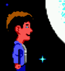
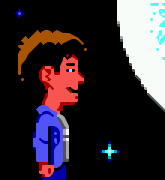
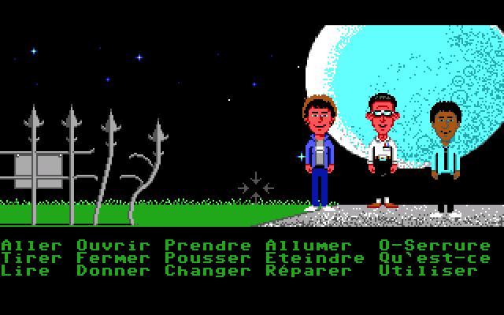
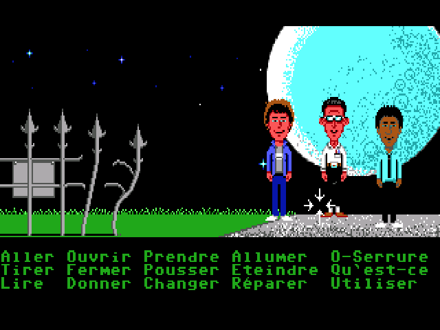
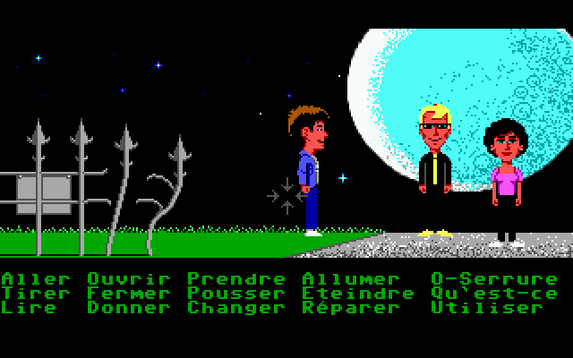
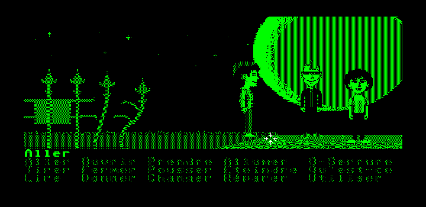
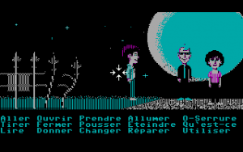
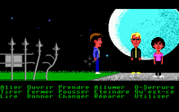
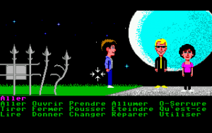

=====================================
Understanding the graphics settings
=====================================

This guide expands on the information contained on the :doc:`graphics settings <../settings/graphics>` page. 

How do the graphics settings work together?
----------------------------------------------

The graphics mode, aspect ratio, and stretch mode settings work together to change the resolution and display of each game. The first setting applied to the image is the graphics mode, then the aspect ratio correction, and then the stretch mode setting. The only exception to this is OpenGL mode, which applies all settings in one pass to arrive at a final image. 

Render modes are only applicable to some older games that were designed to be played on multiple systems, and lets us choose which system's graphics to replicate. 

Graphics modes
---------------------------

The original game graphics are upscaled using different graphical filters, which are specialized algorithms used to ensure that low resolution pixel-art still looks good when it is displayed at a higher resolution.

If the game originally ran at a resolution of 320x200—which is typical for most SCUMM games—then using a graphics mode with a scale factor of 2x yields 640x400 graphics. A 3x scale factor yields 960x600.

There is always a speed penalty when using any form of filtering.

A comparison of graphics modes
*************************************

    **1x**: No filtering, no scaling. Fastest.
   
.. figure:: /images/graphics/graphics_mode/2x.png

   **2x**: No filtering, scales the image by a factor of 2. Default for non 640x480 games.

   
   **3x**: No filtering, scales the image by a factor of 3.

    **2xSaI**: SaI filter, factor 2x.

    **Super2xSaI**: Enhanced 2xSAI filtering, factor 2x.

    **SuperEagle**: Less blurry than 2xSAI, but slower. Factor 2x.

    **AdvMAME2x**: Doesn't rely on blurring like 2xSAI, fast. Factor 2x.

    **AdvMAME3x**: Doesn't rely on blurring like 2xSAI, fast. Factor 3x.

    **HQ2x**: Very nice high quality filter, but slow. Uses lookup tables to create anti-aliased output. Factor 2x.

    **HQ3x**: Very nice high quality filter, but slow. Uses lookup tables to create anti-aliased output. Factor 3x.

    **TV2x**: Interlace filter. Introduces scan lines to emulate a TV. Factor 2x.

    **DotMatrix**: Dot matrix effect. Factor 2x.

.. note::
    
    Not all platforms support all the graphics modes. 

To switch between graphics modes, press :kbd:`Ctrl + Alt` and :kbd:`1` to :kbd:`8`. 

OpenGL mode
**************

OpenGL graphics mode works a little differently to the other graphics modes. Instead of applying the aspect ratio and stretch mode settings one after the other (and after the graphics mode scaling has been applied), it does all the scaling and stretching in one step, going directly from the original game resolution to the final display resolution. OpenGL mode uses hardware rendering, instead of software rendering. 

Output is controlled by your window size (or screen resolution if in full screen) and the stretch mode selected, as well as the **Filter graphics** option. 

.. _aspect:

Aspect ratio correction
------------------------------------

Older games were designed to be run at 320x200 pixels, but on systems where each pixel was rectangular instead of square. This means that on modern systems these games look wider and flatter than they are supposed to. Aspect ratio correction duplicates lines of pixels to correct this. 

For a game with an original resolution of 320x200, aspect ratio correction results in a resolution of 320x240. 

    No aspect ratio correction applied.

    Aspect ratio correction applied. The moon is actually round, as it should be!  

To toggle aspect ratio on and off, press :kbd:`Ctrl+Alt+a`.

.. _stretch:

Stretch modes
----------------------

There are five stretch modes:

- Center: centers the image in the window. 
- Pixel-perfect scaling: scales the image to the highest multiple of the game resolution that fits the window, or that fits the screen if in fullscreen mode. Any empty space is filled with black bars. 

    - For example, a game with an original resolution of 320x200 with aspect ratio correction applied (320x240) and a 3x graphics mode, will be stretched to a multiple of 900x720 pixels: 1800x1440, 2700x2160 and so on.

- Fit to window: fits the image to the window, but maintains the aspect ratio and does not stretch it to fill the window.
- Stretch: stretches the image to fill the window
- Fit to window (4:3): fits the image to the window, at a forced 4:3 aspect ratio.

To switch between stretch modes, press :kbd:`Ctrl+Alt+s`.

Render mode
-------------

For most games this setting will have no effect. For some of the older games that could be played on different systems and graphics cards, this control lets you decide which system you want ScummVM to reproduce. 

Below are some of the common render modes, to illustrate how the render mode setting works. 

   
    Maniac Mansion with <default> render mode

    Maniac Mansion with Hercules Green render mode

.. figure:: ../images/graphics/render_mode/herc_amber.png

    Maniac Mansion with Hercules Amber render mode

    Maniac Mansion with CGA (4 color) render mode

    Maniac Mansion with EGA (16 color) render mode

    Maniac Mansion with Amiga (32 color) render mode

Filter graphics
----------------

When enabled, ScummVM uses bilinear interpolation instead of nearest neighbor for the :ref:`aspect ratio <aspect>` and :ref:`stretch mode <stretch>`. It does not affect the graphics mode scaling unless OpenGL is selected, in which case it determines how the OpenGL scaling is done. 

Nearest neighbor is a simple way to scale an image; each pixel becomes multiple pixels of the same color. While this preserves the sharper details in a pixel art image, it also creates "jagged" edges as the image is scaled up. Bilinear interpolation finds the average color between pixel color values and fills in missing pixel, which results in a "smoothed" image. 

To toggle between bilinear interpolation and nearest neighbor, press :kbd:`Ctrl+Alt+f`.