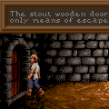
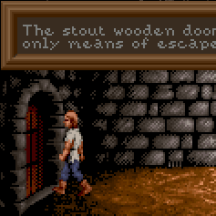
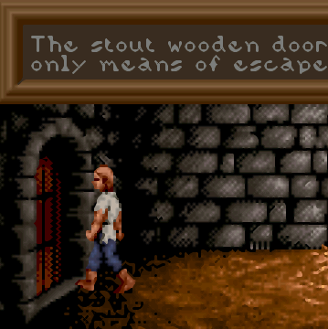
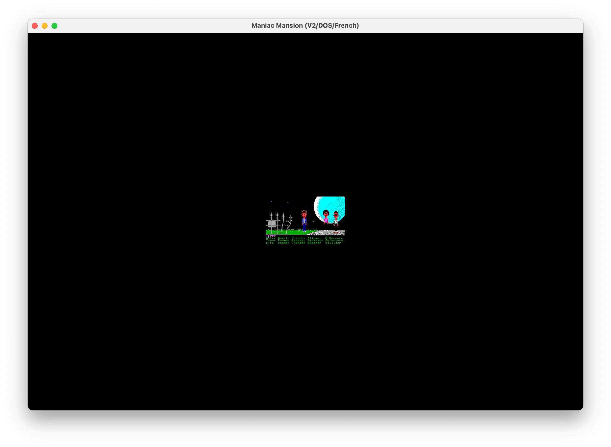
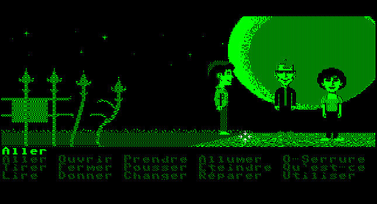

=====================================
Understanding the graphics settings
=====================================

This guide expands on the information contained on the :doc:`graphics settings <../settings/graphics>` page.

How do the graphics settings work together?
----------------------------------------------

The graphics mode, aspect ratio, and stretch mode settings work together to change the resolution and display of each game. The first setting applied to the image is the graphics mode, then the aspect ratio correction, and then the stretch mode setting. The only exception to this is OpenGL mode, which applies all settings in one pass to arrive at a final image.

Render modes are only applicable to some older games that were designed to be played on multiple systems, and lets us choose which system's graphics to replicate.

Graphics modes
---------------------------

The original game graphics are upscaled using different graphical filters, which are specialized algorithms used to ensure that low resolution pixel-art still looks good when it is displayed at a higher resolution.

If the game originally ran at a resolution of 320x200—which is typical for most SCUMM games—then using a graphics mode with a scale factor of 2x yields 640x400 graphics. A 3x scale factor yields 960x600.

There is always a speed penalty when using any form of filtering.

A comparison of graphics modes
*************************************

    **Normal1x**: No filtering, no scaling (original resolution). Fastest.

   **Normal2x**: No filtering, scales the image by a factor of 2. Default for non 640x480 games.

.. figure:: ../images/graphics/graphics_mode/3x.png

   **Normal3x**: No filtering, scales the image by a factor of 3.

.. figure:: ../images/graphics/graphics_mode/4x.png

    **Normal4x**: No filtering, scales the image by a factor of 4.

.. figure:: ../images/graphics/graphics_mode/hq2x.png

    **HQ2x**: Uses lookup tables to create anti-aliased output. Very nice high quality filter, but slow.

    **HQ3x**: Uses lookup tables to create anti-aliased output. Very nice high quality filter, but slow.

.. figure:: ../images/graphics/graphics_mode/edge2x.png

    **Edge2x**: Uses edge-directed interpolation. Sharp, clean, anti-aliased image with very few artifacts.

.. figure:: ../images/graphics/graphics_mode/edge3x.png

    **Edge3x**: Uses edge-directed interpolation. Sharp, clean, anti-aliased image with very few artifacts.

.. figure:: ../images/graphics/graphics_mode/advmame2x.png

    **AdvMAME2x**: Expands each pixel into 4 new pixels based on the surrounding pixels. Doesn't rely on blurring like 2xSAI, fast.

.. figure:: ../images/graphics/graphics_mode/advmame3x.png

    **AdvMAME3x**: Expands each pixel into 4 new pixels based on the surrounding pixels. Doesn't rely on blurring like 2xSAI, fast.

    **AdvMAME3x**: Expands each pixel into 4 new pixels based on the surrounding pixels. Doesn't rely on blurring like 2xSAI, fast.

    **SaI2x**: Uses bilinear filtering to interpolate pixels.

.. figure:: ../images/graphics/graphics_mode/supersai2x.png

    **SuperSaI2x**: An enhanced version of the SAI2x filter.

.. figure:: ../images/graphics/graphics_mode/supereagle2x.png

    **SuperEagle2x**: A variation of the SAI2x filter. Less blurry than SAI2x, but slower.

    **PM2x**: Analyzes the eight neighboring pixels to create smoother diagonal lines and rounded edges.

    **DotMatrix2x**: Dot matrix effect.

.. figure:: ../images/graphics/graphics_mode/tv2x.png

    **TV2x**: Interlace filter. Introduces scan lines to emulate a TV.

.. note::

    Not all platforms support all the graphics modes.

To switch between graphics modes, press :kbd:`Ctrl + Alt` and :kbd:`1` to :kbd:`8`.

OpenGL mode
**************

OpenGL graphics mode works a little differently to the other graphics modes. Instead of applying the aspect ratio and stretch mode settings one after the other (and after the graphics mode scaling has been applied), it does all the scaling and stretching in one step, going directly from the original game resolution to the final display resolution. OpenGL mode uses hardware rendering, instead of software rendering.

Output is controlled by your window size (or screen resolution if in full screen) and the stretch mode selected, as well as the **Filter graphics** option.

.. _aspect:

Aspect ratio correction
------------------------------------

Older games were designed to be run at 320x200 pixels, but on systems where each pixel was rectangular instead of square. This means that on modern systems these games look wider and flatter than they are supposed to. Aspect ratio correction duplicates lines of pixels to correct this.

For a game with an original resolution of 320x200, aspect ratio correction results in a resolution of 320x240.

.. figure:: ../images/graphics/aspect_ratio/no_aspect_ratio.png

    No aspect ratio correction applied.

.. figure:: ../images/graphics/aspect_ratio/aspect_ratio.png

    Aspect ratio correction applied. The moon is actually round, as it should be!

To toggle aspect ratio on and off, press :kbd:`Ctrl+Alt+a`.

.. _stretch:

Stretch modes
----------------------

Stretch modes control how the game screen is stretched to fill the ScummVM window (or the screen in full screen mode).

    **Center**: The game screen is not scaled and is centered in the ScummVM window.

    **Pixel-perfect scaling**: The game screen is scaled to the highest multiple of the game resolution that fits in the ScummVM window. Any empty space is filled with black bars.

The base resolution for this stretch mode includes the selected scaler and, if enabled, the :ref:`aspect ratio correction <aspect>`. This means that if the original game resolution is 320x200 and a 2x scaler is selected, the display is a multiple of 640x400 (for example 1280x800 or 1920x1200). And if aspect ratio correction is also selected, the display is a multiple of 640x480. With this stretch mode you may thus prefer to use either the OpenGL graphics mode or the SDL Surface graphics mode with a 1x scaler.

This means that while the width of result will always be a multiple of the original game width, if aspect ratio correction is enabled the height of the result may not be a multiple of the original game height. This can thus cause some blurring. If you want to use aspect ratio correction but avoid any blurring, you may prefer to use the Even-pixels scaling.

    **Even pixels scaling**: The game screen is scaled to the highest multiples of the original game width and height. Any empty space is filled with black bars. This mode is only available for the OpenGL graphics mode.

The factors used on the width and height may be different if the :ref:`aspect ratio correction <aspect>` is enabled as it will try to get the result as close as possible to the expected aspect ratio. For example, with a screen resolution of 1920x1080, a game with an original resolution of 320x200 and the aspect ratio correction enabled will be stretched to 1280x1000 (original width of 320 x 4 and original height of 200 x 5). Unlike the Pixel-perfect scaling, This does not provide exactly the expected aspect ratio (4:3) but uses instead a good approximation (4:3.125) while ensuring all the original pixels are scaled by the same amount.

.. figure:: ../images/graphics/stretch_mode/fit-to-window.png

    **Fit to window**: Fits the game to the window, but maintains the aspect ratio.

With this mode you may get either horizontal black bars or vertical black bars on the side, but not both.

    **Stretch to window**: Stretches the game to fill the window.

The game may be stretch horizontally or vertically to fill the window. This mode does not enforce the aspect ratio of the game to be preserved.

    **Fit to window (4:3)**: Fits the image to the window, at a forced 4:3 aspect ratio.

To switch between stretch modes, press :kbd:`Ctrl+Alt+s`.

Render mode
-------------

For most games this setting will have no effect. For some of the older games that could be played on different systems and graphics cards, this control lets you decide which system you want ScummVM to reproduce.

Below are some of the common render modes, to illustrate how the render mode setting works.

.. figure:: ../images/graphics/render_mode/default.png

    Maniac Mansion with <default> render mode

    Maniac Mansion with Hercules Green render mode

.. figure:: ../images/graphics/render_mode/herc_amber.png

    Maniac Mansion with Hercules Amber render mode

.. figure:: ../images/graphics/render_mode/cga.png

    Maniac Mansion with CGA (4 color) render mode

.. figure:: ../images/graphics/render_mode/ega.png

    Maniac Mansion with EGA (16 color) render mode

    Maniac Mansion with Amiga (32 color) render mode

Filter graphics
----------------

When enabled, ScummVM uses bilinear interpolation instead of nearest neighbor for the :ref:`aspect ratio <aspect>` and :ref:`stretch mode <stretch>`. It does not affect the graphics mode scaling unless OpenGL is selected, in which case it determines how the OpenGL scaling is done.

Nearest neighbor is a simple way to scale an image; each pixel becomes multiple pixels of the same color. While this preserves the sharper details in a pixel art image, it also creates "jagged" edges as the image is scaled up. Bilinear interpolation finds the average color between pixel color values and fills in missing pixel, which results in a "smoothed" image.

To toggle between bilinear interpolation and nearest neighbor, press :kbd:`Ctrl+Alt+f`.

3D Graphics settings
---------------------

Vsync
*******
V-sync, or vertical sync, synchronizes the frame rate of the game with the monitor's refresh rate, or the video capture refresh rate. This helps to prevent screen "tearing", where the screen displays parts of multiple frames at once, which looks like a horizontal line where the image appears to split.

This setting is enabled by default.

Renderers
*********
There are three options for rendering 3D games: OpenGL, OpenGL with shaders, or software.

- OpenGL uses the graphics card (GPU) to render the game.
- OpenGL with shaders also uses the GPU, but also uses shaders, if available, to render the game. Shaders are small programs running on the GPU which transform certain graphics inputs to outputs. They control things such as how the pixels are drawn on the 3D shapes.
- The software option uses the computer's CPU, instead of a graphics card, to render the game.

Not all render options are available for all games. If in doubt, leave the setting at **<default>**.

Anti-aliasing
***************
Without anti-aliasing, the computer takes the color it finds at the center of the pixel, and applies that color to the entire pixel. This results in jagged, pixelated lines at the edges of objects. Anti-aliasing, in a nutshell, is how we get nice, smooth lines on a 3D game.

Historically, anti-aliasing was done using a method called Supersampling. With this method, each frame is rendered behind-the-scenes to a higher resolution, and then downscaled to produce a much smoother, better looking image. Unfortunately, this method is very GPU-intensive, and too slow.

Multisampling Anti-Aliasing, or MSAA for short, was developed as a much faster alternative; the computer renders as much of the image as possible without anti-aliasing, and then only applies anti-aliasing to the edges. It samples each pixel to find out where the edge is, and how to blend the colors to create a smooth edge. The numbered options in the ScummVM :doc:`../settings/graphics` tab (2x, 4x and 8x), refer to how many samples are taken. 8x MSAA produces a better image than 2x MSAA, but is also more GPU-intensive.
