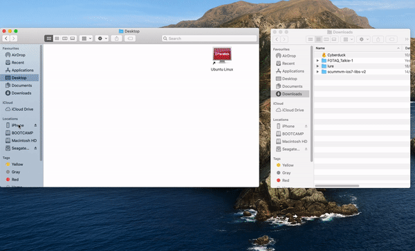

==============
iOS
==============

There are two methods to install ScummVM onto your iOS device, and the method you use depends on whether or not your device is jailbroken. 

No Jailbreak
==============

This method is a little complex, however it is currently the only way to install ScummVM to an iOS device that is not jailbroken. While a rudimentary knowledge of the command line would be useful, the following instructions, if followed carefully, can be completed by anyone. 

Prerequisites
****************

- A computer running MacOSX with Xcode installed. Xcode is a free App, available from the Mac App Store.
- An Apple Developer account. You can sign up for a free account on the `Apple Developer Member Center <https://developer.apple.com/membercenter/>`_ with your Apple ID. 
- The ScummVM `iOS Libraries <https://www.scummvm.org/frs/build/scummvm-ios7-libs-v2.zip>`_ downloaded. 

.. note::

    If you have a free Apple developer account, each build will only be valid for 7 days, which means you will need to repeat these steps and re-install ScummVM every week.

Creating the Xcode project
***************************

The first step is to download the repository containing the code we'll need to build the app with. The easiest way to do this is from the command line. Go to **Applications > Utilities > Terminal** and enter the following:

.. code-block:: bash

    git clone https://github.com/scummvm/scummvm.git

.. note::
    The default branch of the ScummVM repository will be the master branch. To build a specific version, checkout the appropriate branch. For example, to build version 2.1.1, use the following command:

    .. code-block::

        git checkout branch-2-1-1

If you haven't done so before now, open Xcode from the Applications folder, and accept the End User License Agreement. Starting Xcode for the first time will also install the command line tools we require for the next steps.

The next step changes our present working directory and then generates the tools we need to create the Xcode project.

.. code-block:: bash

    cd scummvm/devtools/create_project/xcode
    xcodebuild

Now we move back a few directories, to create a new build directory at the same level as the repository. 

.. code-block:: bash

    cd ../../../..
    mkdir build
    cd build

Your present working directory will now be the new ``build`` directory. Unzip the downloaded iOS libraries package into the build folder by using the following command:

.. code-block:: bash

    unzip ~/Downloads/scummvm-ios7-libs-v2.zip

Generating the Xcode project
*****************************

It's time to generate the Xcode project. Ensure your present working directory is still the ``build`` directory, and then run the following on the command line:

.. code::

    ../scummvm/devtools/create_project/xcode/build/Release/create_project ../scummvm --xcode --enable-fluidsynth --disable-nasm --disable-opengl --disable-theora --disable-taskbar --disable-tts --disable-fribidi

The resulting directory structure will look like this:

.. code-block:: bash

    Home
     |--scummvm
     '--build
         |-- include 
         |-- lib
         |-- engines
         '-- scummvm.xcodeproj

.. tip::

    To view the Home directory in the Finder, click on **Go** in the top menu bar, and then click **Home**, or alternatively use the keyboard shortcut :kbd:`shift` + :kbd:`command` + :kbd:`H`. 

Open the ``scummvm.xcodeproj`` file from the Finder, or via the command line:

.. code-block:: bash

    open scummvm.xcodeproj

Building ScummVM
*****************

Once Xcode is open, connect the device you are installing ScummVM onto. At the top of the window, select **ScummVM-iOS** and then the device you connected. You will need to trust the device before it will show up on the list of connected devices. 

The last step before building the app is to change the bundle identifier and manage signing. Click on the **scummvm** project in the left pane, and then click on **ScummVM - iOS** under **TARGETS**. On the menu bar above, click on **General**. Under **Identity** you should see a field labeled **Bundle Identifier**. Here you will need to input a unique identifier in reverse-DNS format. This can be as simple as com.\ *yournamehere*. 

Next to **General**, click on **Signing & Capabilities**. Under **Signing**, tick the **Automatically manage signing** box, and select your developer account from the **Team** dropdown menu. If you have not added your developer account to Xcode, do this now by clicking **Add an Account...** in the dropdown menu.

In the upper left-hand corner, press the play button to start building ScummVM. When the build has finished, it will launch on your connected device. 

.. image:: ../images/ios/ios_xcode_build.gif
   :class: with-shadow

Transferring game files to your device
*****************************************

The easiest way to transfer files to your device is by using the Finder. In the Finder app on your Mac, navigate to **Locations** in the left pane, and click on the connected device. Click on **Files**, then drag and drop the folder containing the game files into the **ScummVM** folder. 

Alternatively, upload game folders to your iCloud Drive, or to any other cloud sharing service. On your iOS device, use the Files app to copy these folders into the ScummVM folder located on the device. 

For more information on which files ScummVM requires, and how to add and play games, see `adding and playing games <adding_games>`_.

Jailbreak
==========

How to jailbreak an iOS device is outside the scope of this documentation. However, should you have a device that is jailbroken, iOS .deb and .ipa packages are available for install from the `ScummVM downloads page <https://www.scummvm.org/downloads>`_.

Prerequisites
***************

- A jailbroken iOS device
- A file manager app such as Filza on your iOS device
- The openSSH app on your iOS device
- An SFTP client such as Cyberduck, installed on your computer

Installing ScummVM
*******************

Go to the `ScummVM downloads page <https://www.scummvm.org/downloads>`_ and download the recommended .deb package. Your device will ask how to open the file. Choose Filza.

Ensure the .deb package is saved somewhere in the ``/var/mobile`` directory. It should default to ``/var/mobile/Documents``, which is fine. Tap on the file and then tap **Install** in the upper right corner to install ScummVM.

The .ipa package can be installed in the same way.

You will need to restart your device for the install to complete. 

Transferring game files to your device
**************************************

Open Cyberduck on your computer. Click on **Open Connection** at the top left corner of the window. Select **SFTP (SSH File Transfer Protocol)** from the dropdown menu.  Next to **Server:**, type in the IP address of your iOS device. You can find this information on your iOS device by going to **Settings > Wi-Fi** and then tapping on the **i** symbol next to your Wi-Fi network name. The IP address is listed next to **IP Address**.

Enter ``root`` as the Username, and unless you have changed it, ``Alpine`` as the Password. Click **Connect**. Once you are connected, you will be able to see all the files and directories on your connected device.

ScummVM on the iOS device can access the directory containing its Savegames, which in this case should be ``/var/mobile/Documents``. Drag and drop folders containing game files into this directory. 

For more information on which files ScummVM requires, and how to add and play games, see :doc:`adding_games`.

