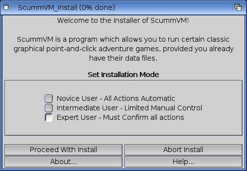

=============================
AmigaOS 4
=============================

This page contains all the information you need to get ScummVM up and running on AmigaOS 4. 

What you'll need
===================

- A system running Amiga OS 4

Installing ScummVM
=====================================

ScummVM is available for download from the `ScummVM Downloads page <https://www.scummvm.org/downloads/>`_ or the `OS4 Depot <http://www.os4depot.net>`_. 

Download and extract the ``.lha`` file. 

Run the extracted ``ScummVM_Install`` script. This installer guides you through the installation process. 

    The ScummVM installer. 

To automatically keep ScummVM up to date through AmiUpdate, run the ``Autoinstall`` script. 

Transferring game files
=========================

For games on PC or Mac formatted discs, use the original platform to access the data files, and then transfer these to Amiga. Alternatively, if you have external hardware such as a Catweazel floppy disc controller, you might be able to use this to access the files. 

ScummVM for Amiga OS has Cloud and LAN functionality, to help manage the transfer of files. See :doc:`../use_scummvm/connect_cloud` and :doc:`../use_scummvm/LAN`. 

See :doc:`../use_scummvm/game_files` for more information about game file requirements.

Controls
=================

Controls can be manually configured in the :doc:`Keymaps tab <../settings/keymaps>`. See the :doc:`../use_scummvm/keyboard_shortcuts` page for common default keyboard shortcuts. 

Paths 
=======

Saved games 
*******************
``Games:ScummVM/saves``

Configuration file 
**************************
``Games:ScummVM/scummvm.ini``

Settings
==========

For more information about Settings, see the Settings section of the documentation. Only platform-specific differences are listed here. 

Audio
******

The CAMD driver allows the use of MIDI hardware. Select CAMD as the :ref:`Preferred device <device>`.

Known issues
==============

Due to the big-endian nature of Amiga OS, there can sometimes be graphics and sounds issues with games. Check out the Platform Overview `wiki page <https://wiki.scummvm.org/index.php?title=Platforms/Overview>`_ for a list of compatible engines. 

If a game crashes and it's listed as compatible, report it as a :doc:`bug <../help/report_bugs>`.