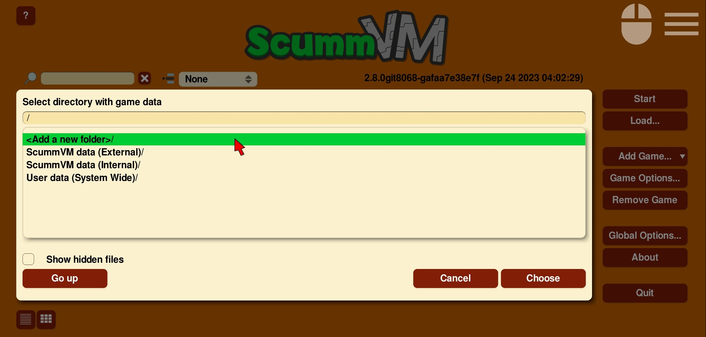
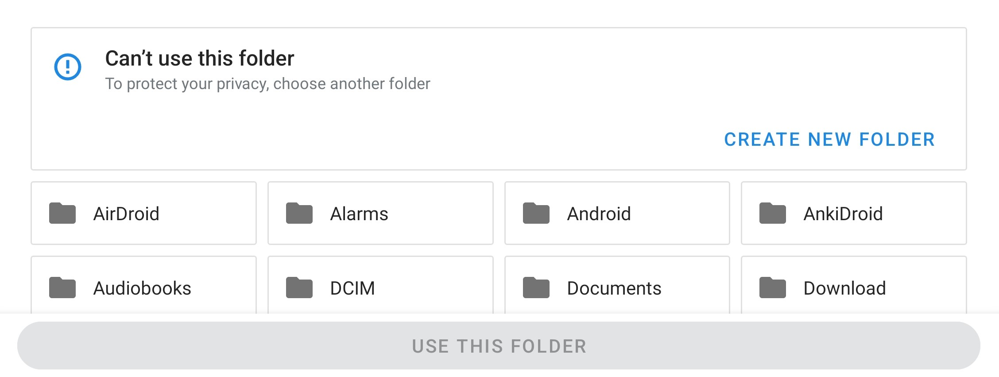
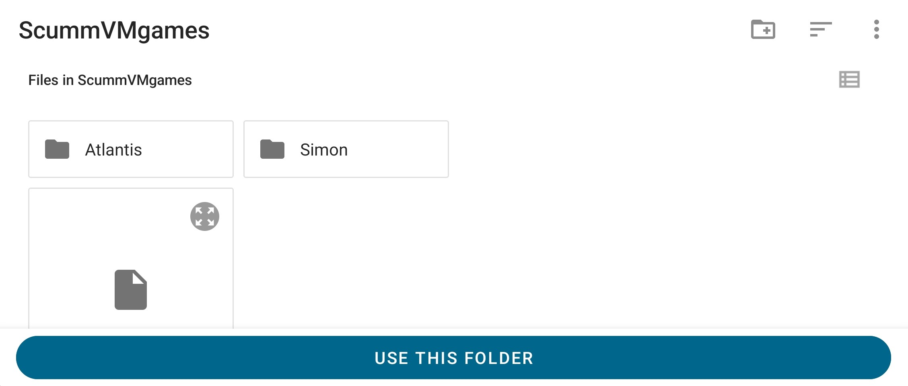
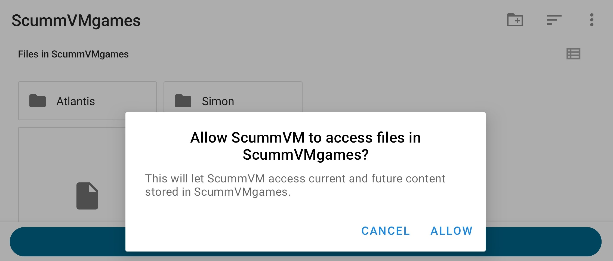
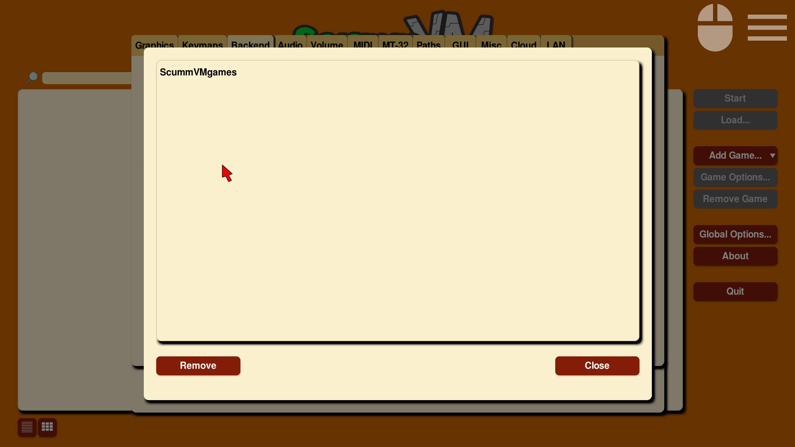

===============
Android
===============

This page contains all the information you need to get ScummVM up and running on an Android device.

What you'll need
================

- An Android device running Android 4.1 (Jelly Bean) or newer.

.. note::

    ScummVM has been tested to work up to Android 16.

Installing ScummVM
====================================

There are two ways to install ScummVM on an Android device; install it from the Google Play Store, or manually download and install the APK package from the ScummVM downloads page.

Installing from the Google Play Store
***************************************

The latest supported version of ScummVM is on the Google Play Store; search for ScummVM on the Google Play Store and select **Install**.

Manually installing the APK package
*************************************

On your device, use a web browser app to navigate to the `ScummVM downloads page <https://www.scummvm.org/downloads>`_. The recommended download section on the page suggests the correct ``.apk`` package, however if it does not, scroll down to select the correct package.

.. tip::

    To find the correct package for your device, find out whether the device has a 32 or 64-bit operating system, and which chipset the device has. Do an internet search using the device model number to find these details.

Click on the correct package to start the download. After it has downloaded, go to the file and tap on it to start the install process. Use either a file manager app, or select the file directly from the web browser downloads. The file manager or the web browser asks for permission to install the package, and after permission is granted, returns to the install.

.. note::

    The downloaded APK package is treated as an app from an unknown source, because it doesn't originate in the Google Play store. To allow unknown apps:

    - For Android 7 or lower, go to **Settings > Security > Device Administration**, scroll down to **Device Administration** and enable **Unknown Sources**.
    - For Android 8 or higher, go to **Settings > Apps and Notification** and select **Install Unknown Apps**.

Transferring game files
========================================

ScummVM has built-in Cloud functionality, which lets you connect your Google Drive, OneDrive, Box or Dropbox account. For more information, see the :doc:`../use_scummvm/connect_cloud` page. ScummVM also has the ability to run a local web server. For more information, see the :doc:`../use_scummvm/LAN` page.

There are a few other options to transfer the game files:

 - Copy the files directly onto the microSD card, if the device has one.
 - USB transfer from a computer. To complete file transfer by USB cable, tap the **Charging this device via USB notification** when the device is connected. Select **Use USB for** and then **File Transfer**. An Android File Transfer window opens.
 - Download games such as freeware games or those from digital distributors directly to your device.

See :doc:`../use_scummvm/game_files` for more information about game file requirements.

Adding games
================

1. Select **Add Game...** from the launcher.

2. Inside the ScummVM file browser, select **Go Up** until you reach the root folder which has the **<Add a new folder>** option.

    Root folder with <Add a new folder> option

3. Double-tap **<Add a new folder>**. In your device's file browser, navigate to the folder containing all your game folders. For example, **SD Card > ScummVMgames**

    Android file browser root

    Android file browser selectable folder with **Use this folder** button

4. Select **Use this folder**.
5. Select **ALLOW** to give ScummVM permission to access the folder.

    Android file browser request to grant ScummVM directory access permission

6. In the ScummVM file browser, double-tap to browse through your added folder. Add a game by selecting the sub-folder containing the game files, then tap **Choose**.

To add more games, repeat Steps 1 and 6.

.. _addSAFpath:

    .. note::
        Starting with version 2.7.0 of ScummVM for Android, significant changes were made to the file access system to allow support for modern versions of the Android Operating System.

        If existing added games or custom paths no longer work, go to **Game Options > Paths**, select the path to update, then follow steps 2 through 6 above.

.. _addSAFpathRestrictedFilesProfile:

    .. note::
        If the Android device's **Files** app has been manually deactivated, please re-activate it, if possible, because it is used by ScummVM as the native File explorer.

        Furthermore, an Android user with a **restricted profile** might not be able to run the device's **Files** app with full access rights, so it will be impossible to browse the list of folders and files on external storage (SD Card) of their device to choose a folder to grant ScummVM the SAF access permission.

.. _addSAFpathAndroidStudioDeviceExplorerKnownIssue:

    .. note::
        On a few devices it was observed that when Android Studio's "Device Explorer" utility is used to browse the device's folders and upload files from a PC to the Android device then, upon re-launching ScummVM on that device, it may behave as all granted SAF access permissions are lost and cannot be granted again. In this case, a device restart should fix this odd "hiccup"; after the restart, ScummVM will properly acknowledge any previously configured SAF-accessible folders.

Removing permissions
************************

To remove any folder permissions granted to ScummVM, go to the **Global Options > Backend** tab.

.. figure:: ../images/android/gui-remove-permissions.png

    Backend tab with "Remove folder authorizations..." button

    Dialog with list of permissions to remove

If any permissions are removed in error, see :ref:`this note <addSAFpath>` for instructions to reinstate them.

Controls
=============

Default control mapping
****************************

Controls can also be manually configured in the :doc:`Keymaps tab <../settings/keymaps>`. See the :doc:`../use_scummvm/keyboard_shortcuts` page for common keyboard shortcuts.

.. csv-table::
    :header-rows: 1
    :class: controls

        Touch screen control, Action
        One finger tap, Left mouse button click
        One finger tap + movement, Mouse movement
        One finger tap and hold for >0.5s, Right mouse button click
        One finger tap and hold for >1s, Middle mouse button click
        Double tap + movement, "Left mouse button hold and drag, such as for selection from action wheel in Curse of Monkey Island"
        Two finger tap, Right mouse button click
        Two finger tap + movement of second finger, "Right mouse button hold and drag, such as for selection from action wheel in Tony Tough"
        Two finger slide up/down, Scroll (reverse mouse wheel)
        Three finger tap, Middle mouse button click
        Three finger tap + movement of third finger, Middle mouse button hold and drag
        Long press system Back button, Opens Global Main Menu
        Short press system Back button, "Skip, or Cancel/Quit in the Launcher"
        Long press system Menu button, Opens/closes Virtual keyboard
        Short press system Menu button, Opens Global Main Menu
        D-pad up/down/left/right, Mouse movement
        D-pad center, Left mouse button click
        Trackball movement, Mouse movement
        Trackball click, Left mouse button click

Touch controls
****************
The touch control scheme can be configured in the global settings. From the Launcher, go to **Options > Backend > Choose the preferred touch mode**.
It's possible to configure the touch mode for three situations (ScummVM menus, 2D games and 3D games) and choose one of the three possible modes:

    - Direct mouse, the touch controls are direct. The pointer jumps to where the finger touches the screen (default for menus).
    - Touchpad emulation, the touch controls are indirect. The finger can be far away from the pointer and still move it, like on a laptop touchpad.
    - Gamepad emulation, the touch controls don't move any mouse. The fingers must be placed on lower left and right of the screen and respectively emulate a directional pad and action buttons.
    - The pointer speed setting in the :doc:`Controls tab <../settings/control>` affects how far the pointer moves in response to a finger movement.

The touch mode can be switched at anytime by tapping on the controller icon, next to the menu icon at the top right of the screen.

To display or hide the small controller icon, from the Launcher select **Options** and then the **Backend** tab. Tick the **Show on-screen control** box to enable the controller icon.

Two finger tap
^^^^^^^^^^^^^^^^^

To perform a two finger tap, hold one finger down and then tap with a second finger.

Three finger tap
^^^^^^^^^^^^^^^^^^

To perform a three finger tap, start with holding down one finger and progressively touch down the other two fingers, one at a time, while still holding down the previous fingers. Imagine you are impatiently tapping your fingers on a surface, but then slow down that movement so it is rhythmic, but not too slow.

Two finger slide
^^^^^^^^^^^^^^^^^

To perform a two finger slide, place two fingers on the touch screen (typically the index and middle finger) and slide them upwards or downwards.

Immersive Sticky fullscreen mode
^^^^^^^^^^^^^^^^^^^^^^^^^^^^^^^^^^

ScummVM for Android uses the Immersive Sticky fullscreen mode, which means that the Android system bar is hidden until the user swipes from an edge with a system bar. Swipe from the edge to reveal the system bars.  They remain semi-transparent and disappear after a few seconds unless you interact with them. Your swipe also registers in the game, so if you need to swipe from an edge with system bars, your game play is not interrupted.

Global Main Menu
^^^^^^^^^^^^^^^^^^

To open the Global Main Menu, tap on the small menu icon at the top right of the screen.

To display or hide the small menu icon, from the Launcher select **Options** and then the **Backend** tab. Tick the **Show on-screen control** box to enable the menu icon.

Virtual keyboard
^^^^^^^^^^^^^^^^^^^^^

To open the virtual keyboard, long press on the small controller icon at the top right of the screen, or tap on any editable text field. To hide the virtual keyboard, tap the small controller icon (which became a keyboard one) again, or tap outside the text field.

Paths
=======

Saved games
**************

By default, the saved games are saved in the internal app folder. To change the path, go to the :doc:`../settings/paths` tab in either the global or game-specific settings.

Configuration file
************************

The configuration file is in the internal app folder, and this path cannot be changed.

Accessing the internal app folder
^^^^^^^^^^^^^^^^^^^^^^^^^^^^^^^^^^^^

To access the internal app folder, use ScummVM's built-in LAN functionality:

1. From the Launcher, select **Options** and then the **LAN** tab.
2. Select **/root/Path**.
3. Use the file browser to **Go up** to the root of the ScummVM file browser.
4. Select the **ScummVM data (Internal)** folder, and tap **Choose**.
5. Run the server to access the ``scummvm.ini`` configuration file.

For more information, see the :doc:`../use_scummvm/LAN` page.

Known issues
===============

- If ScummVM is uninstalled or downgraded, its internal and external app spaces are fully deleted. If you want to keep the saved games, use ScummVM's :doc:`cloud <../use_scummvm/connect_cloud>` or LAN functionality to keep those files. Alternatively, change the saved game path to a shared location such as an SD card.
