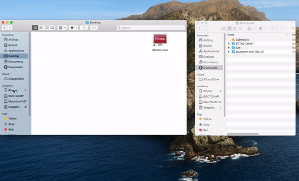

==============
iOS
==============

This page contains all the information you need to get ScummVM up and running on an iOS device.

ScummVM is an open source software, which means you can get, modify, and compile the source code yourself.  If you want to do so, see the :doc:`ios_build` page.

Transferring game files
========================

ScummVM comes bundled with a few games and demos, but it supports many more games. See :doc:`../use_scummvm/add_play_games` for more information.

There are multiple ways to transfer game files to your iOS device.

ScummVM has built-in cloud functionality, which lets you connect your Google Drive, OneDrive, Box or Dropbox account. For more information, see the :doc:`../use_scummvm/connect_cloud` page. ScummVM also has the ability to run a local web server. For more information, see the :doc:`../use_scummvm/LAN` page.

.. note::

 ScummVM's cloud functionality does not currently support iCloud, however you can upload game folders to your iCloud and then use the Files app on your iOS device to copy these folders into the local ScummVM folder.

Another way to transfer files (for macOS Catalina and newer) to your device is by using the Finder while your device is connected to your Mac. In the Finder app on your Mac, navigate to **Locations** in the left pane, and click on the connected device. Click on **Files**, then drag the folder containing the game files into the **ScummVM** folder. For older versions of macOS, and for Windows users, file transfer can be done in iTunes.

See :doc:`../use_scummvm/game_files` for more information about game file requirements.

Controls
============

.. csv-table::
    :widths: 40 60
    :header-rows: 1
    :class: controls

        Touch screen control, Action
        One finger tap, Left mouse click
        :ref:`twofinger`, Right mouse click
        :ref:`twofingerdouble`, ESC
        One finger press & hold for >0.5s, "Left mouse button hold and drag, such as for selection from action wheel in Curse of Monkey Island"
        Two fingers press & hold for >0.5s, "Right mouse button hold and drag, such as for selection from action wheel in Tony Tough"
        Two finger swipe (left to right), Toggles between touch direct mode and touchpad mode
        Two finger swipe (right to left), Show/hide on-screen control (iOS 15 and later)
        Two finger swipe (top to bottom), Global Main Menu
        Three finger swipe, Arrow keys

        Pinch gesture, Enables/disables keyboard
        Keyboard spacebar, Pause

.. csv-table::
    :widths: 40 60
    :header-rows: 1
    :class: controls

        Apple Pencil control, Action
        Touch, Left mouse click
        Touch & hold for >0.5s, "Left mouse button hold and drag, such as for selection from action wheel in Curse of Monkey Island"
        3 quick touches, Right mouse click 
        3 quick touches & hold for >0.5s, "Right mouse button hold and drag, such as for selection from action wheel in Tony Tough"

Touch controls
*******************
The touch control scheme can be switched in the global settings. From the Launcher, go to **Options > Control > Touchpad mouse mode**. It's possible to configure the touch mode for three situations (ScummVM menus, 2D games and 3D games) and choose one of the two possible modes:

    - Direct mouse, the touch controls are direct. The pointer jumps to where the finger touches the screen (default for menus).
    - Touchpad emulation, the touch controls are indirect. The finger can be far away from the pointer and still move it, like on a laptop touchpad.
    - The pointer speed setting in the :doc:`Controls tab <../settings/control>` affects how far the pointer moves in response to a finger movement.

The touch mode can be switched at anytime by tapping on the controller icon, next to the menu icon at the top right of the screen.

To display or hide the small controller icon, from the Launcher select **Options** and then the **Backend** tab. Tick the **Show on-screen control** box to enable the controller icon.

.. _twofinger:

Two finger tap
^^^^^^^^^^^^^^^^^^^^^

For a two finger tap, hold one finger down and then tap with a second finger.

.. _twofingerdouble:

Two finger double tap
^^^^^^^^^^^^^^^^^^^^^^^

For a two finger double tap, hold one finger down and then double tap with a second finger.

Keyboard
^^^^^^^^^^^^^^^^^^^^

If no external keyboard is connected, the pinch gesture shows and hides the onscreen keyboard. When an external keyboard is connected the inputs from the external keyboard is enaled by default.
External keyboards are supported and from iOS 13.4 most of the special keys, e.g. function keys, Home and End, are mapped.
For external keyboards missing the special keys, e.g. the Apple Magic Keyboard for iPads, the special keys can be triggered using the following key combinations:

.. csv-table::
    :widths: 40 60
    :header-rows: 1
    :class: keyboard

        Key combination, Action
        CMD + 1, F1
        CMD + 2, F2
        "...", "..."
        CMD + 0, F10
        CMD + SHIFT 1, F11
        CMD + SHIFT 2, F12
        CMD + UP, PAGE UP
        CMD + DOWN, PAGE DOWN
        CMD + LEFT, HOME
        CMD + RIGHT, END

Game controllers
^^^^^^^^^^^^^^^^^^^^

If running iOS 14 and later there is support for connected mouses and gamepad controllers using the Apple Game Controller framework. Only "Extended Gamepad Controllers" are supported at the moment. For more information visit https://developer.apple.com/documentation/gamecontroller/gcextendedgamepad

Paths
=======

Saved games
**************

``/var/mobile/Library/ScummVM/Savegames/`` if the device is jailbroken, or ``Savegames/`` in the ScummVM folder for a non-jailbroken device. Access this folder through the Finder or iTunes.

Configuration file
*********************

``/var/mobile/Library/ScummVM/Preferences`` if the device is jailbroken, or ``Preferences`` in the ScummVM folder for a non-jailbroken device. Access this folder through the Finder or iTunes.

Known issues
===============

- If ScummVM is uninstalled or downgraded, its internal and external app spaces are fully deleted. If you want to keep saved games use ScummVM's :doc:`cloud <../use_scummvm/connect_cloud>` or LAN functionality to keep those files. Alternatively, change the saved game path to a shared location such as an SD card.
- If closing the ScummVM application (background mode) and then killing the application (by swiping the application upwards) there is a risk that the ScummVM configuration file becomes corrupted. Make sure not to kill the application to soon after ptting it to background.
- In rare cases the ScummVM folder is not created in the "Files" application after installing ScummVM. Make sure the ScummVM folder shows up after installation. If not, uninstall the ScummVM, restart the iOS device and reinstall ScummVM.
- In rare cases the system mouse pointer on iPadOS is not hidden so both the ScummVM arrow mouse pointer and the iPadOS system pointer are seen in parallell. It's usually fixed when restartarting the iPad.
