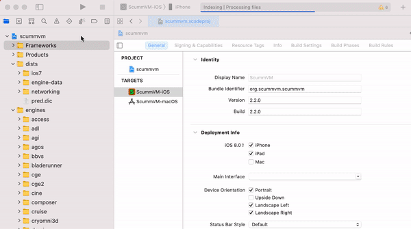
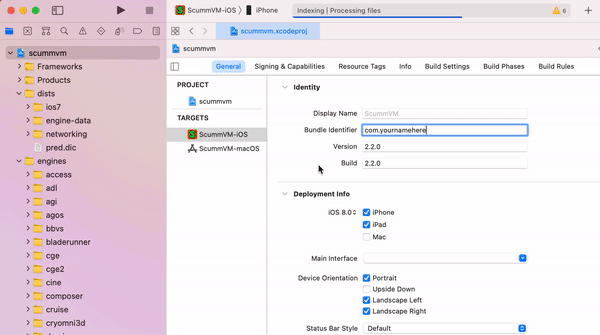

==============
iOS
==============

Install ScummVM
=====================
There are two methods to install ScummVM onto your iOS device, and the method you use depends on whether or not your device is jailbroken. 

No Jailbreak
^^^^^^^^^^^^^^^^

This method is a little complex, however it is currently the only way to install ScummVM to an iOS device that is not jailbroken. While a rudimentary knowledge of the command line would be useful, the following instructions, if followed carefully, can be completed by anyone. 

Prerequisites
****************

- A Mac computer with Xcode installed. Xcode is a free App, available from the Mac App Store.
- An Apple Developer account. You can sign up for a free account on the `Apple Developer Member Center <https://developer.apple.com/membercenter/>`_ with your Apple ID. 
- The ScummVM `iOS Libraries <https://www.scummvm.org/frs/build/scummvm-ios7-libs-v2.zip>`_ downloaded. 

.. note::

    If you have a free Apple developer account, each build will only be valid for 7 days, which means you will need to repeat these steps and re-install ScummVM every week.

Create the Xcode project
***************************

The first step is to download the repository containing the code we'll need to build the app with. The easiest way to do this is from the command line. Go to **Applications > Utilities > Terminal** and enter the following:

.. code-block:: bash

    git clone https://github.com/scummvm/scummvm.git

.. note::
    The default branch of the ScummVM repository will be the master branch. To build a specific version, checkout the appropriate branch. For example, to build version 2.2.0, use the following command:

    .. code-block::

        git checkout branch-2-2-0

If you haven't done so before now, open Xcode from the Applications folder, and accept the End User License Agreement. Starting Xcode for the first time will also install the command line tools we require for the next steps.

The next step changes our present working directory and then generates the tools we need to create the Xcode project.

.. code-block:: bash

    cd scummvm/devtools/create_project/xcode
    xcodebuild

Now we move back a few directories, to create a new build directory at the same level as the repository. 

.. code-block:: bash

    cd ../../../..
    mkdir build
    cd build

Your present working directory will now be the new ``build`` directory. Unzip the downloaded iOS libraries package into the build folder by using the following command:

.. code-block:: bash

    unzip ~/Downloads/scummvm-ios7-libs-v2.zip

Generate the Xcode project
*****************************

It's time to generate the Xcode project. Ensure your present working directory is still the ``build`` directory, and then run the following on the command line:

.. code::

    ../scummvm/devtools/create_project/xcode/build/Release/create_project ../scummvm --xcode --enable-fluidsynth --disable-nasm --disable-opengl --disable-theora --disable-taskbar --disable-tts --disable-fribidi

The resulting directory structure will look like this:

.. code-block:: bash

    Home
     |--scummvm
     '--build
         |-- include 
         |-- lib
         |-- engines
         '-- scummvm.xcodeproj

.. tip::

    To view the Home directory in the Finder, click on **Go** in the top menu bar, and then click **Home**, or alternatively use the keyboard shortcut :kbd:`shift` + :kbd:`command` + :kbd:`H`. 

Open the ``scummvm.xcodeproj`` file from the Finder, or via the command line:

.. code-block:: bash

    open scummvm.xcodeproj

Build ScummVM
*****************

Once Xcode is open, connect the device you are installing ScummVM onto. At the top of the window, select **ScummVM-iOS** and then the device you connected. You will need to trust the device before it will show up on the list of connected devices. 

.. figure:: ../images/ios/choose_device.gif

   
The last step before building the app is to change the bundle identifier and manage signing. Click on the **scummvm** project in the left pane, and then click on **ScummVM - iOS** under **TARGETS**. On the menu bar above, click on **General**. Under **Identity** you should see a field labeled **Bundle Identifier**. Here you will need to input a unique identifier in reverse-DNS format. This can be as simple as com.\ *yournamehere*. 

Next to **General**, click on **Signing & Capabilities**. Under **Signing**, tick the **Automatically manage signing** box, and select your developer account from the **Team** dropdown menu. 

   

If you have not added your developer account to Xcode, do this now by clicking **Add an Account...** in the dropdown menu.

In the upper left-hand corner, press the play button to start building ScummVM. When the build has finished, it will launch on your connected device. 

Jailbreak
^^^^^^^^^^^^

How to jailbreak an iOS device is outside the scope of this documentation. However, should you have a device that is jailbroken, iOS .deb and .ipa packages are available for install from the `ScummVM downloads page <https://www.scummvm.org/downloads>`_.

Prerequisites
***************

- A jailbroken iOS device
- A file manager app such as Filza on your iOS device

Install ScummVM
*******************

Go to the `ScummVM downloads page <https://www.scummvm.org/downloads>`_ and download the recommended .deb package. Your device will ask how to open the file. Choose Filza.

Ensure the .deb package is saved somewhere in the ``/var/mobile`` directory. It should default to ``/var/mobile/Documents``, which is fine. Tap on the file and then tap **Install** in the upper right corner to install ScummVM.

The .ipa package can be installed in the same way.

You will need to restart your device for the install to complete. 

Transfer game files 
=======================================

There are multiple ways to transfer game files to your iOS device. 

ScummVM has built-in Cloud functionality, which allows you to connect your Google Drive, OneDrive, Box or Dropbox account. For more information, see the :doc:`../settings/cloud` page. ScummVM also has the ability to run a local web server. For more information, see the :doc:`../settings/lan` page. 

.. note::

 ScummVM's Cloud functionality does not currently support iCloud, however it is possible to upload game folders to your iCloud and then use the Files app on your iOS device to copy these folders into the local ScummVM folder.

Another way to transfer files (for macOS Catalina and newer) to your device is by using the Finder while your device is connected to your Mac. In the Finder app on your Mac, navigate to **Locations** in the left pane, and click on the connected device. Click on **Files**, then drag and drop the folder containing the game files into the **ScummVM** folder. 

.. image:: ../images/ios/ios_transfer_files.gif
   
For older versions of macOS, and for Windows users, file transfer can be done in iTunes. 

For more information on which files ScummVM requires, and how to add and play games, see `adding and playing games <adding_games>`_.

Controls
============

.. csv-table:: 
  	:widths: 40 60 
  	:header-rows: 2

        Game Controller Mapping,
        Action,Touch screen control
        Left click,Single tap
        Right click,"Hold one finger on screen where you want to click, single tap another"
        Arrow keys,Use a three finger swipe in the direction of the arrow key you want. You can also use the arrow buttons in the bar above the keyboard. You may need to scroll across on smaller screens to see these.  
        ESC,"Hold one finger on screen, double tap another, or use the Esc key in the bar above the keyboard."
        Tab,The Tab button in the bar above the keyboard.
        Return,The Return button in the bar above the keyboard.
        Global Main Menu,"Swipe two fingers down from top to bottom, or the left-most button in the bar above the keyboard."
        Enable/disable keyboard,"The pinch gesture enables or disables the keyboard. If no external keyboard is connected, this shows and hides the On Screen keyboard. When an external keyboard is connected, instead of showing/hiding the On Screen keyboard this enables/disables inputs from the external keyboard."
        F 0-9 keys,The F-bar above the keyboard.
        Pause,Keyboard spacebar
        Toggle `Click and drag mode`_,Swipe two fingers up from bottom to top. 
        Toggle `Touchpad mode`_,Swipe two fingers from left to right.  

Click and drag mode
^^^^^^^^^^^^^^^^^^^^

In this mode, a mouse click is sent immediately when you touch the screen, drags to wherever you slide your finger, and releases where you lift your finger. If you press down a second finger in this mode, you effectively release the left mouse button, and press down the right one, which is then released when you lift your finger again. 

This is especially useful for Monkey Island 3: The Curse of Monkey Island and Full Throttle.

Touchpad mode
^^^^^^^^^^^^^^^^

In this mode, the cursor doesn't stay underneath your finger, but is rather moved around from its current position depending on the direction of your finger movement, just like a touchpad on a laptop.

Settings
============

Paths
=======

Saved games
^^^^^^^^^^^^^^^^^

``/var/mobile/Library/ScummVM/Savegames/`` or ``/ScummVM/Savegames/`` for a sandboxed version.

Configuration file
^^^^^^^^^^^^^^^^^^^^^^^

``/var/mobile/Library/ScummVM/Preferences`` or ``/Preferences`` for a sandboxed version.

Known issues
===============

