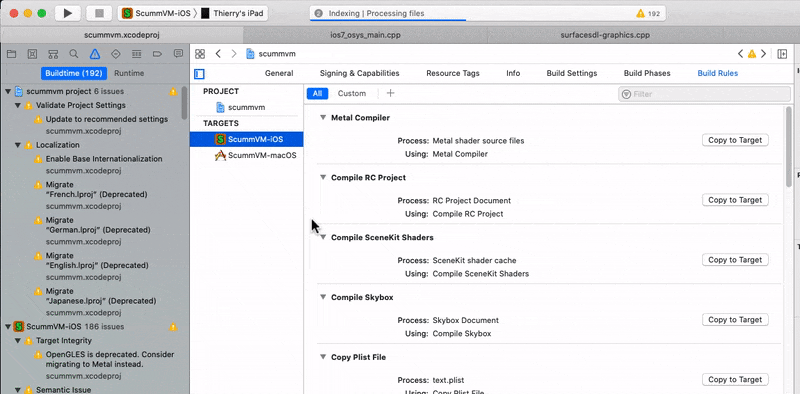
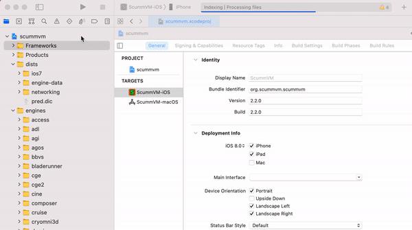
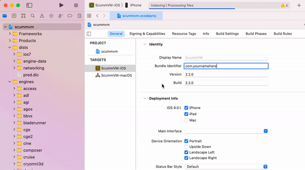

==========================
Build instructions for iOS
==========================

This page contains all the information you need to build and install ScummVM on your iOS device. While a basic knowledge of the command line would be useful, the following instructions, if followed carefully, can be completed by anyone.

What you'll need
^^^^^^^^^^^^^^^^^^^^

- A Mac computer with Xcode installed. Xcode is a free App, available from the Mac App Store.
- An Apple Developer account. You can sign up for a free account on the `Apple Developer Member Center <https://developer.apple.com/membercenter/>`_ with your Apple ID.
- The ScummVM `iOS Libraries <https://downloads.scummvm.org/frs/build/scummvm-ios7-libs-v3.zip>`_ downloaded, and the zip file extracted.

.. note::

    If you have a free Apple developer account, each build will only be valid for 7 days, which means you will need to repeat these steps and rebuild ScummVM every week.

Step 1: Setting up the Xcode project
^^^^^^^^^^^^^^^^^^^^^^^^^^^^^^^^^^^^^^^

The first step is to download the repository containing the code required to build the app. The next steps require use of the command line. Go to **Applications > Utilities > Terminal** and copy and paste the following, then press :kbd:`return`. This downloads (clones) the source code into your Home directory, into a folder called ``scummvm``:

.. code-block:: bash

    git clone --depth 1 -b branch-2-9 https://github.com/scummvm/scummvm.git

.. tip::

    To view the Home directory in the Finder, select **Go > Home** in the menu bar, or press :kbd:`command+shift+H`.

If you haven't done so before now, open Xcode from the Applications folder, and accept the End User License Agreement. Starting Xcode for the first time also installs the command line tools required.

Create a new directory called ``build`` at the same level as the repository you just cloned, using either the Finder, or the command line as follows:

.. code-block::

    mkdir build

Move the contents of the ``scummvm-ios7-libs-v3`` folder you extracted earlier into the ``build`` directory, using either the Finder, or the command line as follows:

.. code-block::

    mv ~/Downloads/frameworks ~/build/

If your downloaded iOS library folder is not in the Downloads folder as it is in the preceding example, change the path to where the folder actually is.

Now let's change the present working directory and then set up the tools required to create the Xcode project:

.. code-block:: bash

    cd scummvm/devtools/create_project/xcode
    xcodebuild

Step 2: Generating the Xcode project
^^^^^^^^^^^^^^^^^^^^^^^^^^^^^^^^^^^^^^^^^^

Change your present working directory to the ``build`` directory:

.. code-block::

    cd ~/build

It's time to generate the Xcode project. Run the following on the command line:

.. code::

    ../scummvm/devtools/create_project/xcode/build/Release/create_project ../scummvm --xcode --use-xcframework --enable-faad --enable-fluidsynth --enable-gif --enable-mikmod --enable-mpeg2 --enable-vpx --disable-nasm --disable-taskbar --disable-tts

The resulting directory structure looks like this:

.. code-block:: bash

    Home
     |--scummvm
     '--build
         |-- frameworks
         |-- engines
         '-- scummvm.xcodeproj

Open the ``scummvm.xcodeproj`` file from the Finder, or from the command line:

.. code-block:: bash

    open scummvm.xcodeproj

Step 3: Building the ScummVM app
^^^^^^^^^^^^^^^^^^^^^^^^^^^^^^^^^^

When Xcode is open, connect a device to install ScummVM onto. At the top of the window, select **ScummVM-iOS** and then select the device you just connected. You will need to "Trust" the device for it to show up on the list of connected devices.

.. figure:: ../images/ios/choose_device.gif

You may need to disable bitcode generation in the build settings. This should already be disabled by default when you make a build specifically for your device, but it is enabled by default when you build for a ''Generic iOS Device''.

Unless you want to debug issues with ScummVM on iOS, you probably want to compile ScummVM in release mode to get better performances when playing games.

The last step before building ScummVM is to change the bundle identifier and manage signing. Click on the **scummvm** project in the left pane, and then click on **ScummVM - iOS** under **TARGETS**. On the menu bar above, click on **General**. Under **Identity** there is a field labeled **Bundle Identifier**. Enter a unique identifier in reverse-DNS format. This can be as simple as com.\ *yournamehere*.

Next to **General**, click on **Signing & Capabilities**. Under **Signing**, tick the **Automatically manage signing** box, and select your developer account from the **Team** dropdown menu.

If you have not added your developer account to Xcode, do this now. Click **Add an Account** in the dropdown menu.

In the upper left-hand corner, press the play button to build ScummVM.

.. note::

  Starting with iOS 16, you may get an error message here if you haven't `enabled Developer Mode <https://developer.apple.com/documentation/xcode/enabling-developer-mode-on-a-device>`_ on your iOS device. This can be done with the **Settings > Privacy & Security > Developer Mode** switch, which will restart your device and reduce its security level.

  If you can't see this option, unplug and plug your device again, and make sure that it's visible to Xcode.

When the build is finished, ScummVM launches on your connected device.

.. note::

  If ScummVM does not launch and you get an error message advising that the app failed to launch due to an invalid code signature, inadequate entitlements or because its profile has not been explicitly trusted by the user, you need to trust the apps that you have built. On your iOS device, go to:

  - **Settings > General > Device Management > Developer App > Trust "Apple Development:yourAppleIDhere" > Trust**
  - or **Settings > General > VPN & Device Management** (iOS 15+)

Using ScummVM
==============

See the See the :doc:`ios` page.
