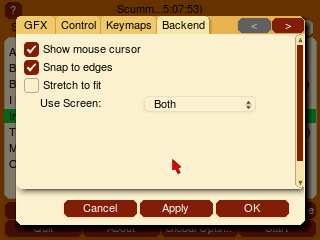

=============================
Nintendo 3DS
=============================

This page contains all the information you need to get ScummVM up and running on a Nintendo 3DS.

What you'll need
===================

- A Nintendo 3DS with a Homebrew Launcher or custom firmware. How to enable homebrew is outside the scope of this documentation.

Installing ScummVM
======================================

Download the Nintendo 3DS package from the `ScummVM Downloads page <https://www.scummvm.org/downloads/>`_. Extract the archive.

There are two ways to install ScummVM: using the 3DSX format, or the CIA format.

Using the 3DSX format
***********************
Copy the extracted files to your SD card into the ``/3ds/scummvm`` directory.

Launch ScummVM using the Homebrew Launcher.

Using the CIA format
***********************

Use any CIA installation software to install the ``scummvm.cia`` file.

The CIA format requires a DSP binary dump saved on your SD card as ``/3ds/dspfirm.cdc``. This is not an optional step, because without this you will not have proper audio support. Documenting this process is outside the scope of this documentation.

Transferring game files
========================

Transfer game folders onto the SD card. The exact location is not important.

ScummVM for the Nintendo 3DS also has cloud functionality. See :doc:`../use_scummvm/connect_cloud`.

See :doc:`../use_scummvm/game_files` for more information about game file requirements.

Controls
=============

Default control mapping
****************************

Controls can also be manually configured in the :doc:`Keymaps tab <../settings/keymaps>`. See the :doc:`../use_scummvm/keyboard_shortcuts` page for common keyboard shortcuts.

.. csv-table::
    :widths: 50 50
    :header-rows: 1
    :class: controls

    Game Controller Mapping:,
    Button,Action
    Circle Pad,Moves the cursor
    R + Circle Pad,Slow Mouse
    Ⓐ,Left mouse button
    Ⓑ,Right mouse button
    Ⓧ,Period (.)
    Ⓨ,Escape
    Control Pad,Keypad cursor keys
    L Button,Toggles magnify mode on/off
    R Button,Toggles between hover/drag modes
    START,Opens global main menu
    SELECT,Opens the virtual keyboard

.. _hover:

Hover mode
************

When using the touchscreen, hover mode simulates the movement of the mouse. You can click with taps, however you can't drag or hold down a mouse button unless you use the buttons mapped to the right/left mouse buttons.

Drag mode
**************

Simulates the click and release of the mouse buttons every time you touch and release the touchscreen. At the moment, this is only a left mouse button click.

Magnify mode
****************
Due to the low resolutions of the 3DS screens (400x240 for the top, and 320x240 for the bottom), games that run at a higher resolution will inevitably lose some visual detail from being scaled down. This can result in situations where essential information, such as text, is indiscernable.

Magnify mode increases the scale factor of the top screen back to 1, but the bottom screen remains unchanged. The touchscreen can then be used to change which part of the game display is being magnified. This can be done even in situations where the cursor is disabled, such as during full-motion video segments.

When activating magnify mode, touchscreen controls are automatically switched to :ref:`hover` mode to reduce the risk of the user accidentally inputting a click when changing the magnified area with the stylus. Clicking can still be done as in normal hover mode. Turning off magnify mode will revert controls back to what was used previously. It will also restore the top screen's previous scale factor.

Magnify mode can only be used when the following conditions are met:

- In the Backend tab in the options dialog, the **Use Screen** option is set to **Both**.
- The horizontal and/or vertical in-game resolution is greater than that of the top screen.
- You're playing a game.

Magnify mode cannot be used in the Launcher menu.

Paths
=======

Saved games
*******************

``sdmc:/3ds/scummvm/saves/``

Configuration file
**************************

``sdmc:/3ds/scummvm/scummvm.ini``

Settings
==========

For more information about Settings, see the Settings section of the documentation. Only platform-specific differences are listed here.

Backend-specific options
**************************

    These options are specific to the 3DS port, and can be set in the :doc:`Backend tab <../settings/backend>`.

Show mouse cursor
    Toggles a visible mouse cursor on/off.

Stretch to fit
    Stretches the image to fit the screen

Snap to edges
    The 3DS touch screen has difficulty reaching the very end of the screen. With this option enabled, if you're within a few pixels of the edge the cursor snaps to the edge.

Use Screen:
    Sets whether ScummVM uses the **Top**, **Bottom** or **Both** screens.

Audio
******

Supported audio file formats:

- MP3
- OGG
- FLAC
- Uncompressed audio

Known issues
==============

Some games are not playable due to the slow CPU speed on the 3DS. If there are any games that run really slowly, this is considered a hardware limitation, not a bug.
