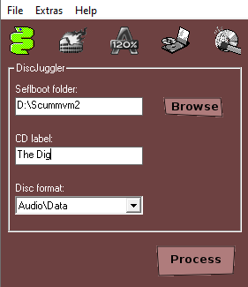

=============================
Sega Dreamcast
=============================

This page contains all the information you need to get ScummVM up and running on a Sega Dreamcast.

What you'll need
=================

- A CD-R disc (80min/700mb).
- A CD-RW drive.
- A computer running Windows. 
- Software to create a bootable disc image, such as `BootDreams <https://dcemulation.org/index.php?title=BootDreams>`_ 
- CD burning software such as Nero Burning ROM, ImgBurn or Alcohol120%.  

Running ScummVM
==================================
There are two ways to get ScummVM running on the Dreamcast:

1. Download the ready-to-go Nero Image and Demos package and burn the extracted ``.nrg`` image to a CD-R using Nero Burning ROM. 
2. Download the Dreamcast plain files package and use the extracted files to create a custom disc image to burn to a CD-R.

Both packages are available from the ScummVM `Downloads page <https://www.scummvm.org/downloads/>`_

Creating a disc from the Dreamcast Nero Image and Demos package
********************************************************************
Use Nero Burning ROM to burn the ``.nrg`` file contained in the package to a CD-R disc. 

Creating a disc from the Dreamcast plain files package
********************************************************
Create a directory on your computer. In this example, the directory is called ``ScummVMDC``.

Copy the downloaded ``SCUMMVM.BIN`` and ``IP.BIN`` files into the ``ScummVMDC`` directory. These are the main boot and engine files required for ScummVM to run.

The ``.PLG`` files in the plain files package are the plugins that are required to run the games. For the best performance, only include the plugins for games you want to play. For example, if you want to play LucasArts games, include ``SCUMM.PLG``. 

In the plain files package there are also ``.DAT`` files. These files might be listed as required Datafiles on the `Datafiles wiki page <https://wiki.scummvm.org/index.php/Datafiles>`_.

Copy the required ``.PLG`` and ``.DAT`` files into the root of the ``ScummVMDC`` directory. 

Next, make a new directory for each game. In this example, all the required Day of the Tentacle data files have been copied into a subdirectory named ``DOTT``. 

Our file structure now looks like this:

::

    ScummVMDC
        |--DOTT
        |    |-- MONSTER.SOU
        |    |-- TENTACLE.000
        |    `-- TENTACLE.001
        |--IP.BIN
        |-- SCUMM.PLG
        `-- SCUMMVM.BIN

The next step is to create a bootable disc image from the ``ScummVMDC`` folder. 

Use Bootdreams to create either a Discjuggler, Nero or Alcohol120% disc image. 

1. Choose the preferred disc image type by clicking on the corresponding icon at the top of the window. 
2. Choose the ``ScummVMDC`` folder as the **Selfboot folder**
3. Enter a title for the disc image in the **CD label** field. 
4. Leave the **Disc format** as **Audio/Data**
5. Click **Process** to create the disc image. 

To burn the resulting image to disc, use any software capable of using those image formats, such as Nero Burning ROM for NRG, Alcohol120% for MDS, and Padus DiscJuggler or ImgBurn for CDI disc images. 

.. tip::

    The image created from the plain files package can also be used with Optical Disc Emulators and similar external hardware.

.. caution::

    Use the lowest possible burning speed for best results; the Dreamcast is an older system and as such can have problems reading discs burned at high speeds.  If available, the 4x speed is ideal. Ensure that you use good quality discs from a reputable manufacturer. If possible, use archival grade discs.  

Transferring game files
========================

Game files can be included on the same CD as the ScummVM binary file, or on a separate disc.

The Dreamcast port does not use the normal ScummVM Launcher. It uses its own custom graphical user interface, which automatically scans the disc for games, and adds the games to a games list through ScummVM's built-in autodetection. 

ScummVM for the Dreamcast supports disc swapping from the GUI. It rescans after a new disc is inserted and repopulates the games list. 

See :doc:`../use_scummvm/game_files` for more information about game file requirements.

Controls
=================

Default control map
*********************

.. csv-table::
    :header-rows: 2

    Game Controller Mapping:,,
    Button,Action,Notes
    Joystick,Moves pointer,
    Directional pad,Moves pointer slowly, Also controls the on-screen keyboard
    Ⓐ,Left Click,
    Ⓑ,Right Click,
    Ⓨ,Spacebar,Pause
    Start,F5,Load and save
    Trigger L,Toggles the virtual keyboard on/off,
    Ⓧ,5,For boxing in Indiana Jones and the Last Crusade
    Ⓧ + Directional pad,"1, 2, 3, 4, 6, 7, 8, 9",For boxing in Indiana Jones and the Last Crusade

The mouse cursor is controlled with the standard Dreamcast controller. The Dreamcast mouse and keyboard peripherals are also supported. 

Paths 
=======

Saved games 
*****************

The Visual Memory Unit (VMU) is used to save and load games. 

Autosave is enabled on the Dreamcast, so each game will use some memory blocks (between 2 and 13) for the autosave in save slot 0.

When a game is saved, the VMU beeps, and a prompt is displayed on the screen to let you know that the game has been saved.

Games are saved and loaded through the built-in game menus. 

Configuration file 
*********************

ScummVM for the Dreamcast does not use a configuration file. 

Settings
==========

There is no way to change ScummVM settings on the Dreamcast.

Known issues
==============

- The Dreamcast has no external storage medium, and only has 16MB of RAM. As such, the Dreamcast port of ScummVM does not support The Curse of Monkey Island or the Dig. The resources required for these games are too great for the Dreamcast to handle. Full Throttle is not completable. 

- There is currently no way to manually add games to the games list. The autodetect feature usually works well, but sometimes games will show up on the list twice, incorrect games will show up with the correct game, and, quite rarely, the game will not show up on the list at all. 

- Some games, for example SPY Fox 1: Dry Cereal, use filenames which are incompatible with the ISO 9660 filesystem standard. The Dreamcast port does not support filename extensions like RockRidge or Joliet, so the CD mastering software needs to be instructed not to change the filenames to comply to ISO 9660, or the engine will not be able to open the files.

