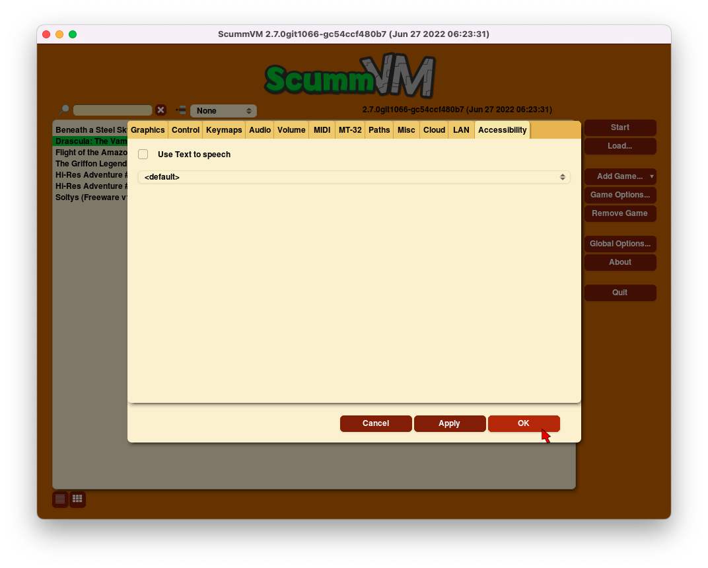

=================
Accessibility
=================

Use the Accessibility tab to change accessibility settings. 

From the Launcher, select **Options**, click the **>** scroll arrow until the LAN tab is visible, and then select the **LAN** tab.

	The Accessibility tab in the global settings. 

All settings can also be changed in the :doc:`../advanced_topics/configuration_file`. The configuration key is listed in italics after each setting description. 

,,,,,,,,,,,,,,,,,,,,,,,,,,

.. _ttsenabled:

Use Text to Speech
	Enables text to speech. As the pointer is held over any text field in the Launcher it is converted to speech. Use the dropdown list to choose from a variety of voices. 

	*tts_enabled* 

