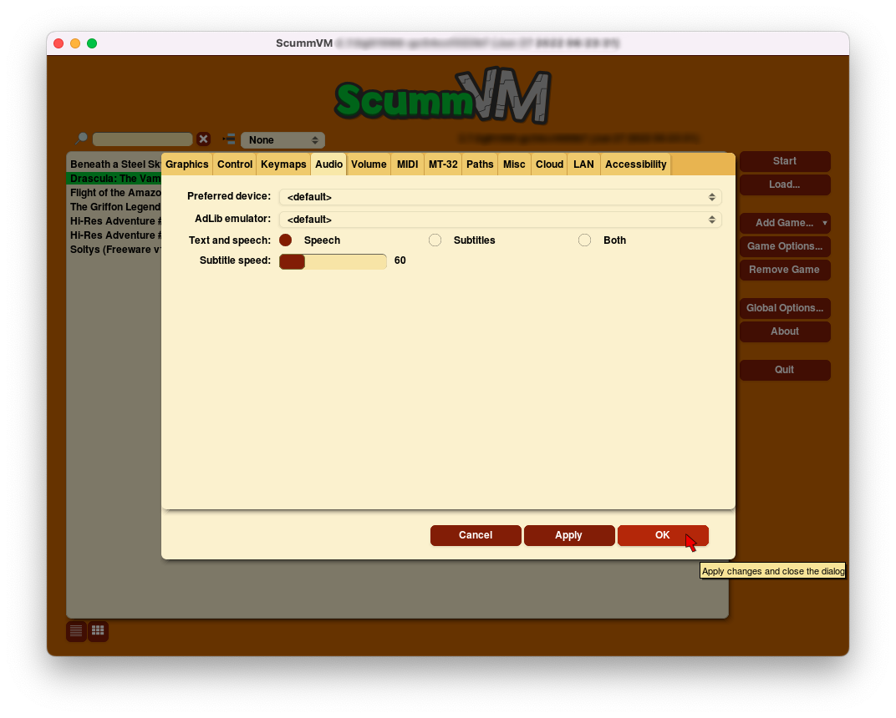
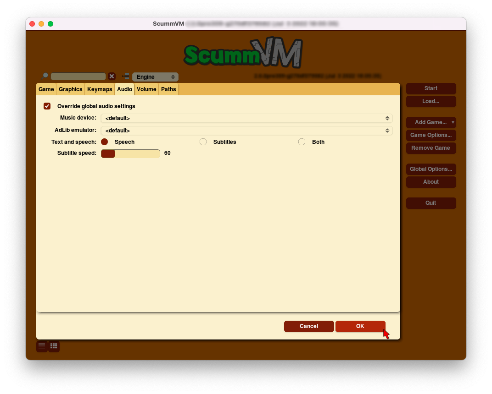
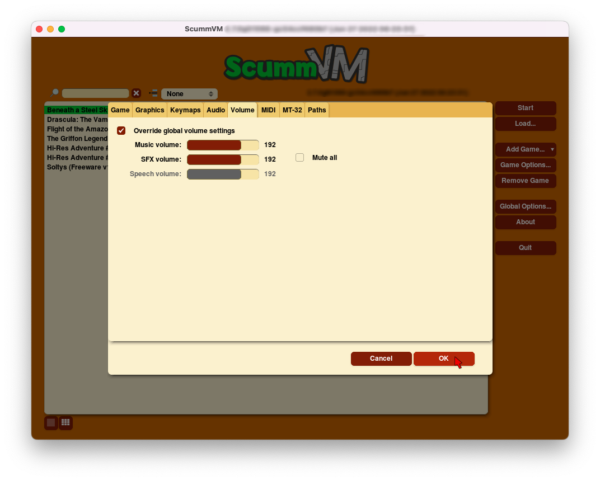

===============
Audio
===============

Audio settings are found on four tabs:

:ref:`Audio <audiotab>` | :ref:`Volume <volumetab>` | :ref:`MIDI <miditab>` | :ref:`MT-32 <mt32tab>` 

**To change settings globally:**
 
 	From the Launcher, select **Options**, then select the applicable tab. 
	 
**To change settings for a specific game:**
	
	From the Launcher, highlight the game in the games list, select **Edit Game**, and then select the applicable tab. 

For a comprehensive look at how to use ScummVM's extensive audio settings, check out our :doc:`../advanced_topics/understand_audio` guide. 

All settings can also be changed in the :doc:`../advanced_topics/configuration_file`. The configuration key is listed in italics after each setting description. 

.. _audiotab:

The Audio tab 
-----------------

Use the Audio tab to change the sound output for games.

    The Audio tab in the global settings

    The Audio tab in the game-specific settings.

,,,,,,,,,,,,,,,,

.. _device:

Preferred device (global settings) or Music device (game-specific settings)
	Specifies the device ScummVM uses to output audio. When set to **<default>**, ScummVM automatically chooses the most appropriate option for the played game. If set to an MT-32 or a MIDI device, or if ScummVM chooses one of these automatically, the settings on the MT-32 or MIDI tabs also apply.

	*music_driver* 

.. _opl:

AdLib Emulator 
	Chooses which emulator is used by ScummVM when the AdLib emulator is chosen as the **Preferred device**.

	*opl_driver* 

.. _speechmute:

Text and Speech
	For games with digitized speech, this setting lets the user decide whether to play the game with speech only, subtitles only, or both. 

	*speech_mute* 

	*subtitles* 

.. _talkspeed:

Subtitle speed
	Adjusts the length of time that the subtitles are displayed on screen. The lower the speed is set, the longer the subtitles are displayed.

	*talkspeed* 

,,,,,,,,,,,,,,,,,,,,,,,,,,,

.. _volumetab:

The Volume tab
-----------------

Use the Volume tab to set the relative volumes for various in-game sounds.

    The Volume tab in the game-specific settings.

,,,,,,,,,,,,,

.. _music:

Music volume
	Adjusts the volume of the music in the game. 

	*music_volume* 

.. _sfx:

SFX volume
	Adjusts the volume of the sound effects in the game.

	*sfx_volume* 

.. _speechvol:

Speech volume
	Adjusts the volume of the digitized speech in the game, if it has any.

	*speech_volume* 

.. _mute:

Mute All
	Mutes all game audio. 

	*mute* 

,,,,,,,,,,,,,,,,,,

.. _miditab:

The MIDI tab 
------------------------------

Use the MIDI tab to change the settings of General MIDI (GM) devices. 

    The MIDI tab in the global settings.

,,,,,,,,,,,,,

.. _gm:

GM Device
	Specifies a preferred General MIDI device, which ScummVM uses if the **Preferred device** is set to **<default>** and General MIDI playback is required.   

	*gm_device* 

.. _soundfont:

Soundfont
	Specifies the path to a soundfont file, if this is required by the GM device. 

	*soundfont* 

.. _multi:

Mixed AdLib/MIDI mode
	Combines MIDI music with AdLib sound effects. 

	*multi_midi* 

.. _gain:

MIDI gain
	Adjusts the relative volume of the MIDI music. This is only supported by some music devices.
	 
	*midi_gain* 

.. _fluid:

FluidSynth 
****************

Opens a new dialog, with three further tabs:
:ref:`fsreverb` | `Chorus`_ | `Misc`_

    The FluidSynth dialog, reached from the MIDI tab.

.. _fsreverb:

Reverb
^^^^^^^^^^^^^^^^^

Reverberation, or reverb, describes the pattern of echoes and reflections that occur when a sound is heard in an enclosed closed space, such as a room or a concert hall. 

.. _revact:

Active
	If ticked, reverb is added to the software synthesizer output. 

	*fluidsynth_reverb_activate* 

.. _revroom:

Room
	Sets the room size, which determines how much reverb there is. 

	*fluidsynth_reverb_roomsize* 

.. _revdamp:

Damp
	Dampens higher-frequency reverb, which produces a warmer sound. 

	*fluidsynth_reverb_damping* 

.. _revwidth:

Width
	Sets the stereo spread of the reverb signal. 

	*fluidsynth_reverb_width* 

.. _revlevel:

Level	
	Sets the reverb output amplitude. 

	*fluidsynth_reverb_level*

,,,,,,,,,,,,,,,,,

_`Chorus`
^^^^^^^^^^^
The chorus effect thickens and colors the audio signal so that it sounds as if there are a chorus of instruments playing one part. 

.. _chact:

Active	
	If ticked, chorus effects are added to the software synthesizer output. 

	*fluidsynth_chorus_activate* 

.. _chnr:

N
	Sets the voice count of the chorus, in other words, how many instruments are playing one part.

	*fluidsynth_chorus_nr* 

.. _chlevel:

Level
	Specifies the output amplitude of the chorus signal.

	*fluidsynth_chorus_level* 

.. _chspeed:

Speed
	Sets the modulation speed of the output, in Hz.

	*fluidsynth_chorus_speed* 

.. _chdepth:

Depth
	Specifies the modulation depth of the chorus.

	*fluidsynth_chorus_depth* 

.. _chwave:

Type
	Specifies the chorus modulation waveform type. 

	*fluidsynth_chorus_waveform* 

,,,,,,,,,,,,,

_`Misc`
^^^^^^^^^^^^^^
.. _interp:

Interpolation
	Sets the interpolation method used by the software synthesizer. 

	*fluidsynth_misc_interpolation* 

,,,,,,,,,,,,,,,

.. _mt32tab:

The MT-32 tab 
-----------------

Use the MT-32 tab to change the settings of Roland MT-32 devices.

    The MT-32 tab in the global settings.

,,,,,,,,,,,,,

.. _mt32:

MT-32 Device
	Specifies a preferred MT-32 device, which ScummVM uses if the **Preferred device** is set to **<default>** and MT-32 playback is required. 

	*mt32_device*

.. _nativemt32:

**True Roland MT-32 (disable GM emulation)**
	Tells ScummVM that the MIDI device is an actual Roland MT-32, LAPC-I, CM-64, CM-32L, CM-500 or other MT-32 device. Note that this cannot be used in conjuntion with the Roland GS device option. 

	*native_mt32*

.. _gs:

**Roland GS device (enable MT-32 mappings)**
	Tells ScummVM that the MIDI device is a GS device that has an MT-32 map, such as an SC-55, SC-88 or SC-8820. Note that this cannot be used in conjunction with the True Roland MT-32 option. 

	*enable_gs*

	

