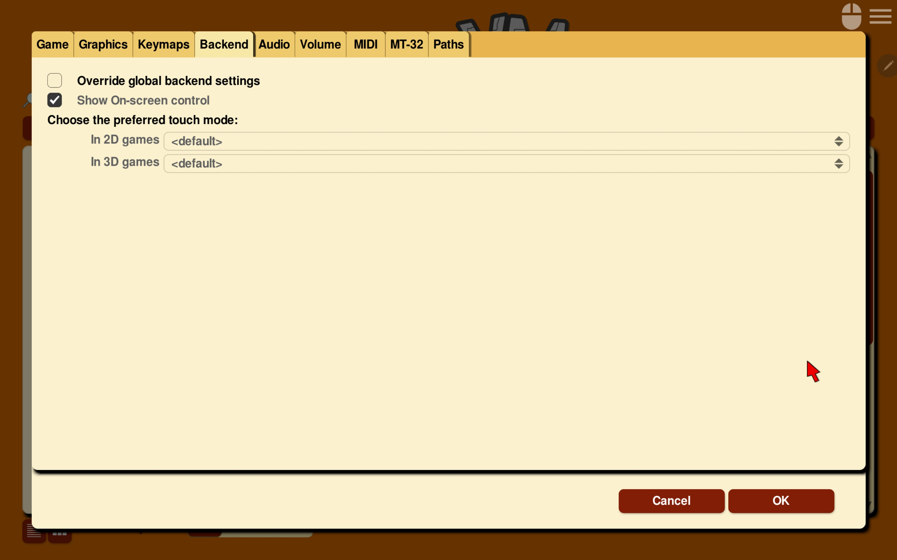

=====================
Backend
=====================

Use the Backend tab to change settings that are unique to the platform being used. This tab is not available for all platforms.

**To change settings globally:**

    From the Launcher, select **Global Options**, then select the **Backend** tab.

**To change settings for a specific game:**

    From the Launcher, highlight the game in the games list, and select the **Game Options** button. If the Launcher is in grid view, select the game and then select the gear icon in the popup window. Select the **Backend** tab.

    The Android Backend tab in the Global Options menu

For a comprehensive look at how to use these settings, check out the individual platform guides.

