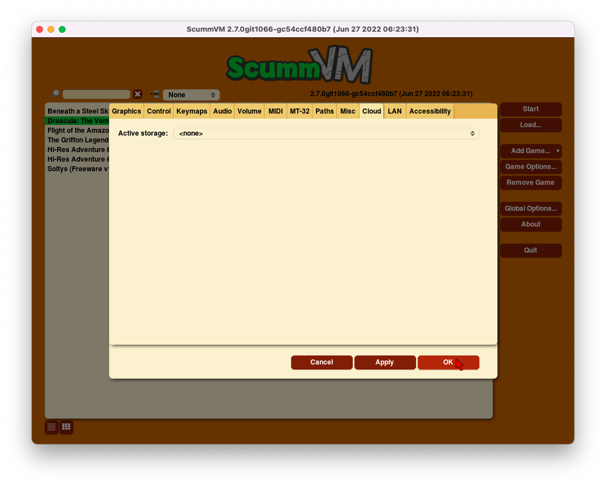

================
Cloud
================

Use the Cloud tab to manage connected cloud storage services.

For a comprehensive look at how to use ScummVM's built-in cloud functionality, check out our :doc:`../use_scummvm/connect_cloud` guide. 

From the Launcher, select **Options**, click the **>** scroll arrow until the Cloud tab is visible, and then select the **Cloud** tab.

    The Cloud tab in the global settings

,,,,,,,,,,,,,,,,,,,,,

Active storage
	Choose from Dropbox, OneDrive, Google Drive, or Box. 

After a Cloud service has been selected, further options are available:

Sync Now
	Manually syncs saved games with the cloud service. Saved games automatically sync on launch, after saving, and on game load. 

Download game files
	Downloads game files from your Cloud ScummVM folder.

Disconnect
	Disconnects the cloud storage account. To change accounts, disconnect and connect a new account. 

.. note::

    Cloud functionality is not supported on all platforms. 

