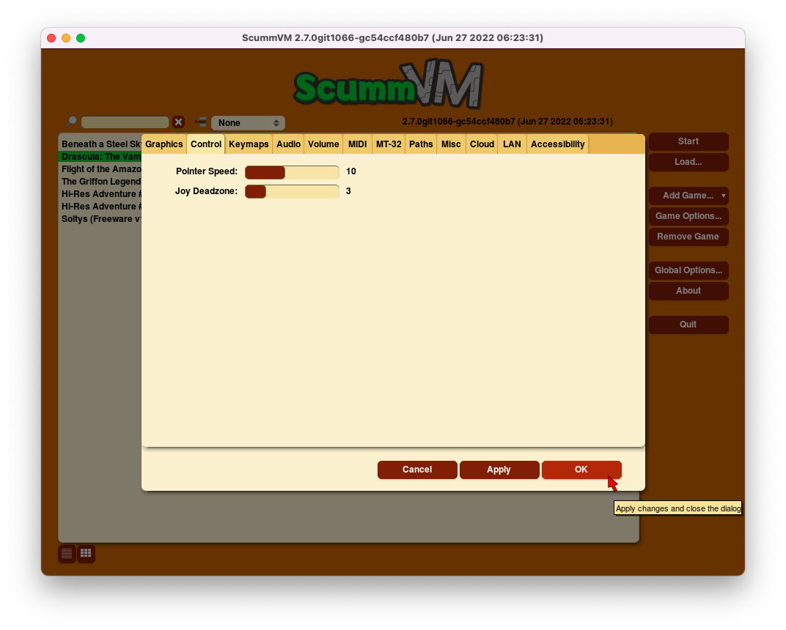

=================
Control
=================

Use the Control tab to change aspects of joystick controls. This tab is only available when a joystick or game controller is connected, or for certain touch screen enabled platforms. 

From the Launcher, select **Options**, and then select the **Control** tab.

    The Control tab in the global settings

,,,,,,,,,,,,,,

.. _mousespeed:

Pointer Speed	
	Sets the speed for the mouse pointer, when it is controlled by the keyboard or a joystick. 

	*kbdmouse_speed*

.. _deadzone:

Joy deadzone
	Sets the deadzone for an analog joystick. A lower value will reduce the size of the deadzone.

	*joystick_deadzone*

Show on-screen control
	Toggles the small on-screen keyboard icon on and off.

Touchpad mouse mode
	Toggles between direct mode and touchpad mode. 