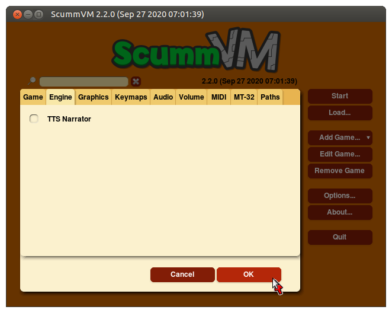

=====================
Engine
=====================

Use the Engine tab to change settings that are unique to the game being played. 

From the Launcher, highlight a game on the games list, select **Edit Game**, and then select the **Engine** tab. This tab is not available for all games. 

To find out which engine powers your game, have a look at the ScummVM Supported Games `wiki page
<https://wiki.scummvm.org/index.php?title=Category:Supported_Games>`_. 

Engines: ADL_ | AGI_ | BLADERUNNER_ | CGE_ | CINE_ | DRASCULA_ | DREAMWEB_ | HDB_ | HOPKINS_ | KYRA_ | LURE_ | MADS_ | NEVERHOOD_ | SCI_ | SCUMM_ | SHERLOCK_ | SKY_ | SUPERNOVA_ | TOLTECS_ | WINTERMUTE_ | XEEN_ |

    The Engine tab in the game-specific settings

All settings can also be changed in the :doc:`../advanced_topics/configuration_file`. The configuration key is listed in italics after each setting description. 

,,,,,,,,,,,,,,,,,,,,

.. _ADL:

ADL
*****

.. _ntsc:

TV emulation
	Emulates the composite output to an NTSC TV.

	*ntsc* 

.. _color:

Color Graphics
	Uses color graphics instead of monochrome graphics.

	*color* 

.. _scan:

Show scanlines
	Darkens every other scanline to mimic the look of a CRT display.

	*scanlines* 

.. _mono:

Always use sharp monochrome text
	Does not emulate NTSC artifacts for text.

	*monotext* 

,,,,,,,,,

.. _AGI:

AGI
*****

.. _osl:

Use original save/load screens
	Uses the original save/load screens instead of the ScummVM screens. 

	*originalsaveload* 

.. _altamiga:

Use an alternative palette
	Uses an alternative palette, common to all Amiga games.

	*altamigapalette* 

.. _support:

Mouse support
	Enables mouse support for movement and in game menus.

	*mousesupport* 

.. _herc:

Use Hercules hires font
	Uses the Hercules hi-resolution font, when the font file is available.

	*herculesfont*

.. _cmd:

Pause when entering commands
	Shows a command prompt window and pauses the game, instead of a real-time prompt.

	*commandpromptwindow* 

.. _2gs:

Add speed menu
	Adds a game speed menu, similar to the PC version.

	*apple2gs_speedmenu* 

,,,,,,	

.. _BLADERUNNER:

BLADERUNNER
******************

.. _sitcom:

Sitcom mode
	Adds laughter after the actor's line or narration.

	*sitcom* 

.. _shorty:

Shorty mode
	Shrinks the actors and makes their voices high pitched.

	*shorty* 

.. _nodelay:

Frame limiter high performance mode
	Avoids use of ``delayMillis()`` function. This mode might result in high CPU usage.

	*nodelaymillisfl* 

.. _fpsfl:

Max frames per second limit
	Targets a maximum of 120 frames per second (fps). When disabled, the game targets 60 fps.

	*frames_per_secondfl* 

.. _stamina:

Disable McCoy's quick stamina drain
	When running, McCoy won't start slowing down as soon as the player stops clicking the mouse.

	*disable_stamina_drain* 

,,,,,,,,

.. _CGE:

CGE
*******

.. _blind:

Color Blind Mode
	Enables Color Blind Mode by default.

	*enable_color_blind* 

,,,,,,

.. _CINE:

CINE
*********

Use original save/load screen
	Uses the original save/load screens instead of the ScummVM screens. 

	*originalsaveload* 

.. _transparentdialog:

Use transparent dialog boxes in 16 color scenes
	Uses transparent dialog boxes in 16 color scenes even if the original game version did not support them.

	*transparentdialogboxes* 

,,,,,,,,,

.. _DRASCULA:

DRASCULA
*************

Use original save/load screens
	Uses the original save/load screens instead of the ScummVM screens. 

	*originalsaveload* 

,,,,,,,,,,

.. _DREAMWEB:

DREAMWEB
**********

Use original save/load screens
	Uses the original save/load screens instead of the ScummVM screens. 

	*originalsaveload* 

.. _bright:

Use bright palette mode
	Displays graphics using the game's bright palette.

	*bright_palette* 

,,,,,,,,,,

.. _HDB:

HDB
**********

.. _hyper:

Enable cheat mode
	Enables debug info and level selection.

	*hypercheat* 

,,,,,,,,,,

.. _HOPKINS:

HOPKINS
*************

.. _gore:

Gore Mode
	Enables Gore Mode when available.

	*enable_gore* 

,,,,,,,,,,

.. _KYRA:

KYRA
********

.. _studio:

Enable studio audience
	Studio audience adds an applause and cheering sounds whenever Malcolm makes a joke.

	*studio_audience* 

.. _skipsupport:

Skip support
	Lets the user skip text and cutscenes.

	*skip_support* 

.. _helium:

Enable helium mode
	Makes characters sound like they inhaled Helium.

	*helium_mode* 

.. _smooth:

Enable smooth scrolling when walking
	Makes scrolling smoother when changing from one screen to another.

	*smooth_scrolling* 

.. _floating:

Enable floating cursors
	Changes the cursor when it floats to the edge of the screen to a directional arrow. Click to walk in that direction.

	*floating_cursors* 

Suggest save names
	Fills in an autogenerated save game description into the input prompt.

	*auto_savenames* 
	
.. _hp:

HP bar graphs
	Enables hit point bar graphs.

	*hpbargraphs* 

.. _btswap:

Fight Button L/R Swap
	Swaps the buttons so that the left button attacks, and the right button picks up items.

	*mousebtswap* 

,,,,,,,,,,

.. _LURE:

LURE
******

.. _ttsnarrator:

TTS Narrator
	Uses text-to-speech to read the descriptions, if text-to-speech is available.

	*tts_narrator* 

,,,,,,,,,,

.. _MADS:

MADS
*******

.. _easy:

Easy mouse interface
	Shows object names when the mouse pointer is held over the object. 

	*EasyMouse* 

.. _objanimated:

Animated inventory items
	Animates the inventory items.

	*InvObjectsAnimated* 

.. _windowanimated:

Animated game interface
	Animates the game interface.

	*TextWindowAnimated* 

.. _naughty:

Naughty game mode
	Enables naughty game mode.

	*NaughtyMode* 

.. _gdither:

Graphics dithering
	Enables graphics dithering.

	*GraphicsDithering* 

,,,,,,,,,,

.. _NEVERHOOD:

NEVERHOOD
************

Use original save/load screens
	Uses the original save/load screens instead of the ScummVM screens. 

	*originalsaveload* 

.. _skiphall:

Skip the Hall of Records storyboard scenes
	Lets the player skip past the Hall of Records storyboard scenes.

	*skiphallofrecordsscenes* 

.. _scale:

Scale the making of videos to full screen
	Scales the making-of videos, so that they use the whole screen.

	*scalemakingofvideos* 

,,,,,,,,,,

.. _QUEEN:

QUEEN
*****

Alternate intro
	Plays the alternate intro for Flight of the Amazon Queen.
	
	*alt_intro* 

,,,,,,,,,,,,,,,

.. _SCI:

SCI
******

.. _dither:

Skip EGA dithering pass (full color backgrounds)
	Skips dithering pass in EGA games. Graphics are shown with full colors.

	*disable_dithering* 

.. _hires:

Enable high resolution graphics
	Enables high resolution graphics and content. 

	*enable_high_resolution_graphics* 

.. _blackline:

Enable black-lined video
	Draws black lines over videos to increase their apparent sharpness.

	*enable_black_lined_video* 

.. _hq:

Use high-quality video scaling
	Uses linear interpolation when upscaling videos, where possible.

	*enable_hq_video* 

.. _larry:

Use high-quality "LarryScale" cel scaling
	Uses special cartoon scaler for drawing character sprites.

	*enable_larryscale*

.. _dsfx:

Prefer digital sound effects
	Prefers digital (sampled) sound effects instead of synthesized ones.

	*prefer_digitalsfx*

Use original save/load screens
	Uses the original save/load screens instead of the ScummVM screens. 

	*originalsaveload* 

.. _fb01:

Use IMF/Yamaha FB-01 for MIDI output
	Uses an IBM Music Feature card or a Yamaha FB-01 FM synth module for MIDI output.

	*native_fb01* 

.. _cd:

Use CD audio
	Uses CD audio instead of in-game audio, if available.

	*use_cdaudio* 

.. _wincursors:

Use Windows cursors
	Uses the Windows cursor (smaller and monochrome) instead of the DOS cursor. 

	*windows_cursors* 

.. _silver:

Use silver cursors
	Uses the alternate set of silver cursors instead of the normal golden cursors. 

	*silver_cursors* 

.. _upscale:

Upscale videos
	Upscales videos to double their size

	*enable_video_upscale* 

.. _censor:

Enable content censoring	
	Enables the game's built-in optional content censoring.

	*enable_censoring* 

,,,,,,,,,,

.. _SCUMM:

SCUMM
************

.. _labels:

Show Object Line
	Show the names of objects at the bottom of the screen.

	*object_labels* 

.. _classic:

Use NES Classic Palette
	Uses a more neutral color palette that closely emulates the NES Classic.

	*mm_nes_classic_palette* 

,,,,,,,,,,

.. _SHERLOCK:

SHERLOCK
*********

Use original load/save screens
	Uses the original save/load screens instead of the ScummVM screens.
	
	*originalsaveload* 

.. _fade:

Pixellated scene transitions
	Enables randomized pixel transitions between scenes. 

	*fade_style* 

.. _help:

Don't show hotspots when moving mouse
	Only shows hotspot names after you click on a hotspot or action button.

	*help_style* 

.. _portraits:

Show character portraits
	Shows portraits of the characters when the characters converse.

	*portraits_on* 

.. _style:

Slide dialogs into view
	Slides UI dialogs into view.

	*window_style* 

.. _transparentwindows:

Transparent windows
	Shows windows with a partially transparent background.

	*transparent_windows* 

TTS Narrator
	Uses text-to-speech to read the descriptions, if text-to-speech is available.

	*tts_narrator*
	
,,,,,,,,,,

.. _SKY:

SKY
******

.. _altintro:

Floppy intro
	Uses the floppy version's intro (CD version only)

	*alt_intro*

,,,,,,,,,,

.. _SUPERNOVA:

SUPERNOVA
**********

.. _improved:

Improved mode
	Removes some repetitive actions, and adds the possibility to change verbs by keyboard.

	*improved* 

,,,,,,,,,,

.. _TOLTECS:

TOLTECS
**************

Use original save/load screens
	Uses the original save/load screens instead of the ScummVM screens. 

	*originalsaveload* 
	
,,,,,,,,,,

.. _WINTERMUTE:

WINTERMUTE
**************

.. _fps:

Show FPS-counter
	Shows the current number of frames per second in the upper left corner.

	*show_fps* 

.. _bilinear:

Sprite bilinear filtering (SLOW)
	Applies bilinear filtering to individual sprites.

	*bilinear_filtering* 

,,,,,,,,,,

.. _XEEN:

XEEN
******

.. _cost:

Show item costs in standard inventory mode
	Shows item costs in standard inventory mode, which lets the value of items be compared.

	*ShowItemCosts* 

.. _durable:

More durable armor
	Armor won't break until character is at -80HP, instead of the default -10HP.

	*DurableArmor* 

