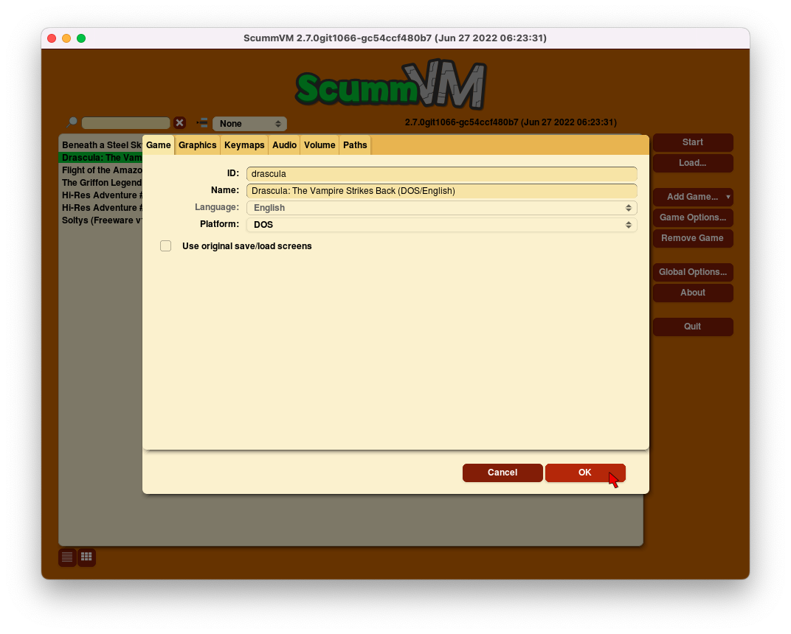

=============
Game
=============

Use the Game tab to display and change information about how the game is
identified by ScummVM.

From the Launcher, highlight the game in the games list, and select the **Game Options** button. If the Launcher is in grid view, select the game and then select the gear icon in the popup window. The menu opens on the **Game** tab. 

    The Game tab in the Game Options menu

All settings can also be changed in the :doc:`../advanced_topics/configuration_file`. The configuration key is listed in italics after each setting description.

,,,,,,,

.. _id:

**ID**
	Shows the short name of the game. Edit this name as required, but use only numbers, letters and hyphens. The ID can also be used for launching the game from the command line.

.. _description:

**Name**
	Shows the full title of the game, as well as some basic information such as original platform and language.

	*description*

.. _lang:

**Language**
	For games that were released with support for multiple languages, this options changes the language of the game. For games that have a single language hardcoded, this option does not change the language of the game, it only affects the subtitles. Select the correct language to ensure that subtitles display correctly, especially for non-English games.

	*language*

.. _platform:

**Platform**
	Specifies the original platform of the game.

	*platform*

,,,,,,

The Game tab also shows settings unique to the game engine for the selected game. 

To find out which engine powers your game, have a look at the ScummVM Supported Games `wiki page
<https://wiki.scummvm.org/index.php?title=Category:Supported_Games>`_ or :ref:`group <group>` games by Engine in the Launcher. 

Engines: ADL_ | AGI_ | AGOS_ | Bladerunner_ | Buried_ | CGE_ | CGE2_ | Chewy_ | Cine_ | Drascula_ | Dreamweb_ | Freescape_ | Griffon_ | GrimE_ | HDB_ | Hopkins_ | Hypno_ | Kyra_ | Lure_ | MADE_ | MADS_ | mTropolis_ | Myst3_ | Nancy_ | Neverhood_ | SCI_ | SCUMM_ | Sherlock_ | Sky_ | Stark_ | Supernova_ | Sword2_ | Sword25_ | Toltecs_ | Trecision_ | Ultima_ | Wintermute_ | Xeen_ | ZVision_ 

,,,,,,,,,,,,,,,,,,,,

.. _ADL:

ADL
*****

.. _ntsc:

TV emulation
	Emulates the composite output to an NTSC TV.

	*ntsc*

.. _color:

Color Graphics
	Uses color graphics instead of monochrome graphics.

	*color*

.. _scan:

Show scanlines
	Darkens every other scanline to mimic the look of a CRT display.

	*scanlines*

.. _mono:

Always use sharp monochrome text
	Does not emulate NTSC artifacts for text.

	*monotext*

,,,,,,,,,

.. _AGI:

AGI
*****

.. _osl:

Use original save/load screens
	Uses the original save/load screens instead of the ScummVM screens.

	*originalsaveload*

.. _altamiga:

Use an alternative palette
	Uses an alternative palette, common to all Amiga games.

	*altamigapalette*

.. _support:

Mouse support
	Enables mouse support for movement and in game menus.

	*mousesupport*

.. _herc:

Use Hercules hires font
	Uses the Hercules hi-resolution font, when the font file is available.

	*herculesfont*

.. _cmd:

Pause when entering commands
	Shows a command prompt window and pauses the game, instead of a real-time prompt.

	*commandpromptwindow*

.. _2gs:

Add speed menu
	Adds a game speed menu, similar to the PC version.

	*apple2gs_speedmenu*

,,,,,,

.. _AGOS:

AGOS
******

.. _opl3mode:

AdLib OPL3 Mode
	OPL3 features are used when AdLib is selected. Depending on the game, this prevents cut-off notes, adds extra notes or instruments, and/or adds stereo.

	*opl3_mode*

.. _dostempo:

Use DOS version music tempos
	Plays music using the tempo of the DOS version of the game (slower than the Windows version)

	*dos_music_tempos*

Use Windows version music tempos	
	Plays music using the tempo of the Windows version of the game (faster than the DOS version)

	*dos_music_tempos*

.. _prefer_digitalsfx:

Prefer digital sound effects	
	Uses digital sound effects instead of synthesized ones. 

	*prefer_digitalsfx*

.. _fadeout:

Disable fade-out effects
	Don't fade every screen to black when leaving a room.

	*disable_fade_effects*

,,,,,,

.. _BLADERUNNER:

Bladerunner
******************

.. _sitcom:

Sitcom mode
	Adds laughter after the actor's line or narration.

	*sitcom*

.. _shorty:

Shorty mode
	Shrinks the actors and makes their voices high pitched.

	*shorty*

.. _nodelay:

Frame limiter high performance mode
	Avoids use of ``delayMillis()`` function. This mode might result in high CPU usage.

	*nodelaymillisfl*

.. _fpsfl:

Max frames per second limit
	Targets a maximum of 120 frames per second (fps). When disabled, the game targets 60 fps.

	*frames_per_secondfl*

.. _stamina:

Disable McCoy's quick stamina drain
	When running, McCoy won't start slowing down as soon as the player stops clicking the mouse.

	*disable_stamina_drain*

.. _crawlsubs:

Show subtitles during text crawl 
	During the intro cutscene, show subtitles during the text crawl.

	*use_crawl_subs*

.. _spanishcredits:

Fix credits for voice actors
	Updates the end credits with corrected credits for the Spanish voice actors.

	*correct_spanish_credits*
	

,,,,,,,,

.. _Buried:

Buried
********

.. _allowskip:

Skip support
	Allows the user to skip cutscenes.

	*skip_support*

,,,,,,,,,,

.. _CGE:

CGE
*********

.. _blind:

Color Blind Mode
	Enables Color Blind Mode by default.

	*enable_color_blind*

.. _tts:

Enable Text to Speech
	Uses TTS to read text in the game, if it is available. 

	*tts_enabled*

,,,,,,

.. _CGE2:

CGE2
******

Color Blind Mode
	Enables Color Blind Mode by default.

	*enable_color_blind*

.. _tts_objects:

Enable Test to Speech for Objects and Options
	Uses TTS to read descriptions, if TTS is available. 

	*tts_enabled_objects*

.. _tts_speech:

Enable Test to Speech for Subtitles
	Uses TTS to read subtitles, if TTS is available. 

	*tts_enabled_speech*

,,,,,,,,,,,

.. _Chewy:

Chewy
*********

.. _originalmenu:

Use original save/load screen
	Uses the original save/load screens instead of the ScummVM screens.

	*original_menus*

,,,,,,,,,,

.. _Cine:

Cine
*********

Use original save/load screen
	Uses the original save/load screens instead of the ScummVM screens.

	*originalsaveload*

.. _transparentdialog:

Use transparent dialog boxes in 16 color scenes
	Uses transparent dialog boxes in 16 color scenes even if the original game version did not support them.

	*transparentdialogboxes*

,,,,,,,,,

.. _Drascula:

Drascula
*************

Use original save/load screens
	Uses the original save/load screens instead of the ScummVM screens.

	*originalsaveload*

,,,,,,,,,,

.. _Dreamweb:

Dreamweb
**********

Use original save/load screens
	Uses the original save/load screens instead of the ScummVM screens.

	*originalsaveload*

.. _bright:

Use bright palette mode
	Displays graphics using the game's bright palette.

	*bright_palette*

Enable Text to Speech for Objects, Options, and the Bible Quote
	Uses TTS to read descriptions (if TTS is available).

	*tts_enabled_objects*

Enable Text to Speech for Subtitles
	Use TTS to read subtitles (if TTS is available)

	*tts_enabled_speech*

,,,,,,,,,,

.. _Freescape:

Freescape
**********

.. _prerecorded:

Prerecorded sounds
	Uses high-quality pre-recorded sounds instead of PC speaker emulation.

	*prerecorded_sounds*

.. _extended:

Extended timer
	Starts the game timer at 99:59:59.

	*extended_timer*

.. _drill:

Automatic drilling
	Allows successful drilling in any area in Driller.

	*automatic_drilling*

.. _demo:

Disable demo mode	
	Ensures demo mode is never activated.

	*disable_demo_mode*

.. _sensors:

Disable sensors
	Ensures sensors do not shoot the player.

	*disable_sensors*

.. _falling:

Disable falling
	Stops player from falling over edges.

	*disable_falling*

,,,,,,,,,

.. _Griffon:

Griffon
***********

Enable Text to Speech
	Uses TTS to read descriptions (if TTS is available)

	*tts_enabled*

,,,,,,,,,,,,,,

.. _GrimE:

GrimE
*****

.. _datausr:

Load user patch (unsupported)
	Loads a user patch. Please note that the ScummVM team doesn't provide support for using such patches.

	*datausr_load*

Show FPS
	Shows the current FPS-rate while playing.

	*show_fps*

,,,,,,,,,,,

.. _Groovie:

Groovie
********
.. _fastmovie:

Fast movie speed
	Plays movies at an increased speed.

	*fast_movie_speed*

Use original save/load screens
	Uses the original save/load screens instead of the ScummVM ones.
	
	*originalsaveload*

.. _ai:

Easier AI
	Decreases the difficulty of AI puzzles.

	*easier_ai*

.. _creditsmusic:

Updated Credits Music
	Play the song The Final Hour during the credits instead of reusing MIDI songs

	*credits_music*

.. _hotspots:

Slim Left/Right Hotspots
	Shrinks the hotspots on the left and right sides for exiting puzzles.

	*slim_hotspots*

.. _speedrun:

Speedrun Mode
	Affects the controls for fast forwarding the game.

	*speedrun_mode*

,,,,,,,,,

.. _HDB:

HDB
**********

.. _hyper:

Enable cheat mode
	Enables debug info and level selection.

	*hypercheat*

,,,,,,,,,,

.. _Hopkins:

Hopkins
*************

.. _gore:

Gore Mode
	Enables Gore Mode when available.

	*enable_gore*

,,,,,,,,,,

.. _Hypno:

Hypno
********
.. _cheats:

Enable original cheats
	Allows cheats by using the C key.

	*cheats*

.. _infH:

Enable infinite health cheat
	Player health will never decrease (except for game over scenes).
	
	*infiniteHealth*

.. _infA:

Enable infinite ammo cheat
	Player ammo will never decrease.

	*infiniteAmmo*

.. _unlock: 

Unlock all levels
	All levels are available to play.

	*unlockAllLevels*

.. _restored:

Enable restored content
	Adds additional content that is not enabled the original implementation.

	*restored*

,,,,,,,,,,,,,

.. _Kyra:

Kyra
********

.. _studio:

Enable studio audience
	Studio audience adds an applause and cheering sounds whenever Malcolm makes a joke.

	*studio_audience*

.. _skipsupport:

Skip support
	Lets the user skip text and cutscenes.

	*skip_support*

.. _helium:

Enable helium mode
	Makes characters sound like they inhaled Helium.

	*helium_mode*

.. _smooth:

Smooth scrolling
	Makes scrolling smoother when walking.

	*smooth_scrolling*

.. _floating:

Enable floating cursors
	Changes the cursor when it floats to the edge of the screen to a directional arrow. Click to walk in that direction.

	*floating_cursors*

.. _autoname:

Suggest save names
	Fills in an autogenerated save game description into the input prompt.

	*auto_savenames*

.. _hp:

HP bar graphs
	Enables hit point bar graphs.

	*hpbargraphs*

.. _btswap:

Fight Button L/R Swap
	Swaps the buttons so that the left button attacks, and the right button picks up items.

	*mousebtswap*

,,,,,,,,,,

.. _Lure:

Lure
******

.. _ttsnarrator:

TTS Narrator
	Uses text-to-speech to read the descriptions, if text-to-speech is available.

	*tts_narrator*

,,,,,,,,,,

.. _MADE:

MADE
******

.. _digitalmusic: 

Play a digital soundtrack during the opening movie
	Uses a digital soundtrack during the introduction, instead of MIDI music. 

	*intro_music_digital*

,,,,,,,,,,

.. _MADS:

MADS
*******

.. _easy:

Easy mouse interface
	Shows object names when the mouse pointer is held over the object.

	*EasyMouse*

.. _objanimated:

Animated inventory items
	Animates the inventory items.

	*InvObjectsAnimated*

.. _windowanimated:

Animated game interface
	Animates the game interface.

	*TextWindowAnimated*

.. _naughty:

Naughty game mode
	Enables naughty game mode.

	*NaughtyMode*

TTS Narrator
	Use TTS to read the descriptions (if TTS is available).

	*tts_narrator*

,,,,,,,,,,

.. _Mohawk:

Mohawk
*********

.. _zip:

Zip Mode activated
	When activated, clicking on an item or area with the lightning bolt cursor takes you directly there, skipping intermediate screens. You can only 'Zip' to a precise area you've already been.

	*zip_mode*

.. _tmode:

Transitions enabled
	Toggle screen transitions on or off. Turning off screen transitions will enable you to navigate more quickly through the game.

	*transition_mode*

.. _flyby:

Play the Myst fly by movie
	The Myst fly by movie was not played by the original engine.

	*playmystflyby*

.. _fuzzy:

Improve Selenitic Age puzzle accessibility
	Allows solving Selenitic Age audio puzzles with more error margin.

	*fuzzy_logic*

.. _cdrom:

Simulate loading times of old CD drives
	Simulate loading times of old CD-ROM drives by adding a random delay during scene transitions.

	*cdromdelay*

.. _water:

Water Effect Enabled
	Toggles the use of QuickTime videos for visual effects related to water surfaces (ripples, waves, etc.).

	*water_effects*

.. _tspeed:

Transitions (Riven only)
	Adjusts the speed of screen transitions. Disabling screen transitions will enable you to navigate more quickly through the game.

	Options:
		- Disabled
		- Fastest
		- Normal
		- Best 

	*transition_mode*

,,,,,,,,

.. _mTropolis:

mTropolis
************

.. _widescreen:

16:9 widescreen mod
	Removes letterboxing and moves some display elements, improving coverage on widescreen displays.

	*mtropolis_mod_obsidian_widescreen*

.. _dynamicmidi:

Improved music mixing
	Enables dynamic MIDI mixer, improving music quality.

	*mtropolis_mod_dynamic_midi*

.. _saveatcheckpoints:

Autosave at progress points
	Automatically saves the game at major progress points.

	*mtropolis_mod_auto_save_at_checkpoints*

.. _shorttransitions:

Enable short transitions
	Plays short transitions that would normally be skipped on fast CPUs.

	*mtropolis_mod_minimum_transition_duration*

.. _sfxsubs:

Enable subtitles for important sound effects
	Enables subtitles for important sound effects.  This may reduce the difficulty of sound recognition puzzles and minigames.

	*mtropolis_mod_sound_gameplay_subtitles*

.. _debugger:

Start with debugger
	Starts the game with the debug overlay active.

	*mtropolis_debug_at_start*

,,,,,,,,,,,,,,

.. _Myst3:

Myst3
*******

.. _widescreen_mod:

Widescreen mod
	Enables widescreen rendering in fullscreen mode.

	*widescreen_mod*
		
,,,,,,,,,,,,,,,,

.. _Nancy:

Nancy
*******

.. _player_speech:

Player Speech
	Enable player speech. Only works if speech is enabled in the Audio settings.
		
	*player_speech*

.. _character_speech:

Character Speech
	Enable NPC speech. Only works if speech is enabled in the Audio settings.
		
	*character_speech*

,,,,,,,,,,,,,,,,

.. _Neverhood:

Neverhood
************

Use original save/load screens
	Uses the original save/load screens instead of the ScummVM screens.

	*originalsaveload*

.. _skiphall:

Skip the Hall of Records storyboard scenes
	Lets the player skip past the Hall of Records storyboard scenes.

	*skiphallofrecordsscenes*

.. _scale:

Scale the making of videos to full screen
	Scales the making-of videos, so that they use the whole screen.

	*scalemakingofvideos*

.. _hint:

Repeat useful Willie's hint
	Repeats actual useful hint by Willie.

	*repeatwilliehint*

,,,,,,,,,,

.. _Queen:

Queen
*******

Alternate intro
	Plays the alternate intro for Flight of the Amazon Queen.

	*alt_intro*

,,,,,,,,,,,,,,,

.. _SCI:

SCI
******

.. _dither:

Skip EGA dithering pass (full color backgrounds)
	Skips dithering pass in EGA games. Graphics are shown with full colors.

	*disable_dithering*

.. _hires:

Enable high resolution graphics
	Enables high resolution graphics and content.

	*enable_high_resolution_graphics*

.. _blackline:

Enable black-lined video
	Draws black lines over videos to increase their apparent sharpness.

	*enable_black_lined_video*

.. _hq:

Use high-quality video scaling
	Uses linear interpolation when upscaling videos, where possible.

	*enable_hq_video*

.. _larry:

Use high-quality "LarryScale" cel scaling
	Uses special cartoon scaler for drawing character sprites.

	*enable_larryscale*

.. _dsfx:

Prefer digital sound effects
	Uses digital (sampled) sound effects instead of synthesized ones.

	*prefer_digitalsfx*

Use original save/load screens
	Uses the original save/load screens instead of the ScummVM screens.

	*originalsaveload*

.. _cd:

Use CD audio
	Uses CD audio instead of in-game audio, if available.

	*use_cdaudio*

.. _wincursors:

Use Windows cursors
	Uses the Windows cursor (smaller and monochrome) instead of the DOS cursor.

	*windows_cursors*

.. _silver:

Use silver cursors
	Uses the alternate set of silver cursors instead of the normal golden cursors.

	*silver_cursors*

.. _upscale:

Upscale videos
	Upscales videos to double their size

	*enable_video_upscale*

.. _censor:

Enable content censoring
	Enables the game's built-in optional content censoring.

	*enable_censoring*

.. _rgb:

Use RGB rendering
	Use RGB rendering to improve screen transitions.

	*rgb_rendering*

.. _palette:

Use per-resource modified palettes
	Use custom per-resource palettes to improve visuals

	*palette_mods*

.. _beard:

Enable bearded musicians
	Enable graphics that were disabled for legal reasons

	*enable_bearded_musicians*

.. _midimode:

MIDI Mode
	When using external MIDI devices, such as through USB-MIDI, select your device here. 

	*midi_mode*

	Options:
		- Standard - GM/MT-32
			- *Standard*
		- Roland D-110/D-10/D-20
			- *D110*
		- YamahaFB01
			- *FB01*

,,,,,,,,,,

.. _SCUMM:

SCUMM
************

.. _labels:

Show Object Line
	Show the names of objects at the bottom of the screen.

	*object_labels*

.. _classic:

Use NES Classic Palette
	Uses a more neutral color palette that closely emulates the NES Classic.

	*mm_nes_classic_palette*

.. _trim: 

Trim FM-TOWNS games to 200 pixels height
	Cuts the extra 40 pixels at the bottom of the screen, to make it standard 200 pixels height, allowing the use of aspect ratio correction.
	*trim_fmtowns_to_200_pixels*

.. _macmusic:

Play simplified music
	This music was presumably intended for low-end Macs, and uses only one channel.

	*mac_v3_low_quality_music*

Enable smooth scrolling
	Uses smooth scrolling instead of the normal 8-pixels steps scrolling.

	*smooth_scroll*

.. _semi:

Allow semi-smooth scrolling
	Allow scrolling to be less smooth during the fast camera movement in the intro

	*semi_smooth_scroll*

.. _enhancements:

Enable game-specific enhancements
	Allow ScummVM to make small enhancements to the game, usually based on other versions of the same game.

	*enable_enhancements*

.. _aoverride:

Load modded audio
	Replaces music, sound effects, and speech clips with modded audio files, if available.

	*audio_override*

.. _originalgui:

Enable the original GUI and Menu
	Allows the game to use the in-engine graphical interface and the original save/load menu.

	*original_gui*

,,,,,,,,,,

.. _Sherlock:

Sherlock
*********

Use original load/save screens
	Uses the original save/load screens instead of the ScummVM screens.

	*originalsaveload*

.. _fade:

Pixellated scene transitions
	Enables randomized pixel transitions between scenes.

	*fade_style*

.. _help:

Don't show hotspots when moving mouse
	Only shows hotspot names after you click on a hotspot or action button.

	*help_style*

.. _portraits:

Show character portraits
	Shows portraits of the characters when the characters converse.

	*portraits_on*

.. _style:

Slide dialogs into view
	Slides UI dialogs into view.

	*window_style*

.. _transparentwindows:

Transparent windows
	Shows windows with a partially transparent background.

	*transparent_windows*

TTS Narrator
	Uses text-to-speech to read the descriptions, if text-to-speech is available.

	*tts_narrator*

,,,,,,,,,,

.. _Sky:

Sky
******

.. _altintro:

Floppy intro
	Uses the floppy version's intro (CD version only)

	*alt_intro*

,,,,,,,,,,

.. _Stark:

Stark
********

.. _assets:

Load modded assets
	Enables loading of external replacement assets.

	*enable_assets_mod*

.. _linearfilter:

Enable linear filtering of the backgrounds images
	When linear filtering is enabled the background graphics are smoother in full screen mode, at the cost of some details.

	*use_linear_filtering*

.. _fontantialias:

Enable font anti-aliasing
	Creates smoother text.

	*enable_font_antialiasing*

,,,,,,,,,,,,

.. _Supernova:

Supernova
**********

.. _improved:

Improved mode
	Removes some repetitive actions, and adds the possibility to change verbs by keyboard.

	*improved*

Enable Text to Speech
	Use TTS to read descriptions (if TTS is available).

	*tts_enabled*

,,,,,,,,,,

.. _Sword2:

Sword2
********

Show object labels
	Shows labels for objects on mouse hover

	*object_labels*

,,,,,,,,,,,

.. _Sword25:

Sword25
**********

.. _english:

Use English speech
	Use English speech instead of German for every language other than German.

	*english_speech*

,,,,,,,,,,,,,

.. _Toltecs:

Toltecs
**************

Use original save/load screens
	Uses the original save/load screens instead of the ScummVM screens.

	*originalsaveload*

,,,,,,,,,,

.. _Trecision:

Trecision
***********

Use original save/load screens
	Use the original save/load screens instead of the ScummVM ones.

	*originalsaveload*

,,,,,,,,,,,,,,

.. _TwinE:

TwineE
*******

.. _wall:

Enable wall collisions
	Enables the original wall collision damage.

	*wallcollision*

.. _debugmode:

Enable debug mode
	Enables the debug mode. 

	*debug*

.. _usecd:

Enable audio CD
	Enables the original audio cd track.

	*usecd*

.. _sound:

Enable sound
	Enable the sound for the game

	*sound*

.. _voice:

Enable voices
	Enable the voices for the game

	*voice*

.. _displaytext:

Enable text
	Enable the text for the game

	*displaytext*

.. _movie:

Enable movies
	Enable the cutscenes for the game.

	*movie*

.. _mouse:

Enable mouse
	Enables the mouse for the UI.

	*mouse*

.. _usa:

Use the USA version
	Enables the USA specific version flags. 

	*version*

.. _highres:

Enable high resolution
	Enables a higher resolution for the game

	*usehighres*

TTS Narrator
	Use TTS to read the descriptions (if TTS is available)

	*tts_narrator*

,,,,,,,,

.. _Ultima:

Ultima
********

Use original save/load screens
	Use the original save/load screens instead of the ScummVM ones.

	*originalsaveload*

.. _frameskip:

Enable frame skipping
	Allow the game to skip animation frames when running too slow.

	*frameSkip*

.. _framelimit:

Enable frame limiting
	Limits the speed of the game to prevent running too fast.

	*frameLimit*

.. _cheat:

Enable cheats
	Allows cheats by commands and a menu when player is clicked.

	*cheat*

Enable high resolution
	Enable a higher resolution for the game

	*usehighres*

.. _footsteps:

Play foot step sounds
	Plays a sound when the player moves.

	*footsteps*

.. _jump:

Enable jump to mouse position
	Jumping while not moving targets the mouse cursor instead of direction.

	*targetedjump*

.. _fontoverride:

Enable font replacement
	Replaces game fonts with rendered fonts

	*font_override*

Enable font anti-aliasing
	Results in smoother text. 

	*font_antialiasing*

.. _silencer:

Camera moves with Silencer
	Camera tracks the player movement rather than snapping to defined positions.

	*camera_on_player*

.. _christmas:

Always enable Christmas easter-egg
	Enables the Christmas music at any time of year.

	*always_christmas*

,,,,,,,

.. _Wintermute:

Wintermute
**************

.. _fps:

Show FPS-counter
	Shows the current number of frames per second in the upper left corner.

	*show_fps*

.. _bilinear:

Sprite bilinear filtering (SLOW)
	Applies bilinear filtering to individual sprites.

	*bilinear_filtering*

.. _2d:

Force to use 2D renderer (2D games only)
	Forces ScummVM to use 2D renderer while running 2D games.

	*force_2d_renderer*

,,,,,,,,,,

.. _Xeen:

Xeen
******

.. _cost:

Show item costs in standard inventory mode
	Shows item costs in standard inventory mode, which lets the value of items be compared.

	*ShowItemCosts*

.. _durable:

More durable armor
	Armor won't break until character is at -80HP, instead of the default -10HP.

	*DurableArmor*

,,,,,,,,,,,,,

.. _ZVision:

ZVision
*********

Use original save/load screens
	Use the original save/load screens instead of the ScummVM ones

	*originalsaveload*

.. _double:

Double FPS
	Increases framerate from 30 to 60 FPS.

	*doublefps*

.. _venus:

Enable Venus
	Enables the Venus help system.

	*venusenabled*

.. _noanim:

Disable animation while turning
	Disables animation while turning in panorama mode.

	*noanimwhileturning*

.. _mpeg:

Use high resolution MPEG video	
	Use MPEG video from the DVD version instead of lower resolution AVI.

	*mpegmovies*
