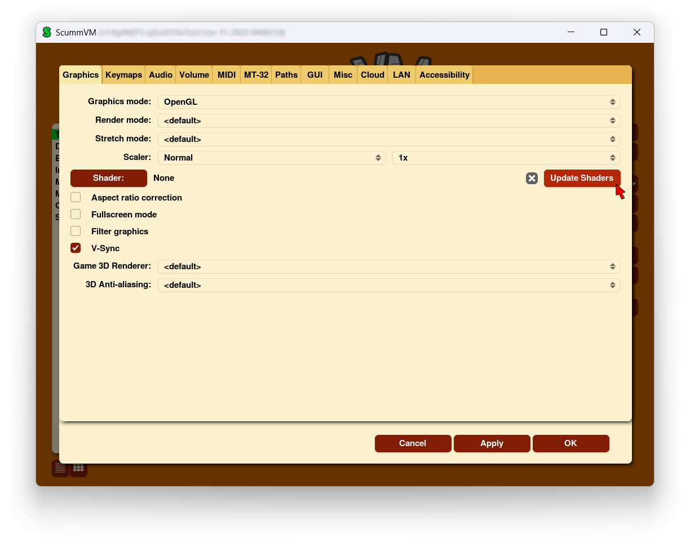

===============
Graphics
===============

Use the Graphics tab to change how games look when they are played.

**To change settings globally:**

 	From the Launcher, select **Global Options**. The Global Options menu opens on the **Graphics** tab.

**To change settings for a specific game:**

	From the Launcher, highlight the game in the games list, and select the **Game Options** button. If the Launcher is in grid view, select the game and then select the gear icon in the popup window. Select the **Graphics** tab.

For a comprehensive look at how to use these settings, check out our :doc:`../advanced_topics/understand_graphics` guide.

    The Graphics tab in the Global Options menu

All settings can also be changed in the :doc:`../advanced_topics/configuration_file`. The configuration key is listed in italics after each setting description.

,,,,,,,

.. _gfxmode:

Graphics mode
	Change the graphics backend used to render the ScummVM window on the screen. Different graphics modes have different options available (such as scalers and stretch modes).

	*gfx_mode*

.. _render:

Render mode
	Changes how the game is rendered.

	*render_mode*

.. _stretchmode:

Stretch mode
	Changes the way the game is displayed in relation to the window or screen size.

	*stretch_mode*

.. _scalers:

Scalers
	Changes the resolution of the game, while also selecting which filter is used to scale up the resolution. For example, a 2x scaler will take a 320x200 resolution game and scale it up to 640x400.

	*scaler* and *scale_factor*

.. _ratio:

Aspect ratio correction
	If ticked, corrects the aspect ratio so that games appear the same as they would on original 320x200 resolution displays.

	*aspect_ratio*

.. _fullscreen:

Fullscreen mode
	If ticked, games are played using the entire screen, instead of a window. The actual apperance is defined by the other graphics settings.

	*fullscreen*

.. _filtering:

Filter graphics
	If ticked, uses bilinear interpolation instead of nearest neighbor resampling for the aspect ratio correction and stretch mode. It does not affect the graphics mode.

	*filtering*

.. _vsync:

V-Sync in 3D games
	If ticked, synchronizes the frame rate of a game with the monitor's refresh rate to prevent screen tearing.

	*vsync*

.. _renderer:

Game 3D renderer
	Changes how a 3D game is rendered. This setting has no effect on 2D games.

	- OpenGL: renders on hardware (uses the GPU)
	- OpenGL with shaders: renders on hardware with shader support
	- Software: renders on software (uses the CPU).

	*renderer*

.. _antialiasing:

3D Anti-aliasing
	Changes the anti-aliasing method. The number refers to how many samples are taken per pixel; 8x takes 8 samples per pixel and is the most accurate, but is also the most processor-intensive option.

	*antialiasing*
