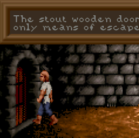
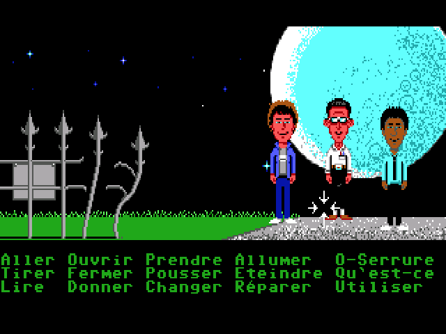
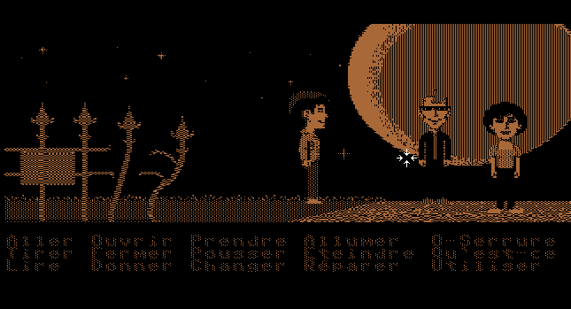

===============
Graphics
===============

Overview
=========

The Graphics tab
-----------------

To change settings globally, go to **Options > Graphics**. To change settings for a game, select the game, then go to **Edit Game > Graphics**. 

Use the graphics tab to change how games look when they are played. 

.. figure:: ../images/settings/graphics.png

    The Graphics tab in the global settings

,,,,,,,

.. _gfxmode:

Graphics mode
	Changes the resolution of the game. For example, a 2x graphics mode will take a 320x200 resolution game and scale it up to 640x400. 

	*gfx_mode* 

		
.. _render:

Render mode
	Changes how the game is rendered, which affects how the game looks. 

	*render_mode* 
			
.. _stretchmode:

Stretch mode
	Changes the way the game is displayed in relation to the window size.

	*stretch_mode* 

.. _ratio:

Aspect ratio correction
	If ticked, corrects the aspect ratio so that games appear the same as they would on original 320x200 resolution displays. 

	*aspect_ratio* 

.. _fullscreen:

Fullscreen mode
	Switches between playing games in a window, or playing them in fullscreen mode. Switch between the two by using :kbd:`Alt + F5` while in a game.

	*fullscreen* 

.. _filtering:

Filter graphics
	If ticked, uses bilinear interpolation instead of nearest neighbor resampling for the aspect ratio correction and stretch mode. It does not affect the graphics mode. 

	*filtering* 

Further reading
=================

How do the graphics settings work together?
----------------------------------------------

The graphics mode, aspect ratio, and stretch mode settings work together to change the resolution and display of each game. The first setting applied to the image is the graphics mode, then the aspect ratio correction, and then the stretch mode setting. The only exception to this is OpenGL mode, which applies all settings in one pass to arrive at a final image. 

Render modes are only applicable to some older games that were designed to be played on multiple systems, and lets us choose which system's graphics to replicate. 

Graphics modes
---------------------------

The original game graphics are upscaled using different graphical filters, which are specialized algorithms used to ensure that low resolution pixel-art still looks good when it is displayed at a higher resolution.

If the game originally ran at a resolution of 320x200 - which is typical for most SCUMM games - then using a graphics mode with a scale factor of 2x will yield 640x400 graphics. A 3x scale factor will yield 960x600.

A comparison of graphics modes
*************************************

.. figure:: ../images/graphics/graphics_mode/1x.png

    **1x**: No filtering, no scaling. Fastest.
   
.. figure:: /images/graphics/graphics_mode/2x.png

   **2x**: No filtering, factor 2x. Default for non 640x480 games.

.. figure:: ../images/graphics/graphics_mode/3x.png
   
   **3x**: No filtering, factor 3x.

.. figure:: ../images/graphics/graphics_mode/2xsai.png

    **2xSaI**: SaI filter, factor 2x.

.. figure:: ../images/graphics/graphics_mode/super2xsai.png

    **Super2xSaI**: Enhanced 2xSAI filtering, factor 2x.

.. figure:: ../images/graphics/graphics_mode/supereagle.png

    **SuperEagle**: Less blurry than 2xSAI, but slower. Factor 2x.

.. figure:: ../images/graphics/graphics_mode/advmame2x.png

    **AdvMAME2x**: Doesn't rely on blurring like 2xSAI, fast. Factor 2x.

.. figure:: ../images/graphics/graphics_mode/advmame3x.png

    **AdvMAME3x**: Doesn't rely on blurring like 2xSAI, fast. Factor 3x.

    **HQ2x**: Very nice high quality filter, but slow. Factor 2x.

.. figure:: ../images/graphics/graphics_mode/hq3x.png

    **HQ3x**: Very nice high quality filter, but slow. Factor 3x.

.. figure:: ../images/graphics/graphics_mode/tv2x.png

    **TV2x**: Interlace filter, tries to emulate a TV. Factor 2x.

.. figure:: ../images/graphics/graphics_mode/dotmatrix.png

    **DotMatrix**: Dot matrix effect. Factor 2x.

Not all engines support all, or even any, of the graphics modes. 

There is always a speed penalty when using any form of anti-aliasing/linear filtering.

To switch between graphics modes on the go, use :kbd:`Ctrl` + :kbd:`Alt` + :kbd:`1` to :kbd:`8`. 

OpenGL mode
**************

OpenGL graphics mode works a little differently to the other graphics modes. Instead of applying the aspect ratio and stretch mode settings one after the other (and after the graphics mode scaling has been applied), it does all the scaling and stretching in one step, going directly from the original game resolution to the final display resolution. 

Output is controlled by your window size (or screen resolution if in full screen) and the stretch mode selected, as well as the Filter graphics option. 

.. _aspect:

Aspect ratio correction
------------------------------------

Older games were designed to be run at 320x200 pixels, but on systems where each pixel was rectangular instead of square. This means that on modern systems these games look wider and flatter than they are supposed to. Aspect ratio correction duplicates lines of pixels to correct this. 

.. figure:: ../images/graphics/aspect_ratio/no_aspect_ratio.png

    No aspect ratio correction applied.

    Aspect ratio correction applied - notice the moon is actually round now.  

To toggle aspect ratio on and off, use :kbd:`Ctrl` + :kbd:`Alt` + :kbd:`a`.

.. _stretch:

Stretch modes
----------------------

There are five stretch modes:

- Center - centers the image in the window. 
- Pixel-perfect scaling - scales the image to a multiple of the original game resolution as much as possible (for example, 2x, 3x, 4x and so on), and fills the remaining empty space with black borders. 
- Fit to window - fits the image to the window, but maintains the aspect ratio and does not stretch it to fill the window.
- Stretch - stretches the image to fill the window
-  Fit to window (4:3) - fits the image to the window, at a forced 4:3 aspect ratio.

To switch between stretch modes on the go, use :kbd:`Ctrl` + :kbd:`Alt` + :kbd:`s`.

Render mode
-------------

For most games this setting will have no effect. For some of the older games that could be played on different systems and graphics cards, this control allows us to decide which system we want ScummVM to reproduce. 

Below are some of the common render modes, to illustrate how the render mode setting works. 

.. figure:: ../images/graphics/render_mode/default.png
   
    Maniac Mansion with <default> render mode

.. figure:: ../images/graphics/render_mode/herc_green.png

    Maniac Mansion with Hercules Green render mode

    Maniac Mansion with Hercules Amber render mode

.. figure:: ../images/graphics/render_mode/cga.png

    Maniac Mansion with CGA (4 color) render mode

.. figure:: ../images/graphics/render_mode/ega.png

    Maniac Mansion with EGA (16 color) render mode

.. figure:: ../images/graphics/render_mode/amiga.png

    Maniac Mansion with Amiga (32 color) render mode

Filter graphics
----------------

When enabled, ScummVM uses bilinear interpolation instead of nearest neighbor for the :ref:`aspect ratio <aspect>` and :ref:`stretch mode <stretch>`. It does not affect the graphics mode scaling unless OpenGL is selected, in which case it determines how the OpenGL scaling is done. 

To toggle between bilinear interpolation and nearest neighbor, use :kbd:`Ctrl` + :kbd:`Alt` + :kbd:`f`.