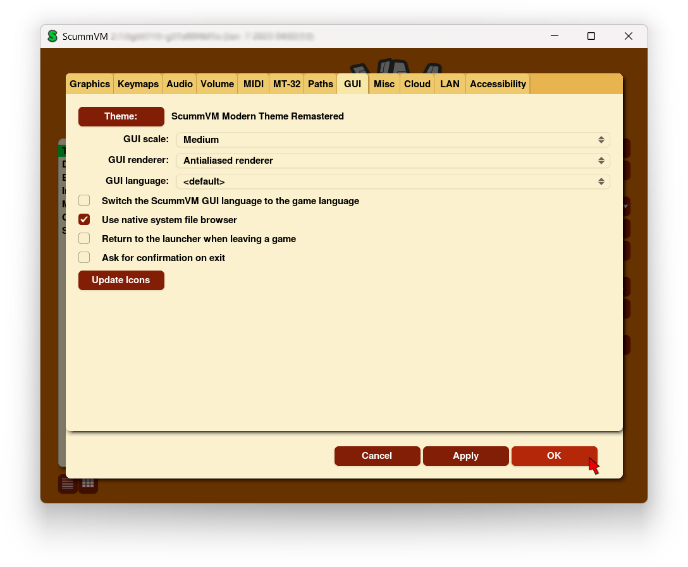
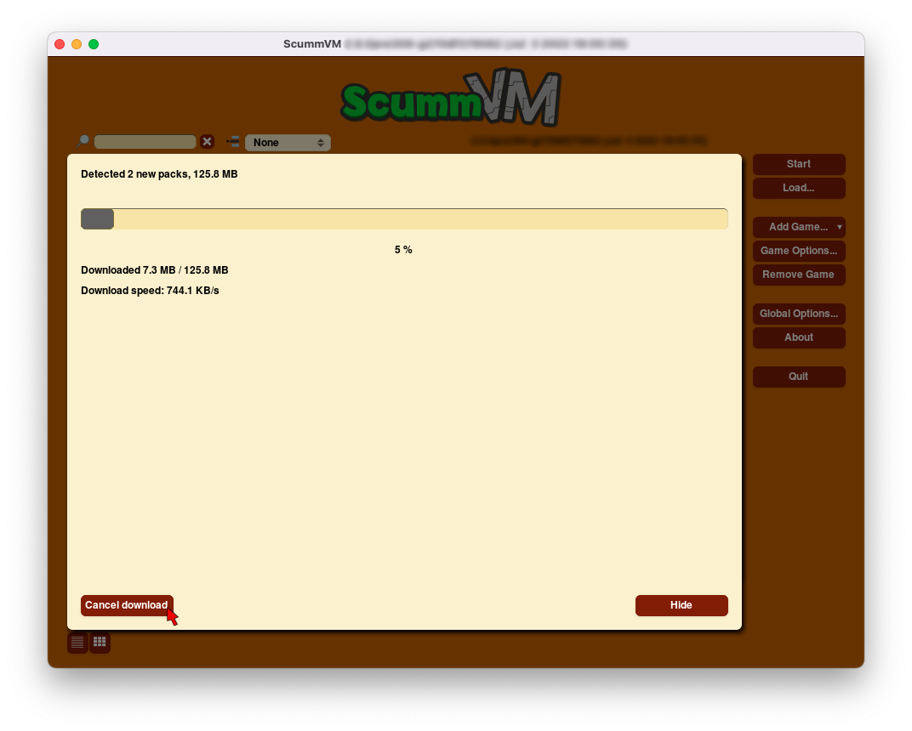

=====================
GUI
=====================

Use this tab to the GUI tab to change the look and feel of the ScummVM graphical user interface. 

From the Launcher, select **Global Options**, if necessary click the **>** scroll arrow until the GUI tab is visible, and then select the **GUI** tab.

    The GUI tab in the global settings

All settings can also be changed in the :doc:`../advanced_topics/configuration_file`. The configuration key is listed in italics after each setting description.

,,,,,,,,,,,,,,

.. _theme:

Theme
	Changes the visual appearance of the ScummVM Launcher

	*gui_theme*

GUI scale
	Scale the ScummVM GUI to be bigger or smaller. Using a larger scale can help to make the text easier to read when using ScummVM on a big screen.

	*gui_scale*

GUI renderer
	Defines how the ScummVM GUI is rendered; normal or antialiased.

	*gui_renderer*

GUI language
	Chooses the language of the ScummVM Launcher.

	*gui_language*

.. _guilanguage:

Switch the ScummVM GUI language to the game language
	If ticked, the Launcher language is the same as the game language.

	*gui_use_game_language*

.. _guibrowser:

Use native system file browser
	Uses the system file browser instead of the ScummVM browser.

	*gui_browser_native*

.. _guireturn:

Always return to the launcher when leaving a game
	If ticked, removes the **Quit** option from the Global Main Menu. Only the **Return to Launcher** option remains.

	*gui_return_to_launcher_at_exit*

.. _guiconfirm:

Ask for confirmation on exit
	If ticked, a confirmation dialog appears when you choose **Quit** or **Return to Launcher** from the Global Main Menu.

	*confirm_exit*

.. _updateicons:

Update Icons
	Click on the Update Icons button to download new or updated artwork for game icons. ScummVM will scan to find applicable icons; once these have been found, click on the **Download** button in the pop up window to start the download. Click the **Hide** button to close the window and continue the download in the background. Use the **Cancel download** button to cancel the download.

	The Update Icons window

	The icon packs can also be downloaded manually from https://downloads.scummvm.org/frs/icons/ and must be placed in the :ref:`Icon Path <iconspath>`. The packs are incremental and you need all of them to have all the available icons and not just the most recent pack.
