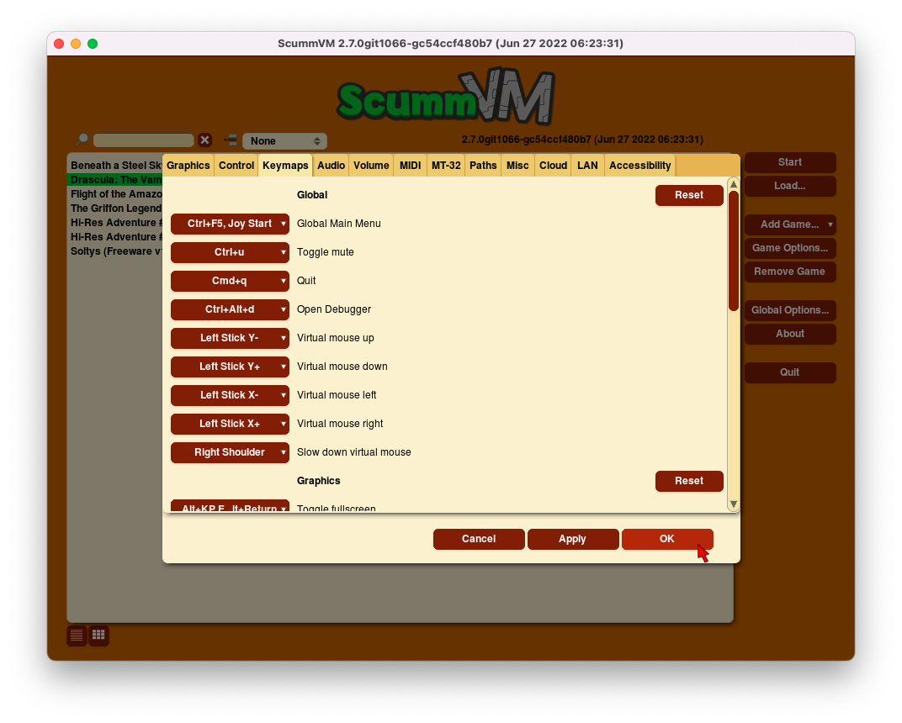
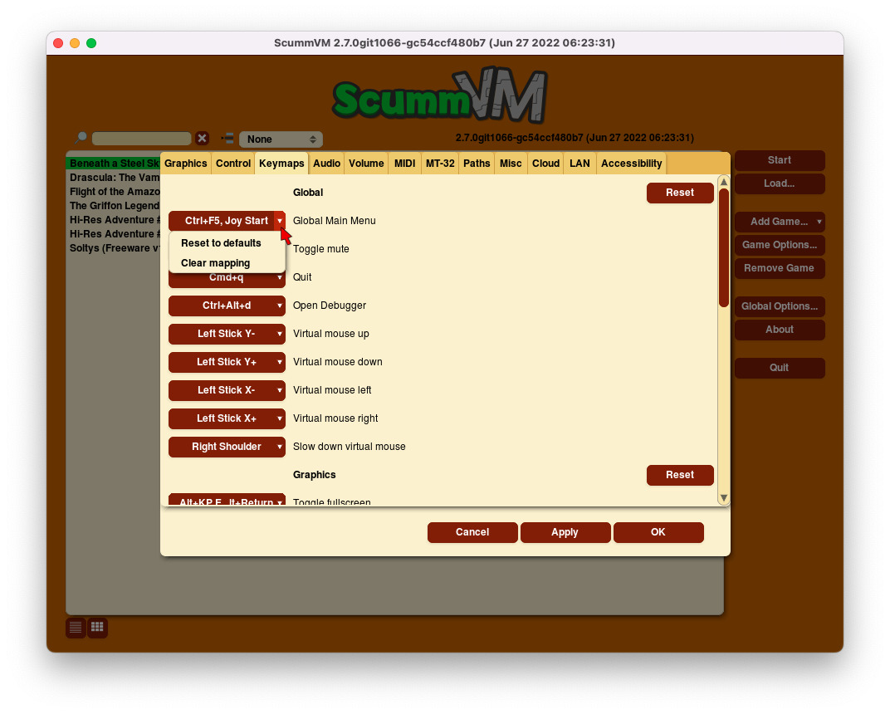

===============
Keymaps
===============

Use the Keymaps tab to assign actions to keyboard keys or shortcuts, or to mouse or joystick buttons. 

**To change settings globally:** 

	From the Launcher, select **Options**, then select the **Keymaps** tab. 

**To change settings for a specific game:** 

	Highlight the game in the games list, select **Edit Game** then select the **Keymaps** tab. 

    The Keymaps tab in the global settings

    The Keymaps dropdown options.

All settings can also be changed in the :doc:`../advanced_topics/configuration_file`. The configuration key is listed in italics after each setting description. 

,,,,,,,,,,,,,,,,,

Click on the button next to the desired action to add an additional key or button. Click on the **▼**  dropdown expander for more options. 

If all the mapped keys are not visible, hold the pointer over the button to see all the mapped keys. 

Reset
	Resets all keymaps to default.

Reset to defaults
	Resets the keymaps for that action to default. 

Clear mapping
	Clears all keymaps for that action.

,,,,,,,,,,,,,,,,,,,

Global settings
-------------------

The following are the available global keymap options. Listed in italics are the configuration keywords. For more information, see the :doc:`../advanced_topics/configuration_file` page. 

Global 
*********
.. _gmm:

Global Main Menu
	*keymap_global_MENU*

.. _mute:

Toggle mute
	*keymap_global_MUTE*

.. _globalquit:

Quit
	*keymap_global_QUIT*

.. _debug:

Open Debugger
	*keymap_global_DEBUGGER*

.. _vmouseup:

Virtual mouse up
	*keymap_global_VMOUSEUP* 

.. _vmousedown:

Virtual mouse down
	*keymap_global_VMOUSEDOWN*

.. _vmouseleft:

Virtual mouse left
	*keymap_global_VMOUSELEFT*

.. _vmouseright:

Virtual mouse right
	*keymap_global_VMOUSERIGHT*

.. _vmouseslow:

Slow down virtual mouse 
	*keymap_global_VMOUSESLOW*

Graphics
************

.. _FULS:

Toggle fullscreen
	*keymap_sdl-graphics_FULS*

.. _CAPT:

Toggle mouse capture
	*keymap_sdl-graphics_CAPT*

.. _SCRS:

Save screenshot
	*keymap_sdl-graphics_SCRS*

.. _ASPT:

Toggle aspect ratio correction
	*keymap_sdl-graphics_ASPT*

.. _FILT:

Toggle linear filtered scaling
	*keymap_sdl-graphics_FILT*

.. _STCH:

Cycle through stretch modes
	*keymap_sdl-graphics_STCH*

.. _SCL:

Increase the scale factor
	*keymap_sdl-graphics_SCL+*

Decrease the scale factor
	*keymap_sdl-graphics_SCL-* 

.. _FLT1:

Switch to nearest neighbour scaling 
	*keymap_sdl-graphics_FLT1*

.. _FLT2:

Switch to AdvMame 2x/3x scaling
	*keymap_sdl-graphics_FLT2*

.. _FLT3:

Switch to HQ 2x/3x scaling
	*keymap_sdl-graphics_FLT3*

.. _FLT4:

Switch to 2XSai scaling
	*keymap_sdl-graphics_FLT4* 

.. _FLT5:

Switch to Super2xSai scaling
	*keymap_sdl-graphics_FLT5*

.. _FLT6:

Switch to SuperEagle scaling
	*keymap_sdl-graphics_FLT6*

.. _FLT7:

Switch to TV 2x scaling
	*keymap_sdl-graphics_FLT7*

.. _FLT8:

Switch to DotMatrix scaling
	*keymap_sdl-graphics_FLT8* 

GUI 
*****
.. _interact:

Interact
	*keymap_gui_INTRCT*

.. _close:

Close
	*keymap_gui_CLOS*

.. _guiup:

Up 
	*keymap_gui_UP*

.. _guidown:

Down
	*keymap_gui_DOWN*

.. _guileft:

Left 
	*keymap_gui_LEFT*

.. _guiright:

Right
	*keymap_gui_RIGHT*

Game settings
-------------------

The following are the available keymap game-specific keymaps options. Listed in italics are the configuration keywords. For more information, see the :doc:`../advanced_topics/configuration_file` page. 

Default game keymap
********************

.. _LCLK:

Left mouse button 
	*keymap_engine-default_LCLK* 

.. _MCLK:

Middle click 
	*keymap_engine-default_MCLK*

.. _RCLK:

Right click
	*keymap_engine-default_RCLK*

.. _pause:

Pause
	*keymap_engine-default_PAUSE*

.. _menu:

Game menu 
	keymap_engine-default_MENU

.. _skip:

Skip
	*keymap_engine-default_SKIP*

.. _SKLI:

Skip line 
	*keymap_engine-default_SKLI*

.. _PIND:

Predictive input dialog 
	*keymap_engine-default_PIND*

.. _RETURN:

Confirm 
	*keymap_engine-default_RETURN*

.. _up:

Up 
	*keymap_engine-default_UP*

.. _down:

Down 
	*keymap_engine-default_DOWN*

.. _left:

Left 
	*keymap_engine-default_LEFT*

.. _right:

Right 
	*keymap_engine-default_RIGHT*