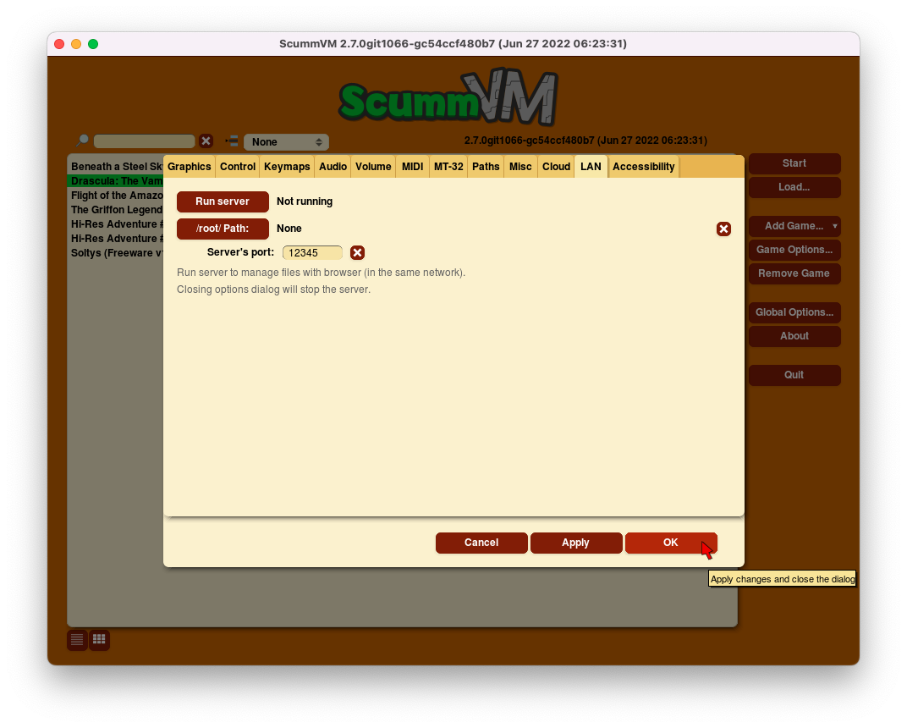

==============
LAN
==============

Overview
============

ScummVM can run a local network web server which allows browser-based file management, including uploading and downloading game files. 

The LAN tab
------------

From the Launcher, go to **Options**, click the red **>** until the LAN tab is visible, then go to **LAN**.

Use the LAN tab to control the web server. 

    The LAN tab in the global settings

,,,,,,,,,,,,,,,,,,,,,,,,,,,,,,,

Run server
	Starts the web server. Once running, this displays the URL at which the web server can be accessed. 

Stop server
    Stops the web server. 

.. _serverport:

Server's port
	The port on which the web server is available. 
	
	*local_server_port* 

.. _rootpath:

/root/ Path	
	Specifies the root path of the server. Any sub-directories will be accessible. 

	*rootpath* 

