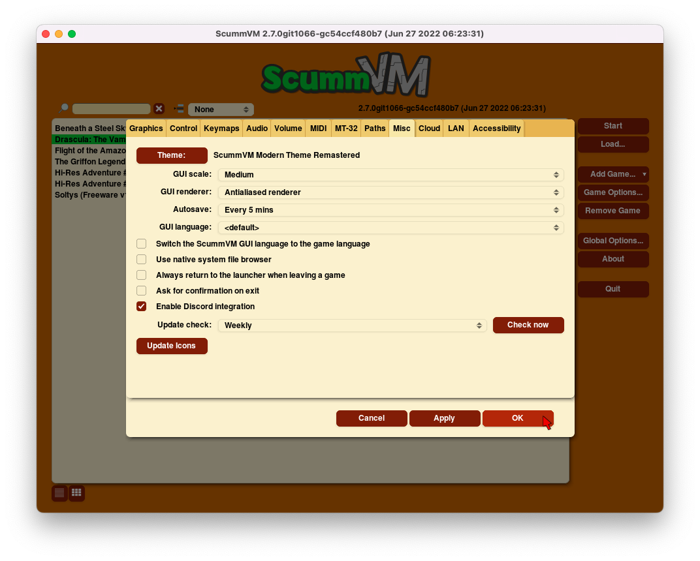

======================
Miscellaneous
======================

Use the Misc tab to change miscellaneous settings that don’t belong on any of the other tabs.

From the Launcher, select **Options**, click the **>** scroll arrow until the Misc tab is visible, and then select the **Misc** tab.

    The Misc tab in the global settings.

All settings can also be changed in the :doc:`../advanced_topics/configuration_file`. The configuration key is listed in italics after each setting description. 

,,,,,,,,,,,,,,,

.. _theme:

Theme
	Changes the visual appearance of the ScummVM Launcher

	*gui_theme* 

GUI Renderer
	Defines how the ScummVM GUI is rendered; normal or antialiased.

	*gui_renderer* 

.. _autosave:

Autosave
	Adjusts the time period between autosaves. The default setting is 5 minutes. 

	*autosave_period* 

GUI Language
	Chooses the language of the ScummVM Launcher.

	*gui_language* 

.. _guilanguage:

Switch the ScummVM GUI language to the game language
	If ticked, the Launcher language is the same as the game language. 

	*gui_use_game_language* 

.. _guibrowser:

Use native system file browser
	Uses the system file browser instead of the ScummVM browser. 

	*gui_browser_native*
