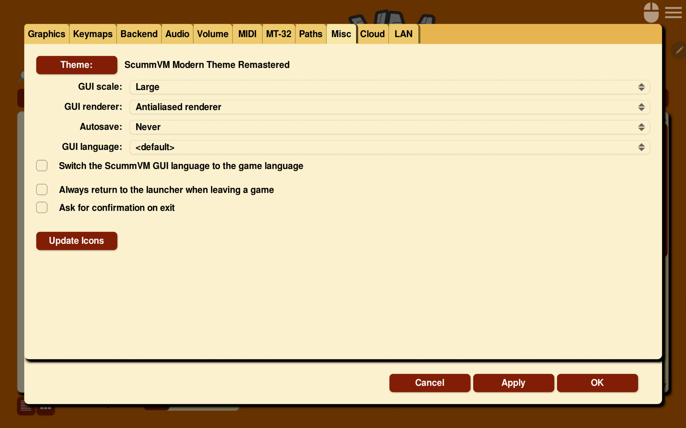

======================
Miscellaneous
======================

Use the Misc tab to change miscellaneous settings that don’t belong on any of the other tabs.

From the Launcher, select **Global Options**, if necessary click the **>** scroll arrow until the Misc tab is visible, and then select the **Misc** tab.

    The Misc tab in the Global Options menu

All settings can also be changed in the :doc:`../advanced_topics/configuration_file`. The configuration key is listed in italics after each setting description.

,,,,,,,,,,,,,,,,

.. _theme:

Theme
	Changes the visual appearance of the ScummVM Launcher

	*gui_theme*

GUI scale
	Scale the ScummVM GUI to be bigger or smaller. Using a larger scale can help to make the text easier to read when using ScummVM on a big screen.

	*gui_scale*

GUI renderer
	Defines how the ScummVM GUI is rendered; normal or antialiased.

	*gui_renderer*

.. _autosave:

Autosave
	Adjusts the time period between autosaves. The default setting is 5 minutes.

	*autosave_period*

GUI language
	Chooses the language of the ScummVM Launcher.

	*gui_language*

.. _guilanguage:

Switch the ScummVM GUI language to the game language
	If ticked, the Launcher language is the same as the game language.

	*gui_use_game_language*

.. _guibrowser:

Use native system file browser
	Uses the system file browser instead of the ScummVM browser.

	*gui_browser_native*

.. _guireturn:

Always return to the launcher when leaving a game
	If ticked, removes the **Quit** option from the Global Main Menu. Only the **Return to Launcher** option remains.

	*gui_return_to_launcher_at_exit*

.. _guiconfirm:

Ask for confirmation on exit
	If ticked, a confirmation dialog appears when you choose **Quit** or **Return to Launcher** from the Global Main Menu.

	*confirm_exit*

.. _updateicons:

Update Icons
	Downloads updated artwork for game icons. The Icon Path must be set on the :doc:`../settings/paths` tab. ScummVM comes preloaded with the icons for all the freeware games on the `ScummVM Downloads page <https://www.scummvm.org/games/#games>`_ .
