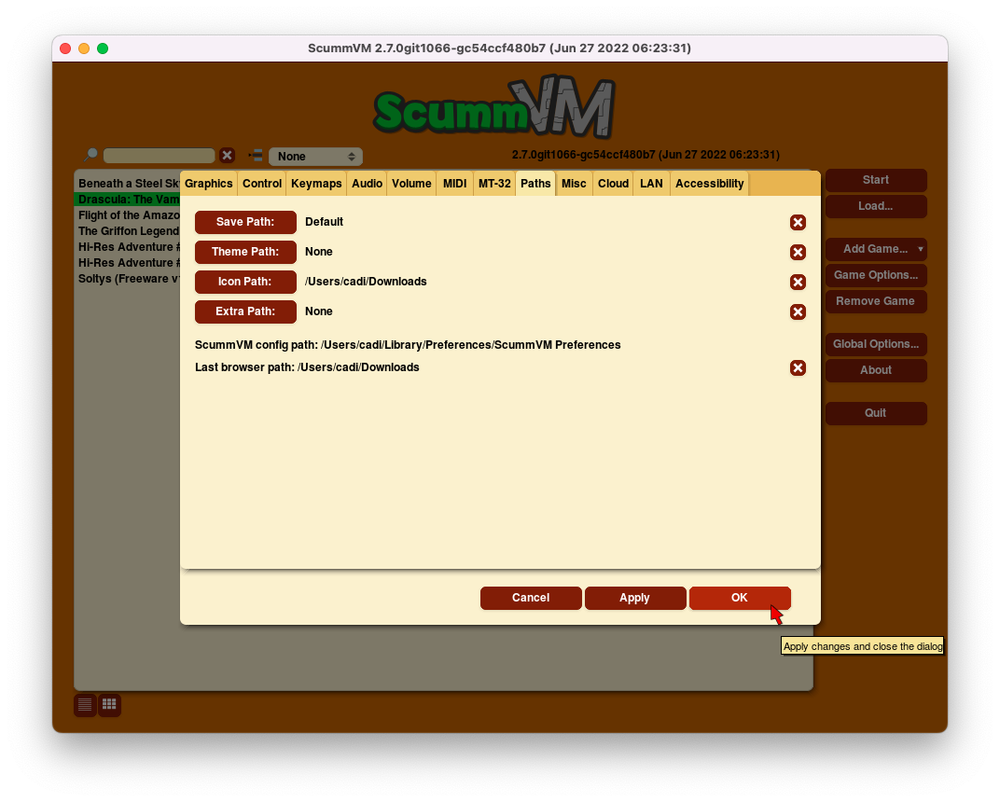

==============
Paths
==============

Use the Paths tab to tell ScummVM where to look for files.

**To change settings globally:**

 	From the Launcher, select **Global Options**, then select the **Paths** tab.

**To change settings for a specific game:**

	From the Launcher, highlight the game in the games list, and select the **Game Options** button. If the Launcher is in grid view, select the game and then select the gear icon in the popup window. Select the **Paths** tab.

    The Paths tab in the Global Options menu

All settings can also be changed in the :doc:`../advanced_topics/configuration_file`. The configuration key is listed in italics after each setting description.

,,,,,,,,,,,,,,,,,

.. _savepath:

Save Path
	Sets the path to the folder in which ScummVM stores saved games. For more information on the default location of saved games, see the :ref:`Save and Load games <savelocation>` page, or the guide for the platform you're using.

	*savepath*

.. _themepath:

Theme Path
	Sets the path to the folder in which ScummVM stores additional themes.

	*themepath*

.. _extra:

Extra Path
	Sets the path to the folder in which ScummVM will look for various extra files. These could include additional datafiles required for certain games, Soundfonts or MT-32 ROMs.

	*extrapath*

.. _iconspath:

Icon Path
	Sets the path to the folder in which ScummVM will look for additional icons for the launcher grid view.

	*iconspath*

ScummVM config path:
	Shows where the :doc:`../advanced_topics/configuration_file` is saved.

Last browser path:
	Shows the last folder accessed by the file browser. See more about the :ref:`file browser <add and play games>` here. 

