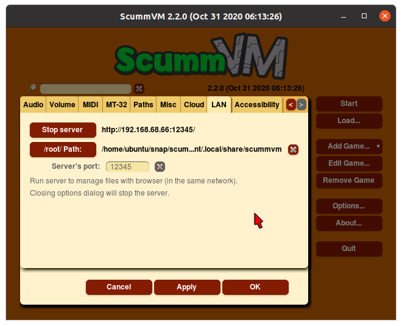
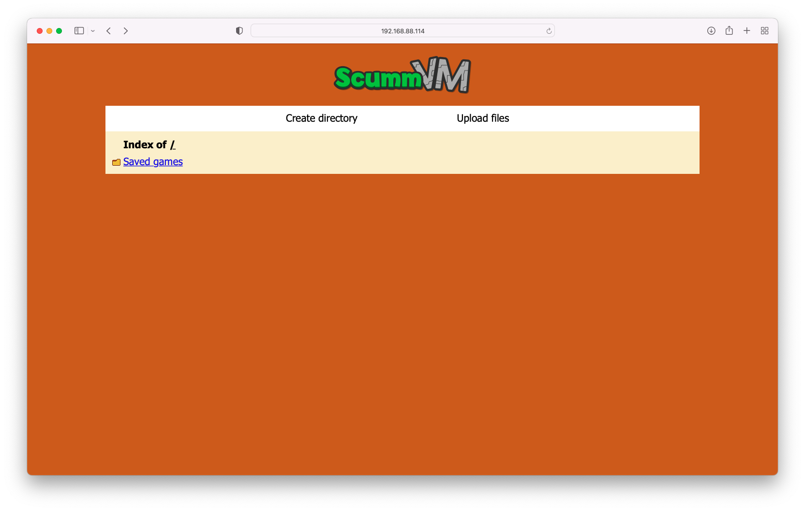
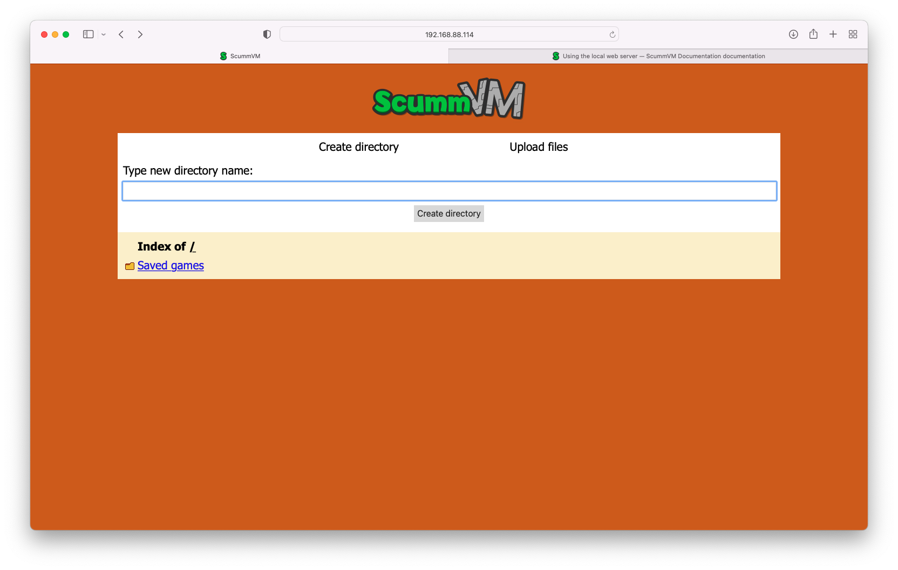
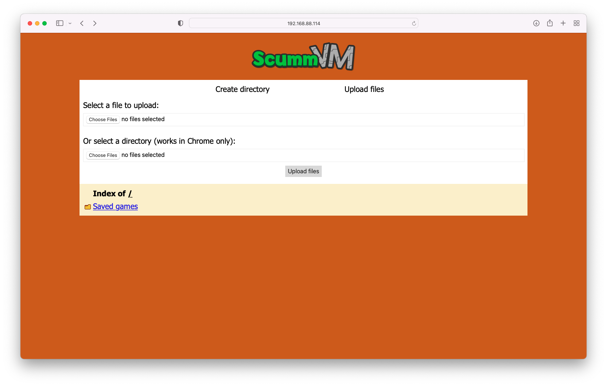

==================================
Using the local web server
==================================

ScummVM can run a local web server (LAN), to simplify the transfer of game files, saved games and configuration files between devices on the same network. This is a good option if you do not want to use the Cloud, or if ScummVM for your platform does not have cloud functionality. 

.. note:: 

    LAN functionality is not supported on all platforms. 

This guide explains how to set up and run a local web server. 

From the Launcher, select **Options**, click the **>** scroll arrow until the LAN tab is visible, and then select the **LAN** tab.

Click **Run server** to start the server. 

    The LAN tab, with the server running. 
    
To access the server, type the URL shown into the address bar of any web browser:

    The server's browser interface. 

To download a file, click on the file to open the system download dialog. 

To create a new directory, click **Create Directory**. 

    Create a new directory.

To upload files, click **Upload Files** and select files from the system file browser. 

    Upload files. 

To change which files are accessible on the web server, set the **/root/ Path** to the directory containing the files you wish to access. You can access anything inside that directory, but you cannot access its parent directory. On some platforms ScummVM automatically sets the **/root/ Path**, but on some other platforms you need to configure this manually before running the web server for the first time. 

To stop the web server, click **Stop server** to stop the server, or click **Ok** to close the settings dialog.  
