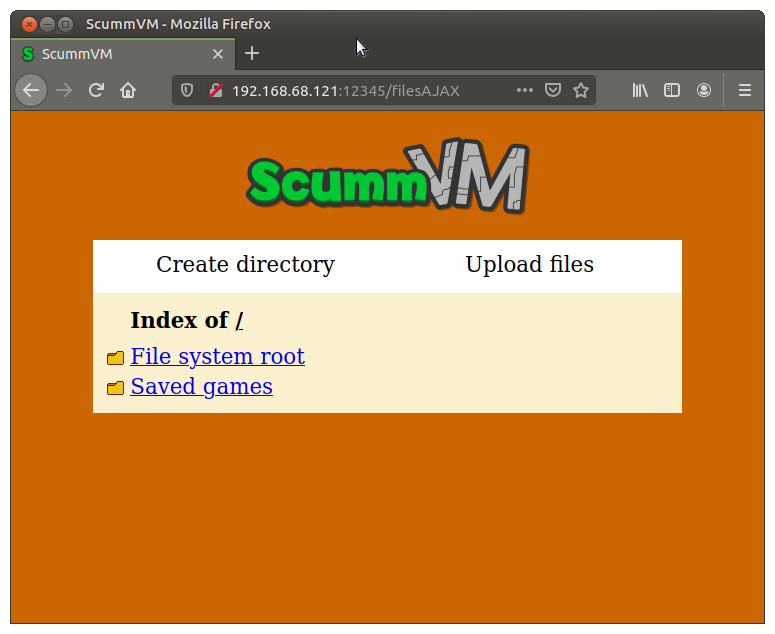
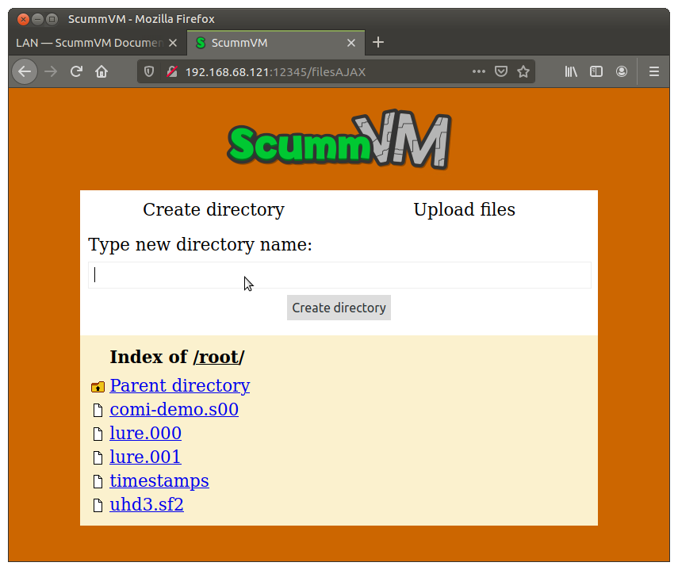

==============================
Set up a local web server
==============================

ScummVM can run a local web server, to allow the transfer of files between devices on the same network. 

How to use the web server
----------------------------

From the Launcher, select **Options**, click the **>** scroll arrow until the LAN tab is visible, and then select the **LAN** tab.

Click **Run server** to start the server. 

.. figure:: ../images/cloud_and_lan/lan_server_running.png

    The LAN tab, with the server running. 
    
To access the server, type the URL shown into the address bar of any web browser:

    The server's browser interface. 

To download a file, click on the file. A system download dialog box opens.

To create a new directory, click **Create Directory**. 

    Create a new directory.

To upload files, click **Upload Files** and select files from the system file browser. 

.. figure:: ../images/settings/LAN_server_upload.png

    Upload files. 

To change which files are accessible on the web server, set the **/root/ Path** to the directory containing the files you wish to access. You can access anything inside that directory, but you cannot access its parent directory.  

To stop the web server, click **Stop server** to stop the server, or **Ok** to close the settings dialog.  
