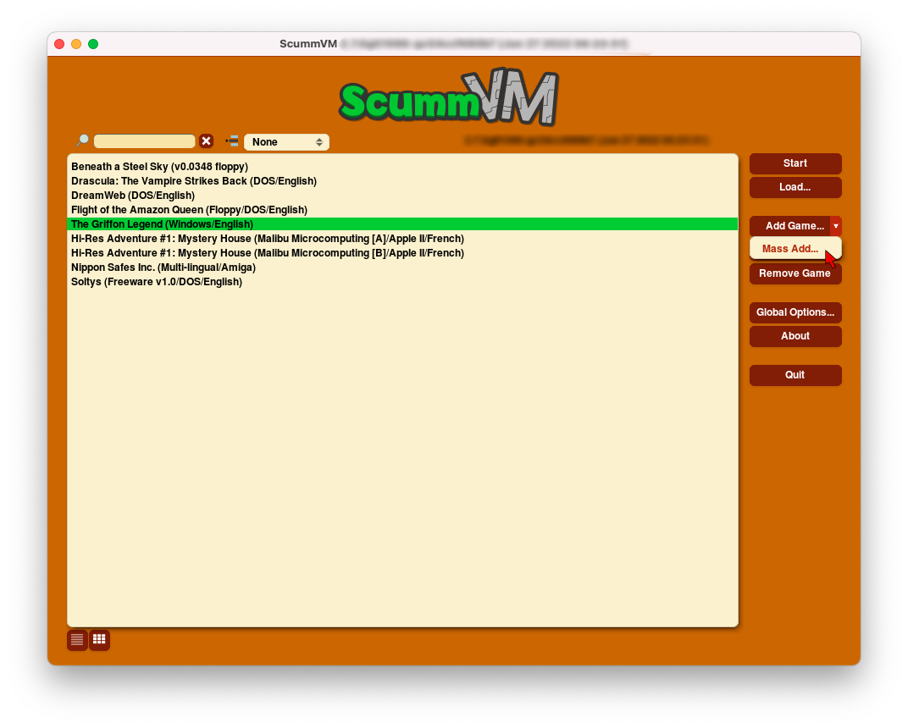
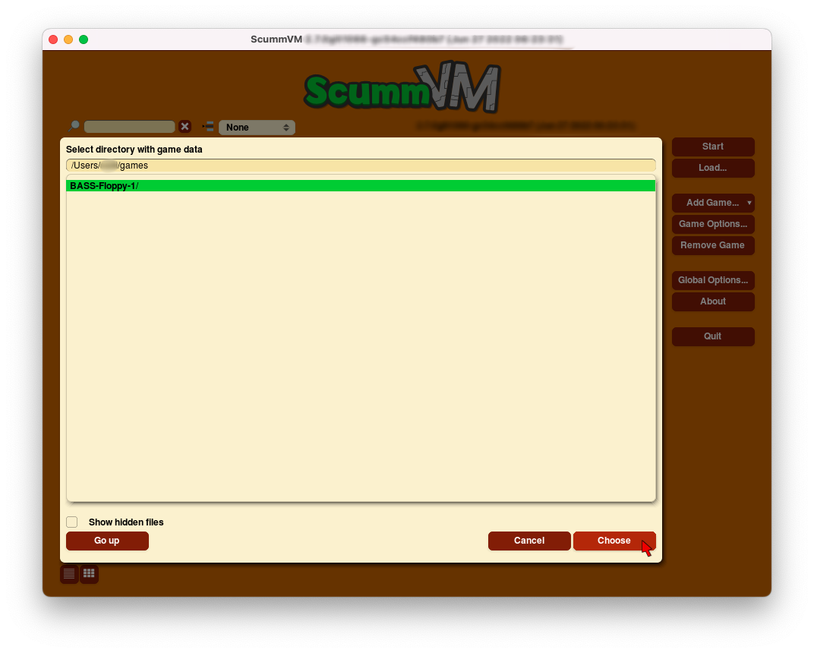
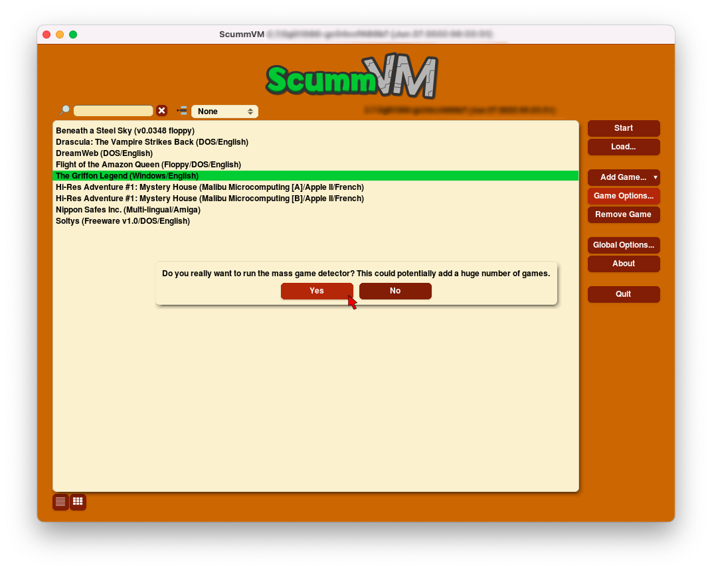

=================================
Adding and playing a game
=================================

Where to get the games
=============================

One of the most frequently asked questions is, "Where do I get the games?!?". If you still have your old floppy discs or CDs lying around, and have a way to read them, then you can use the game files from those original discs.

If you haven't had a floppy disc or even a CD in your possession for a while, there is a ScummVM `wiki page <https://wiki.scummvm.org/index.php?title=Where_to_get_the_games>`_ dedicated to helping you find some games to play.

.. tip::

   ScummVM has an affiliate referrer programme with ZOOM-Platform.com, so if you are going to buy a game, please use this `ZOOM-Platform.com <https://www.zoom-platform.com/?affiliate=c049516c-9c4c-42d6-8649-92ed870e8b53>`_ link to help the project!

Make sure to check out the `compatibility list <https://www.scummvm.org/compatibility/>`_ on the ScummVM website, and the `Supported Games page <https://wiki.scummvm.org/index.php?title=Category:Supported_Games>`_ and `Platform Overview page <https://wiki.scummvm.org/index.php/Platforms/Overview>`_ on the ScummVM wiki before you buy a game, to ensure it can run with ScummVM.

.. _add and play games:

Adding games to the Launcher
==============================

The following steps explain how to add a game to ScummVM, and assume you have access to the data files for each game. If you're not sure how to access the game data files, see the :doc:`game_files` page.

1. Run ScummVM to open :doc:`the Launcher <../use_scummvm/the_launcher>`.

2. In the Launcher window, click **Add Game**. This opens a file browser; either the system file browser or the ScummVM file browser.

.. image:: ../images/Launcher/add_game.png

To add multiple games at once, click the expander arrow next to **Add Game**, and select **Mass Add**.

3.  Use the file browser to locate the folder containing the game data files. For the ScummVM file browser: Double click on a folder to open it, and use **Go up** to go back up one level. Highlight the folder by clicking on it, and then click **Choose**

.. note::

   The **Use Native file browser**  option in the :doc:`Misc <../settings/misc>` tab of the global settings controls whether ScummVM uses the system file browser, or its own file browser.

If you are using **Mass Add**, select **Yes** to run the mass game detector. A dialog opens to advise which games were added to the games list.

Sometimes, ScummVM detects multiple versions of a single game. In this case, highlight the correct version and click **Choose** to continue.

.. figure:: ../images/Launcher/choose_version.png

.. caution::

   If you are using **Mass Add**, ScummVM adds all versions of a game.

If you are adding an unknown version of a game, ScummVM is not able to add the game to the games list. An error message appears to warn you that the game has not been added.

4. The **Game Options** window opens to allow configuration of various settings for the game. These can be reconfigured at any time, but for now everything should be OK at the default settings. Any settings changed here override the global settings. Click **Ok**.

.. image:: ../images/Launcher/game_settings.png
   :class: with-shadow

.. note::

   The **Game Options** window does not open when **Mass Add** is used.

5. Games are now ready to play! To play, either double-click on the game in the games list, or highlight the game by clicking on it, and then click **Start**. In grid view, either double-click on a game to start it, or select the game and click the play icon in the pop-up window. 

.. image:: ../images/Launcher/start_game.png
   :class: with-shadow

Games can also be launched directly from the command line. For more information, see the `Command line options <../advanced_topics/command_line>`_ page.

A note about copyright
==============================

ScummVM has a strict anti-piracy stance and the team wil not tolerate discussions around pirated games in any part of the project, including on the Forum or on Discord.

Copy protection screen
************************

There are cases where the game companies themselves bundled 'cracked' executables with their games. In these cases the data files still contain the copy protection scripts, but the interpreter bypasses them; similar to what an illegally cracked version might do, only that here the producer of the game did it. There is no way for ScummVM to tell the difference between legitimate and pirated data files, so for the games where a cracked version of the original interpreter was sold at some point, ScummVM has to bypass the copy protection.

In some cases ScummVM still shows the copy protection screen. Enter any answer; chances are that it will work.
