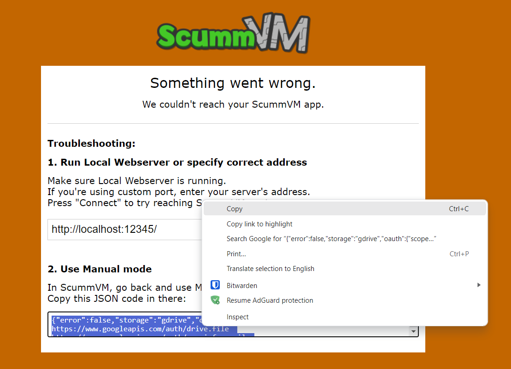

===============================
Connecting a cloud service
===============================

Connecting ScummVM to a cloud storage service provides an easy way of sharing game files and saved games between multiple devices. ScummVM currently supports Dropbox, OneDrive, Google Drive and Box, although only one service can be connected at any one time.

.. note::

    Cloud functionality is not supported on all platforms.

This guide explains how to connect a cloud service to ScummVM.

From the Launcher, select **Options** and then select the **Cloud** tab.

Select your preferred cloud storage service from the **Active storage** dropdown.

.. figure:: ../images/cloud_and_lan/cloud_storage.png

Click **Connect**.

The cloud connection wizard
------------------------------

The cloud connection wizard offers two ways to connect the cloud service: Quick mode and Manual mode. 

Quick mode
****************
1. Select **Quick mode**

2. Select **Run server**. This starts a :doc:`Local Webserver <../use_scummvm/LAN>`. Select **Next**.

3. Click on the link. 

4. In the browser window that opens, select the cloud service to connect. Untick the **ScummVM version 2.7.1 or newer** tickbox if you're using an older version.  

5. Sign in to the chosen cloud service. Once completed, return to ScummVM. On the success screen, select **Finish** to exit. 

6. Back on the main Cloud tab, check the username for the connected service is correct, then select **Enable storage**.

.. figure:: ../images/cloud_and_lan/cloud_enable.png

Manual mode
**************

If the Local Webserver is not working, use manual mode to connect the cloud service. 

1. Select **Manual mode**.

.. figure:: ../images/cloud_and_lan/cloud_wizard_manual.png

2. Click on the link. 

3. In the browser window that opens, select the cloud service to connect.  Untick the **ScummVM version 2.7.1 or newer** tickbox if you're using an older version. 

4. Sign in to the chosen cloud service.
5. When the error screen appears, copy the JSON code found in the text box.

6. Return to ScummVM, select **Paste** and then **Next**.

7. On the success screen, select **Finish** to exit. 

8. Back on the main Cloud tab, check the username for the connected service is correct, then select **Enable storage**.

.. figure:: ../images/cloud_and_lan/cloud_enable.png

Using the cloud with ScummVM
------------------------------

Saved games sync automatically on launch, when a game is saved, and when a saved game is loaded. Select **Sync now** to manually sync.

To download game files from your cloud ScummVM folder, click **Download game files**.

.. note:: 
    The game file download functionality is not available with Google Drive. To use this feature, choose another provider. 

To change to a different cloud account, or to disconnect your cloud account from ScummVM, click **Disconnect**.