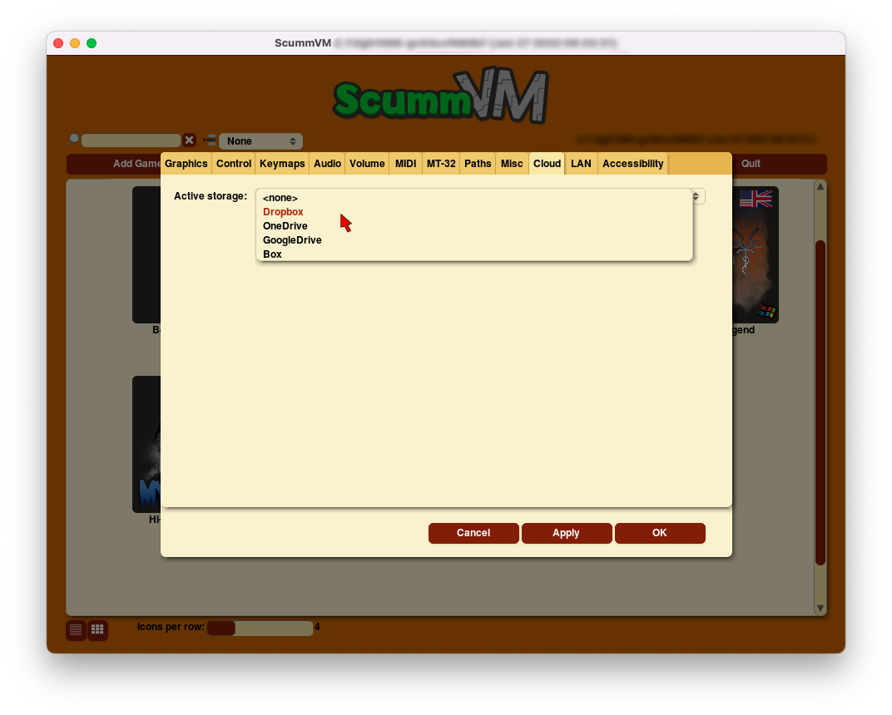

===============================
Connecting a cloud service
===============================

Connecting ScummVM to a cloud storage service provides an easy way of sharing game files and saved games between multiple devices. ScummVM currently supports Dropbox, OneDrive, Google Drive and Box, although only one service can be connected at any one time. 

.. note:: 

    Cloud functionality is not supported on all platforms. 

This guide explains how to connect a cloud service to ScummVM. 

From the Launcher, select **Options**, click the **>** scroll arrow until the Cloud tab is visible, and then select the **Cloud** tab.
 
Select your preferred cloud storage service from the **Active storage** dropdown. 

Click on the link shown at **1.**, and sign in to your cloud storage account. A 6-digit code is displayed after you sign in.

.. figure:: ../images/cloud_and_lan/cloud_code.png

.. warning::

    Do not share this 6-digit code with anyone before you connect your cloud storage account. 

For devices without a web browser, navigate to the following ScummVM links on a computer or any other device with a web browser:

`Dropbox <https://cloud.scummvm.org/dropbox>`_ | `OneDrive <https://cloud.scummvm.org/onedrive>`_ | `Google Drive <https://cloud.scummvm.org/gdrive>`_ | `Box <https://cloud.scummvm.org/box>`_

Copy the 6-digit code, click into the empty field next to **Paste**, and then click **Paste**. Alternatively, for devices without a web browser, manually enter the 6-digit code. 

.. figure:: ../images/cloud_and_lan/cloud_connect.png

Click **3. Connect**. After the next page loads, click **Enable storage**.

.. figure:: ../images/cloud_and_lan/cloud_enable.png

Saved games sync automatically on launch, when a game is saved, and when a saved game is loaded. Select **Sync now** to manually sync. 

To download game files from your cloud ScummVM folder, click **Download game files**. 

To change to a different cloud account, or to disconnect your cloud account from ScummVM, click **Disconnect**. 