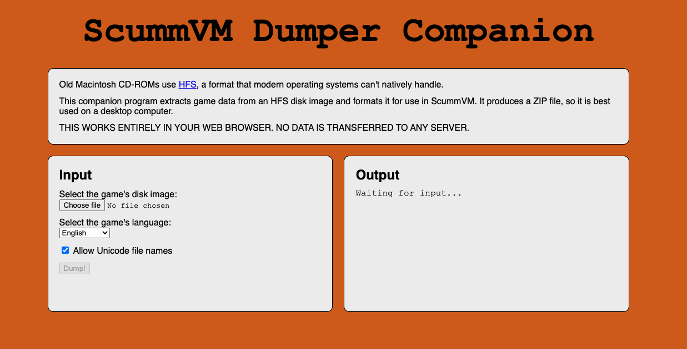

===========================
Handling game files
===========================

ScummVM needs access to the data files for each game. A list of required data files for each game is found on the `wiki entry <https://wiki.scummvm.org/index.php?title=Category:Supported_Games>`__ for that game. ScummVM can run the game data files from any directory it has access to, including external media.

.. note::

    For ease of use, you can create a dedicated games folder into which folder containing game files can be copied. The resulting directory structure will look somewhat like this::

        ScummVM Games
        |-- Day of the Tentacle
        |   |-- MONSTER.SOU
        |   |-- TENTACLE.000
        |   `-- TENTACLE.001
        `-- Flight of the Amazon Queen
            |-- QUEEN.1
            `-- queen.tbl

For games on floppies or CDs, if the data files are accessible, the external media can be accessed directly by ScummVM. Alternatively, copy the game files to a folder as described above. If the data files are not accessible, run the installer on the platform the game was designed for, to extract the game files.

For games downloaded from digital distributors or from various `freeware sources <https://wiki.scummvm.org/index.php?title=Where_to_get_the_games#Freeware_Games>`__ run the installer to extract the data files, or if the data files are supplied as a zip file, extract the files.

For macOS or Linux users without access to a Windows machine, you can get the data files from games that only have Windows installers. Use `Wine <https://www.winehq.org/>`_ to run the Windows installer. Alternatively, for GOG.com games, use `innoextract <https://constexpr.org/innoextract/>`_ to unpack game files from the installer without actually running it.

.. tip::

   Use ScummVM's Cloud functionality to share game files and automatically back up and sync your saved game states. For detailed instructions see the :doc:`../use_scummvm/connect_cloud` guide. For devices on the same local network, ScummVM can also run a web server to allow hassle-free transfer of files. For detailed instructions, see the :doc:`../use_scummvm/LAN` guide. This is a good option if you do not wish to connect a Cloud service.

Multi-disc games
===================

ScummVM needs access to all the data files, so it will not be able to run directly from a CD if the game has multiple discs. To add a multi-CD game, copy the required data files from the CD to a folder on your hard drive. For a list of required files, see the `wiki entry <https://wiki.scummvm.org/index.php?title=Category:Supported_Games>`__ for the game you're playing.

As a general guideline, where there are duplicate, identical files (same name, same file size) on more than one disc, only one copy of the file is required. Where there are files that have the same name but are different on each disc, rename them. For example, where there is a ``music.clu`` on two discs, rename the file on the first disc to ``music1.clu`` and the file on the second disc to ``music2.clu``.

.. _cdaudio:

CD audio
============

In most cases, ScummVM can use CD audio directly from the game CD. If you don't always want to insert the game CD to use the CD audio, you can extract the audio tracks from the CD and save them locally:

1. Extract the CD audio tracks in WAV or AIFF format.
2. Convert the tracks to either MP3, FLAC, M4A or OGG file formats.
3. Place the converted audio files in the same folder that contains the other game datafiles.
4. You can name them in several ways:

   1. track01.ogg - track12.ogg
   2. track1.ogg - track12.ogg
   3. track_01.ogg - track_12.ogg
   4. track_1.ogg - track_12.ogg

.. tip::

    `fre:ac <https://www.freac.org/>`_ is a multi-platform, open-source software, with the ability to both rip CDs and convert audio between MP3, OGG, FLAC and WAV  file formats.

.. _macgames:

Macintosh games
==================
Many of the supported games also exist in versions for the Macintosh, however it can be tricky to extract the correct files from a Macintosh floppy or CD, especially if you are using Windows or Linux. 

Background
-----------------
There are three main aspects of Macintosh floppy or CD media that can make it difficult to extract the game data; the file system, forks, and file name encoding. 

**HFS and HFS+ file system**

The Macintosh uses a different file system to other operating systems; HFS for older media, and HFS+ for more recent ones. 

HFS (`Hierarchical File System <https://en.wikipedia.org/wiki/Hierarchical_File_System>`_), also known as Mac OS Standard, was used on Macintosh hard disk, floppy disks, and CDs until the late 90s. It was superseded by `HFS+ <https://en.wikipedia.org/wiki/HFS_Plus>`_, or Mac OS Extended, with the release of Mac OS 8.1 in 1998. Most game CDs released before the mid-2000 still use HFS. Modern macOS computers can still access HFS+ media, but support for reading HFS media was dropped in macOS 10.15 (Catalina).

To view and copy the files from HFS and HFS+ floppy disks and CDs on a Windows or Linux system, you need to install additional software. 

Most, if not all, Macintosh games supported by ScummVM were released on an HFS medium, but if you do have a HFS+ CD then check out the :ref:`macfileaccessother` section for ways to access these files. ScummVM's :ref:`Python-based dumper <python_dumper>` also supports the HFS+ format if you are using it on macOS. 

**Forks**

Macintosh HFS and HFS+ media have a concept called forks. For those familiar with NTFS, it's the same principle as NTFS streams. A file can consist of two forks, a data fork and a `resource fork <https://en.wikipedia.org/wiki/Resource_fork>`_. Both are important for games to work correctly. Systems other than macOS do not support resource forks, and a regular file copy from a HFS or HFS+ media on such a system will only copy the data fork. To properly preserve the resource fork during the copy, those files need to be converted to a MacBinary file.

**File name encoding**

Filenames in Japanese games are encoded in a way that is unique to Apple. The result is that a Mac copy of a game will not always show the correct filenames.

Macintosh also allowed special characters to be used that are disallowed in filenames on other platforms.

ScummVM runs on a wide variety of platforms and not all those platforms can store Japanese filenames or other special characters, such as non-ascii characters. ScummVM uses `punycode <https://en.wikipedia.org/wiki/Punycode>`_ to handle file names that would otherwise not be supported. Punycode converts all non-ascii characters to a special format. If the original file name had special characters, the new file name will start with ``xn--``,for example, ``xn--Icon-ja6e``.

Files that contain prohibited characters are always puny-encoded.

.. note::

    Windows, MacOS and Linux can store these files and do not need punycode enabled.

For more information, see the `Windows naming conventions <https://docs.microsoft.com/en-us/windows/win32/fileio/naming-a-file#naming-conventions>`_ for a list of prohibited characters. 

.. _macfiledumper:

ScummVM's Macintosh file dumper companion 
-----------------------------------------

ScummVM supplies two versions of a dumper companion: a disk/ISO image version that runs in a browser, and a full-fledged version using Python. The dumper can extract files from an HFS medium, encode files to the MacBinary format, and rename files with Punycode if needed.

Create the ISO image
********************

The first step is to create an ISO image of your floppy or CD medium.

.. note::

    If you are accessing HFS+ media in macOS, or HFS media on a macOS 10.14 Mojave system or older, this step is not required when using the Python dumper in MAC mode.

.. tabbed:: Windows

    .. panels::
        :column: col-lg-12

        Use an application such as `IsoBuster <https://www.isobuster.com>`_ to create an ISO image of the CD.

.. tabbed:: macOS

    .. panels::
        :column: col-lg-12

        Use the following commands in the Terminal to find the identifier of the media, and then create an ISO image of that media.

        List disks to get the identifier for the CD or floppy disk partition:
        .. code-block::

            diskutil list

        Alternatively, find this information using the Disk Utility application. Select the CD partition and look at the name under the *device* section.

        Unmount the disk if needed:
        - By default disks are mounted when they are inserted, and they need to be unmounted so that you can create the ISO file.  
        - HFS is no longer supported on macOS 10.15 and above, therefore those disk cannot be mounted and do not need to be unmounted.

        .. code-block::

            sudo umount /dev/diskID

        Create the iso image:
        .. code-block::

            sudo dd if=/dev/diskID of=/path/name.iso

        Eject the CD:
        .. code-block::

            drutil tray eject

        .. dropdown:: Example

            In the example below the CD is the last disk listed as ``CD_partition_scheme``, and the identifier for the HFS partition is ``disk5s1s2``.

            .. code-block::

                iMac:~ ego$ diskutil list
                /dev/disk0 (internal, physical):
                   #:                       TYPE NAME                    SIZE       IDENTIFIER
                   0:      GUID_partition_scheme                        *121.3 GB   disk0
                   1:                        EFI EFI                     209.7 MB   disk0s1
                   2:                 Apple_APFS Container disk4         121.1 GB   disk0s2

                /dev/disk1 (internal, physical):
                   #:                       TYPE NAME                    SIZE       IDENTIFIER
                   0:      GUID_partition_scheme                        *3.0 TB     disk1
                   1:                        EFI EFI                     209.7 MB   disk1s1
                   2:                 Apple_APFS Container disk4         3.0 TB     disk1s2

                /dev/disk2 (synthesized):
                   #:                       TYPE NAME                    SIZE       IDENTIFIER
                   0:      APFS Container Scheme -                      +3.1 TB     disk2
                                                Physical Stores disk0s2, disk1s2
                   1:                APFS Volume Macintosh HD            1.8 TB     disk2s1
                   2:                APFS Volume Preboot                 42.2 MB    disk2s2
                   3:                APFS Volume Recovery                510.6 MB   disk2s3
                   4:                APFS Volume VM                      20.5 KB    disk2s4

                /dev/disk3 (external, physical):
                   #:                       TYPE NAME                    SIZE       IDENTIFIER
                   0:        CD_partition_scheme                        *783.5 MB   disk3
                   1:     Apple_partition_scheme                         682.2 MB   disk3s1
                   2:        Apple_partition_map                         1.0 KB     disk3s1s1
                   3:                  Apple_HFS disque 1                681.6 MB   disk5s1s2
                iMac:~ ego$ sudo umount /dev/disk3s1s2
                Password:
                iMac:~ ego$ sudo dd if=/dev/disk3s1s2 of=/Users/ego/BS1-fr.iso
                1331200+0 records in
                1331200+0 records out
                681574400 bytes transferred in 396.380454 secs (1719495 bytes/sec)
                iMac:~ ego$ drutil tray eject

.. tabbed:: Linux

    .. panels::
        :column: col-lg-12

        Use the following commands to create an ISO image from an inserted HFS or HFS+ medium.

        .. code-block::

            sudo dd if=/dev/cdrom of=/path/name.iso

        Usually the device will be ``/dev/cdrom``, ``/dev/dvd``, or ``/dev/floppy``. Alternatively, use ``sudo blkid`` to list the mounted and unmounted devices with their ID.

        .. dropdown:: Example

            .. code-block::

                ~$ sudo blkid
                /dev/sr0: PTTYPE="mac"
                ~$ sudo dd if=/dev/sr0 of=/home/ego/BS1-fr.iso
                1332420+0 records in
                1332420+0 records out
                682199040 bytes (682 MB, 651 MiB) copied, 421.918 s, 1.6 MB/s

Using the browser dumper companion
-----------------------------------

The `browser based dumper companion <https://www.scummvm.org/dumper-companion>`_ supports reading HFS media as ISO and disk images. It generates a zip file that can be extracted and then imported in ScummVM.

#. Upload the disk/ISO image file
#. Select the options:  
   
- Choose Japanese when dumping Japanese disks
- Deselect unicode if the platform does not support it

3. Click the dump button
4. Download the ZIP file
5. Extract the ZIP file
6. Add the extracted directory to scummvm

    The browser based dumper companion. 

.. note::

    This web dumper-companion works entirely in your web browser and does not transfer the data to any servers.

.. _python_dumper:

Using the Python dumper companion
----------------------------------
The Python dumper companion supports HFS disks, unless you are running it on a Mac, in which case MAC mode also supports HFS+. 

Prerequisites
*************
- Python3 with pip installed. Information on how to install Python can be found `here <https://wiki.python.org/moin/BeginnersGuide/Download>`_.
- The dumper file `downloaded <https://github.com/scummvm/scummvm/blob/master/devtools/dumper-companion.py>`_ from the repository.  

Installation
*************
Install machfs, and xattr if using macOS: 

.. tabbed:: macOS

    .. panels::
        :column: col-lg-12

        .. code-block::

            pip3 install machfs xattr

.. tabbed:: Others

    .. panels::
        :column: col-lg-12

        .. code-block::

            pip3 install machfs

Use
****

The dumper companion supports three modes: ISO, DIR and MAC. The MAC mode is specific to macOS. There's also a STR mode that is used test drive the punyencode parts. For more info see its help section.

.. note::

    The dumper companion also has help text:

    .. code-block::

        ./dumper-companion.py --help
    

**ISO mode**

This mode will dump an HFS ISO file to the OUTPUT directory. This directory can then be added to scummvm.

.. code-block::

    dumper-companion.py iso [-h] [--punycode] [--japanese] INPUT OUTPUT

Options:

* ``--punycode``: encodes all filename characters as punycode. Select this when your platform doesn't support UTF-8 filenames
* ``--japanese``: Use this when dumping Japanese disks.

**DIR mode**

This mode will puny-encode all files and directories in the current directory.

.. code-block::

    dumper-companion.py dir [-h] directory

**MAC mode**

This mode is specific to macOS. It will traverse a directory, find all the resource forks and combine them in a MacBinary file. It is useful for when you already have all game files on your harddrive and want to import them into ScummVM.

.. code-block::

    dumper-companion.py mac [-h] [--punycode] directory

Options:

* ``--punyencode``: encodes all filename characters as punycode, select this when your platform doesn't support UTF-8 filenames

.. note::

    On macOS ScummVM directly accesses data and resource forks, however converting to MacBinary can be useful if you plan to transfer those files to a different system.

.. _macfileaccessother:

Other methods 
--------------

There are other ways to access HFS and HFS+ media on Windows, macOS, and Linux. These methods require you to copy the files manually.

.. tabbed:: Windows

    .. panels::
        :column: col-lg-12

        For Windows, `HFS Explorer <http://www.catacombae.org/hfsexplorer/>`_  is a basic and free option, which gives you read-only access to both HFS and HFS+ drives. Use the installer rather than the zip file, to ensure it is installed correctly. For files with a resource fork you will need to use the option to extract as MacBinary. Extract files that only have a data fork as a "raw copy, data fork".

        Alternatively, `HFVExplorer <https://www.emaculation.com/doku.php/hfvexplorer>`_ can also be used for HFS drives. There is no option to extract as MacBinary, but you can extract files with a resource fork as AppleDouble using the "extract data and resource fork(s)" option.

.. tabbed:: macOS

    .. panels::
        :column: col-lg-12

        On macOS you can read HFS+ volumes, and in some cases HFS volumes, and copy the files in the usual way in the Finder. Some discs shipped with hidden files that need to be copied. To view hidden files in macOS, press :kbd:`Cmd+Shift+.` in a Finder window.

        There is also no need to convert files with a resource fork into MacBinary files, but if you want to do it, for example to later transfer the files onto a different system, you can use the ``macbinary`` command line tool.

        .. code-block::

            macbinary encode -o <outfile> <infile>

        However the :ref:`dumper companion <macfiledumper>` is recommended in some cases:

           * If you have a newer operating system. HFS media can only be read on macOS 10.14 (Mojave) and older. Support for reading HFS volumes was removed in macOS 10.15 (Catalina).
           * If files contain invalid characters.
           * If you plan to transfer those files to a different system.

.. tabbed:: Linux

    .. panels::
        :column: col-lg-12

        Access HFS+ drives using ``hfsplus``. To use hfsplus, use the command line:

           1. Install hfsplus using the software manager. On Debian-based distributions, use ``sudo apt install hfsplus``.
           2. Find the game disc by running ``sudo fdisk -l`` and finding the one with type ``Apple HFS/HFS+``. In this example, this is ``/dev/fd0``.
           3. Create a mount point, for example: ``sudo mkdir /media/macgamedrive``
           4. Mount the device to that moint point: ``sudo mount -t hfsplus /dev/fd0 /media/macgamedrive``
           5. Access the device at ``/media/macgamedrive``. To copy files you can use ``hpcopy``. It takes options to indicate if the files should be converted to macbinary (``-m``) or copied as a raw file (``-r``).

        Access HFS drives using ``hfsutils``. To use hfsutils, use the command line:

           1. Install hfsutils using the software manager. On Debian-based distributions, use ``sudo apt install hfsutils``.
           2. Find the game disc by running ``sudo fdisk -l`` and finding the one with type ``Apple HFS/HFS+``. In this example, this is ``/dev/fd0``.
           3. Mount the HFS volume by running ``hmount /dev/fd0``
           4. List the files and directories on the HFS media using ``hls``, change the working directory on the HFS media using ``hcd`` and copy files using ``hcopy``. The ``hcopy`` commands take options to indicate if the files should be converted to macbinary (``-m``) or copied as a raw file (``-r``). For example ``hcopy -m "PP Disk 1:PP Data:JMP PP Resources" "pegasus/JMP PP Resources"``.
           5. Unmount the HFS media with ``humount /dev/fd0``

