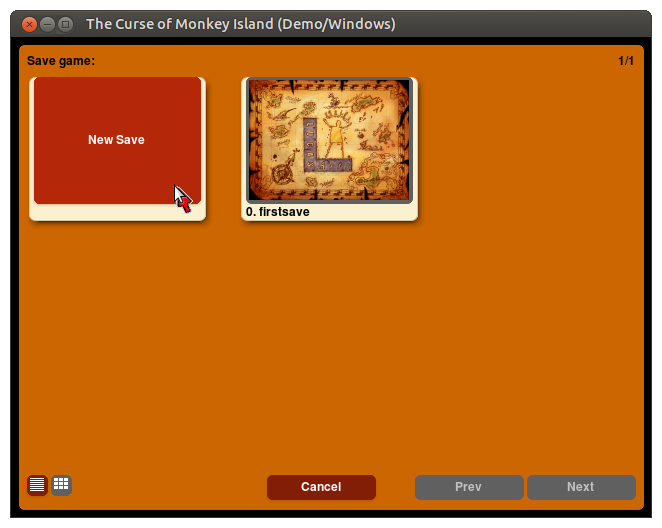
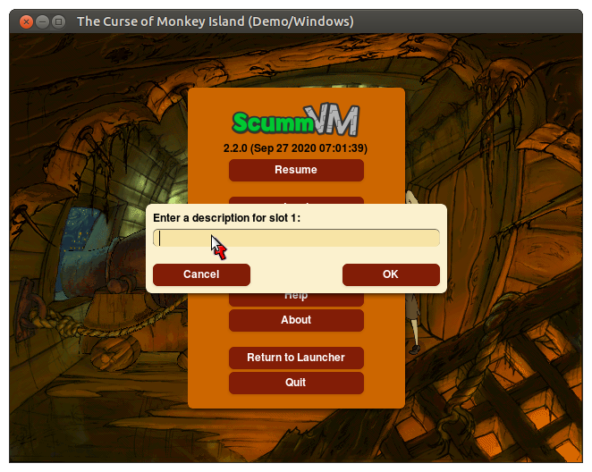
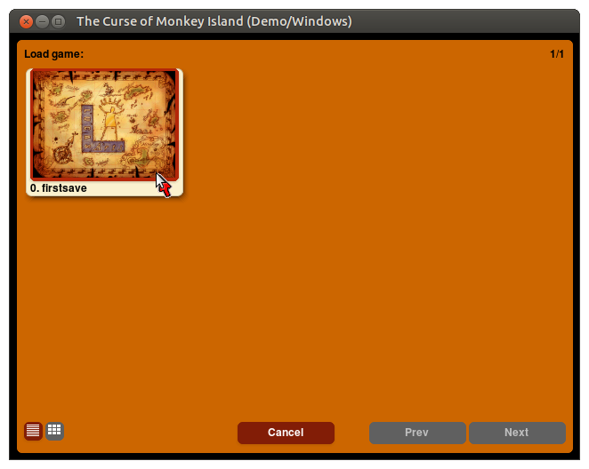

===============================
Save and load games
===============================

Save a game
==============

Press :kbd:`Ctrl+F5` (:kbd:`Ctrl+fn+F5` on a Mac) to access the Global Main Menu. Select **Save**.  

.. figure:: ../images/Launcher/gmm_save.png

	The Global Main Menu, or GMM. 

There are two views: list view and tile view. Click the list and tile icons at the bottom left of the window to toggle between the two.  

	Save a game, tile view.

	Save game decription, tile view. 

.. figure:: ../images/Launcher/save_game_list.png

	Save a game, list view.  

Autosave
------------

ScummVM automatically saves the game every 5 minutes. The :ref:`autosave period <autosave>` can be changed in the Misc settings tab, or in the :doc:`configuration file <../advanced_topics/configuration_file>`.

Load a game
===============

Saved games can be loaded directly from the Launcher without starting the game first, by selecting the **Load** button.

There are two views: list view and tile view. Click the list and tile icons at the bottom left of the window to toggle between the two.  

In list view, the pane on the left shows a list of your saved states. Click on a saved state to highlight it. The pane on the right shows information about the highlighted state such as timestamps, screenshots and playtime.

To load a saved game, highlight the saved state and click **Load**.

To delete a saved game, highlight the saved state and click **Delete**.

.. figure:: ../images/Launcher/load_game_list.png

	Load a game, list view. 

In tile view, each tile shows a screenshot of the saved state, as well as the description and save slot number. Click on the tile to load that saved state.

  
  Load a game, tile view. 

To load a saved state from within a game, press :kbd:`Ctrl+F5` (:kbd:`Ctrl+fn+F5` on a Mac) to access the Global Main Menu. Select **Load**.

.. _savelocation:

Location of saved game files
-------------------------------

The save directory can be changed via the savepath setting in the :doc:`Paths tab <../settings/paths>`. It can also be changed in the :doc:`configuration file <../advanced_topics/configuration_file>`.

Default saved game paths are shown below. 

.. tabbed:: macOS

	.. panels::
		:column: col-lg-12 mb-2

		macOS/Mac OSX
		^^^^^^^^^^
		``~/Documents/ScummVM Savegames/``, where ``~`` is your Home directory. 
	
.. tabbed:: Windows

	.. panels::
		:column: col-lg-12 mb-2

		Windows NT4 
		^^^^^^^^^^^^

		``<windir>\Profiles\username\Application Data\ScummVM\Saved games\`` where ``<windir>`` refers to the Windows directory. Most commonly, this is ``C:\WINDOWS``.

		---
		:column: col-lg-12 mb-2

		Windows 2000/XP
		^^^^^^^^^^^^^^^^^
		``\Documents and Settings\username\Application Data\ScummVM\Saved games\``

		---
		:column: col-lg-12 mb-2

		Window Vista/7/8/10
		^^^^^^^^^^^^^^^^^^^^^^
		``\Users\username\AppData\Roaming\ScummVM\Saved games\``
		
		.. tip::

			The AppData folder is hidden. The steps to view hidden files and folders depends on the Windows version. 

			For more information, see the `Windows support page <https://support.microsoft.com/en-us/help/14201/windows-show-hidden-files>`_.

 

.. tabbed:: Linux/Unix

	.. panels::
		:column: col-lg-12 mb-2

		
		We follow the XDG Base Directory Specification, so by default the saved games can be found at ``~/.local/share/scummvm/saves/``, but this location may vary depending on the value of the ``XDG_DATA_HOME`` environment variable.
		
		``.local`` is a hidden directory. To view it use ``ls -a`` on the command line, or, if you are using a GUI file manager, press :kbd:`Ctrl + H`.

		If ScummVM was installed using Snap, the saves can be found at ``~/snap/scummvm/current/.local/share/scummvm/saves/``

	

.. tabbed:: Other

	.. panels::
		:column: col-lg-12 mb-2

		See the relevant Platform page for details. 

