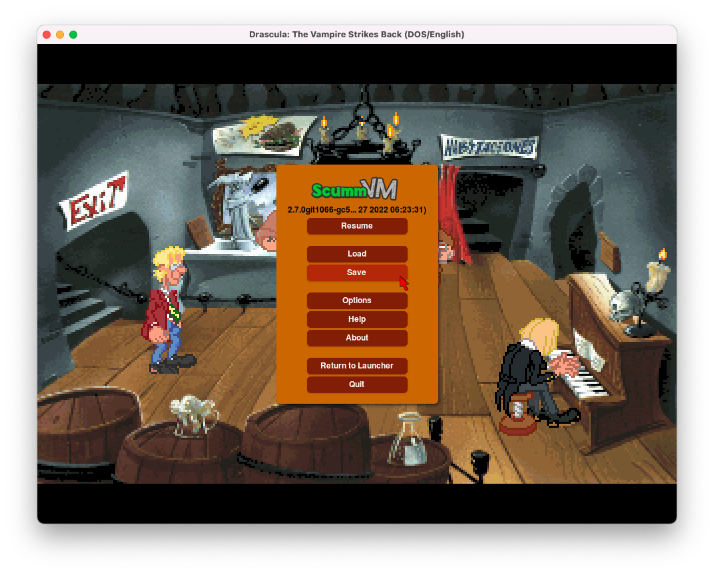
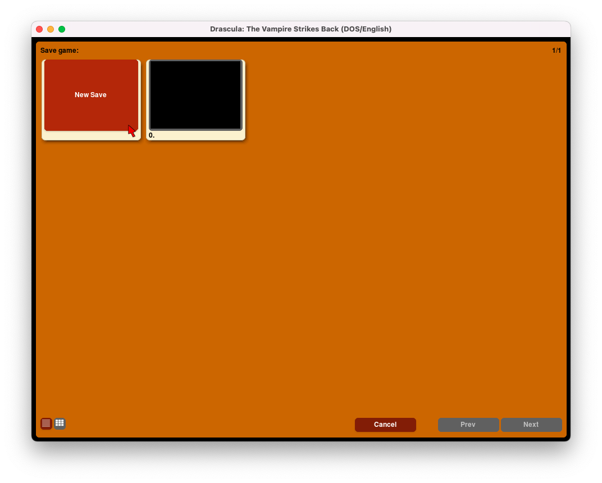
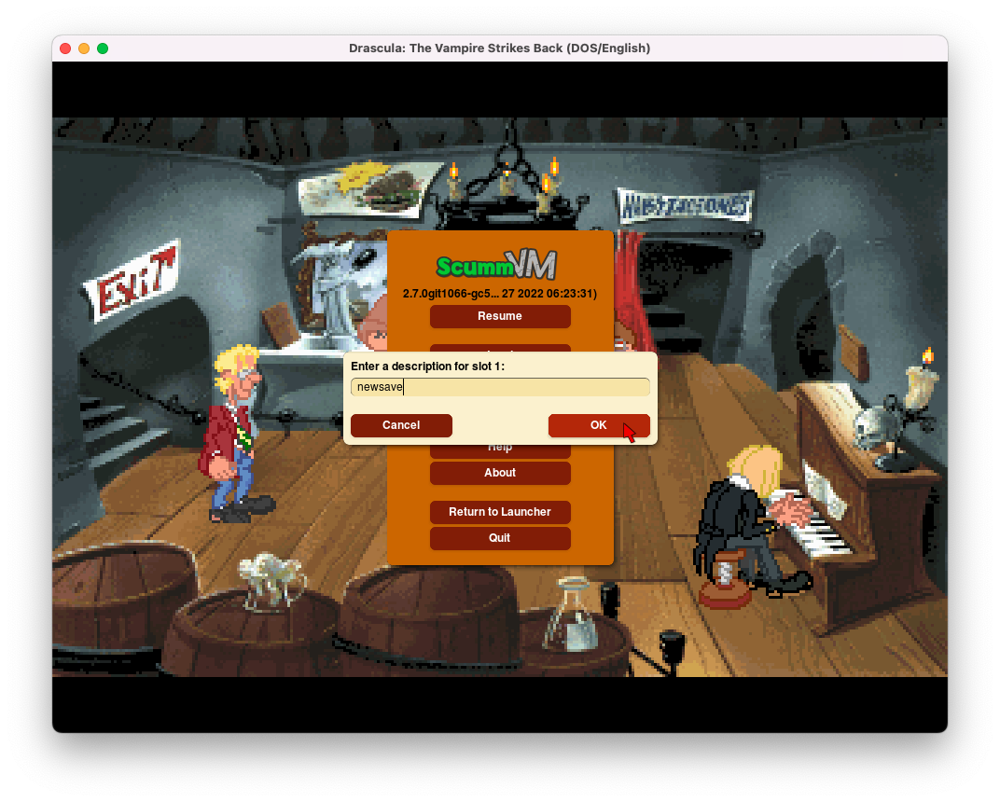
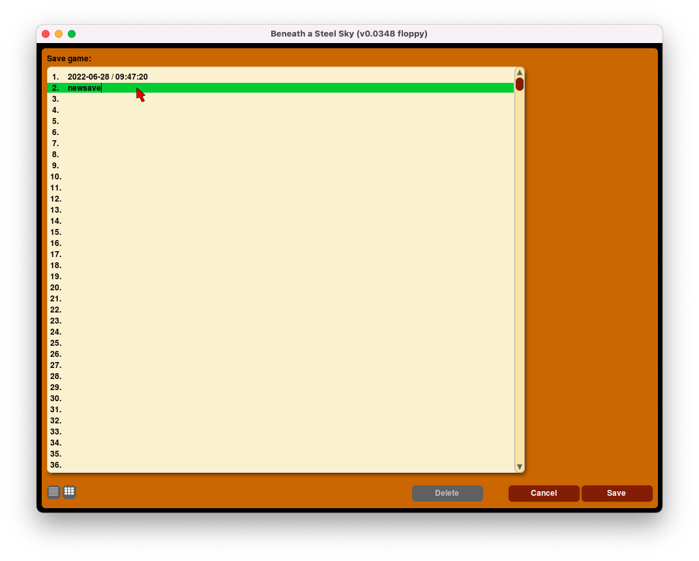
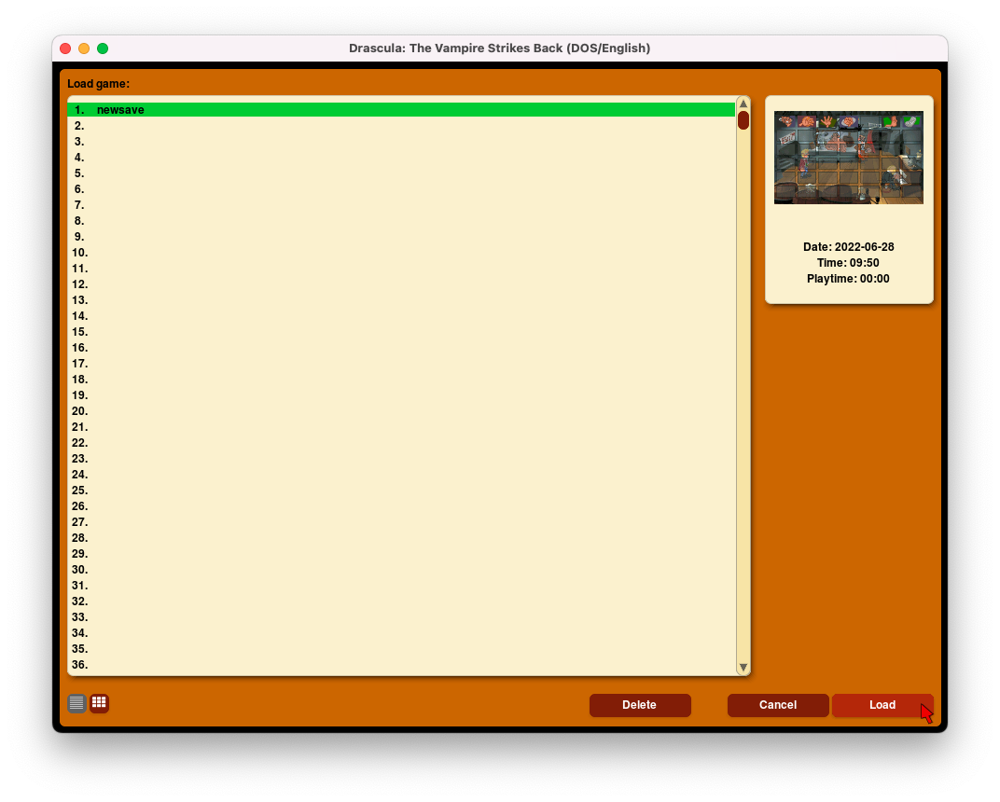
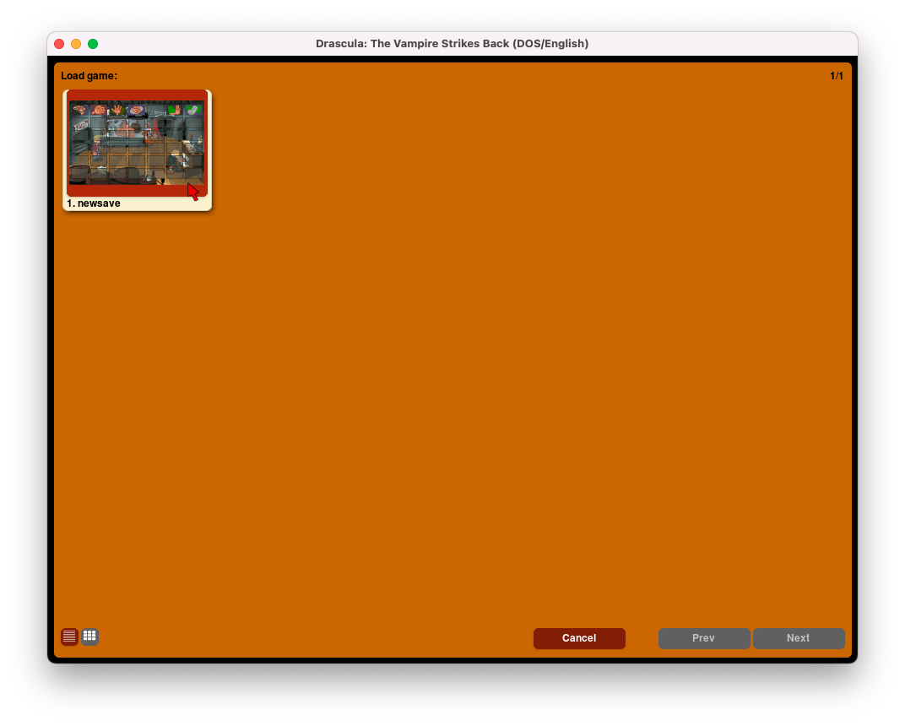

===============================
Saving and loading a game
===============================

This page explains how to save and load a game from the Global Main Menu, or load a game directly from the Launcher.

.. note::

	Some games use their own load or save entry points within the game, or use their own menu instead of the GMM.

Saving a game
==============

When you're playing a game and you're ready to save, press :kbd:`Ctrl+F5` (:kbd:`Ctrl+fn+F5` on a Mac) to access the Global Main Menu. Select **Save**.

	The Global Main Menu (GMM).

There are two views: list view and grid view. Click the list and grid icons at the bottom left of the window to toggle between the two.

In tile view, click on the **New Save** tile. Enter a description for the game, then click **OK**.

	Saving a game, grid view.

	Save game decription, grid view.

In list view, click on a slot to save the game to that slot. Enter a description for the game, then click **Save**.

	Saving a game, list view.

Autosave
------------

ScummVM automatically saves your game every 5 minutes. The :ref:`autosave period <autosave>` can be changed in the Misc settings tab, or in the :doc:`configuration file <../advanced_topics/configuration_file>`.

Location of saved game files
===============================

The save directory can be changed with the savepath setting in the :doc:`Paths tab <../settings/paths>`. It can also be changed in the :doc:`configuration file <../advanced_topics/configuration_file>`.

.. _savelocation:

Default saved game paths are shown below.

.. tab-set::

    .. tab-item:: Windows

        ``%APPDATA%\ScummVM\Saved games``

    .. tab-item:: macOS

        ``~/Documents/ScummVM Savegames/``

    .. tab-item:: Linux/Unix

        ScummVM follows the XDG Base Directory Specification, so by default the saved games can be found at ``~/.local/share/scummvm/saves/``, but this location might vary depending on the value of the ``XDG_DATA_HOME`` environment variable.

        ``.local`` is a hidden directory. To view it use ``ls -a`` on the command line.

        If ScummVM was installed using Snap, the saves can be found at ``~/snap/scummvm/current/.local/share/scummvm/saves/``

Loading a game
===============

If you want to load your saved game without having to start the game first, select the **Load** button directly from the Launcher. To load a saved game while you're playing a game, press :kbd:`Ctrl+F5` (:kbd:`Ctrl+fn+F5` on a Mac) to access the Global Main Menu, then select **Load**.

There are two views: list view and tile view. Click the list and tile icons at the bottom left of the window to toggle between the two.

In list view, the pane on the left shows a list of your saved games. Click on a saved game to highlight it.  In the pane on the right you can see timestamps, screenshots and playtime for that saved game.

Once you have highlighted the game you want to play, click **Load**.

To delete a saved game, highlight the saved game and click **Delete**.

	Loading a game, list view.

In grid view, each tile shows a screenshot of the saved state, as well as a description and a save slot number. Click on the tile to load that saved game.

  Loading a game, grid view.
