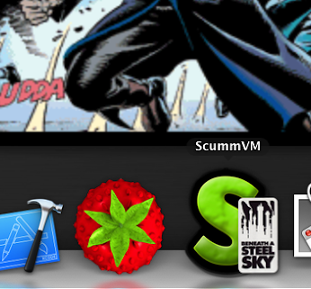

===========================
Taskbar integration
===========================

The taskbar integration has several features:

    - Adds an overlay icon in the taskbar/dock when running a game (Windows and macOS)
    -  Updates a list of recently played games that can be started from the taskbar/dock (Windows and macOS).
    -  Shows a progress bar when doing a mass add of games, and shows the number of games found at the end (Windows, macOS and Linux).
    -  Shows an error state in the taskbar if an error occurs when running a game (Windows only).

Setting up the icon overlay
================================

Currently the taskbar cannot yet use the icons .dat files that can be dowloaded from the **Global Options**. This means the icons need to be downloaded manually from our `Github repository <https://github.com/scummvm/scummvm-icons>`__. Either place these in the default :ref:`Icon Path <iconspath>` or change the Icon Path to point to the folder containing the icons.

The icon files must be ICO files for Windows, or PNG files for macOS. They must follow one of these naming conventions, where xxx is the file extension:

    - :ref:`ID <id>`.xxx
    - gameid.xxx
    - engineid.xxx
    - engineid-gameid.xxx

To find the gameid and the engineid, open the :doc:`configuration file <../advanced_topics/configuration_file>`. The game entry will be similar to this:

.. code::

    [lure]
    description=Lure of the Temptress (VGA/DOS/English)
    iconspath=/Users/user/games/icons
    path=/Users/user/games/lure
    gameid=lure
    engineid=lure

    macOS dock with a custom icon overlay for Beneath a Steel Sky.

Launching recently played games
=======================================

To start a recently played game, right click on the ScummVM icon in the taskbar or dock, and select the game you want to play.

