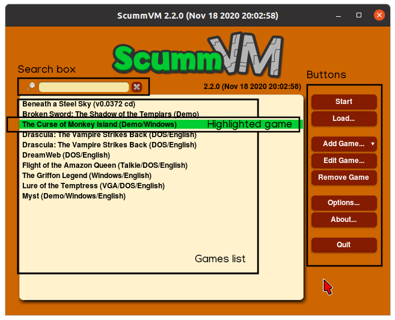
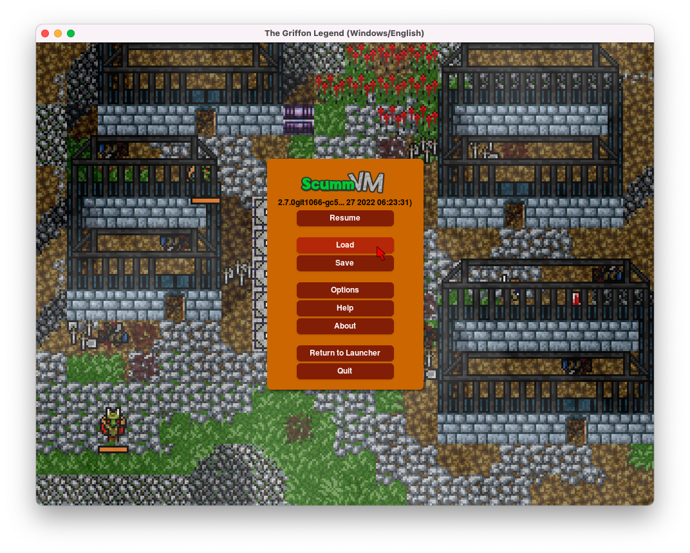

===================================
Understanding the interface
===================================

The Launcher
===============

The main ScummVM window is called the Launcher. The Launcher opens whenever you start ScummVM, unless you launch a game directly from the command line. 

   
   The Launcher, with labels for each GUI element. 

The games list
********************

The pane on the left is the games list, which lists all the games that have been added to ScummVM. The games list usually offers some additional information about each game, such as original platform and language. To highlight any game on the list, type the first letter(s) of its title, or click on it.

The search box
********************

The search box lets you filter the games list. It is located at the top of the page next to the magnifying glass icon. The filter is applied as you type, and is not case sensitive. To clear the filter, click **X**.

There are many ways to filter games. For example, you can type "Monkey Island" to locate all "Monkey Island" games on the list, or you can type "German" to find German games. 

The buttons
************************

To the right of the games list there are a number of buttons. Their functions are as follows:

Start
^^^^^^^^
Launches the highlighted game.

Load 
^^^^^^^

Opens the load game window, from which you can go to a saved game without having to start the game first. 

See the :doc:`save_load_games` page.

Add Game 
^^^^^^^^^^

Opens a file browser. To add a game, select a folder containing game files. 

See the :doc:`add_play_games` page.

Edit Game 
^^^^^^^^^^^^

Opens the game settings window. This window also opens whenever a game is added to the games list in the Launcher.

Use this window to configure settings specific to a game. These settings override the global settings. For more information, see the :doc:`../use_scummvm/how_to_settings` page. 

Remove Game
^^^^^^^^^^^^^

Removes the highlighted game from the list. This does not remove any saved games, so if you add a game to the games list again, you are able to resume where you left off. 

Options
^^^^^^^^^^^

Opens the global settings window. Use this window to define global game settings, as well as change a number of the ScummVM Launcher settings. For more information, see the :doc:`../use_scummvm/how_to_settings` page.

About
^^^^^^^^^^
Shows credits and miscellaneous information about ScummVM.

Quit
^^^^^^^
Closes the Launcher and quits the ScummVM application.

The Global Main Menu
=====================

You can access the ScummVM Global Main Menu, also known as the GMM, while you are playing a game. To open the GMM, press :kbd:`Ctrl+F5` (:kbd:`Ctrl+fn+F5` on a Mac). 

   The Global Main Menu, or GMM.

The buttons
*****************

In the Global Main Menu there are a number of buttons. Their functions are as follows:

Resume 
^^^^^^^^^^

Closes the GMM and resumes the game.

Load
^^^^^^

Opens the load game window. From here, you can load a saved game.

Save
^^^^^^

Opens the save game window. From here, you can save a game. 

Options
^^^^^^^^

Opens a dialog which provides some gameplay options, such as sound volume, subtitle and keymap settings. 

About
^^^^^^^^^^^

Displays the ScummVM **About** dialog. This is also available from the Launcher.

Help
^^^^^^

Displays a list of keyboard shortcuts for the game. 

Return to Launcher
^^^^^^^^^^^^^^^^^^^^^

Quits the game and returns to the Launcher. 

.. note::
   
   This is not available for all games.

Quit
^^^^^^^
Quits the game and ScummVM, and returns to the operating system. Any unsaved game progress is lost. 

