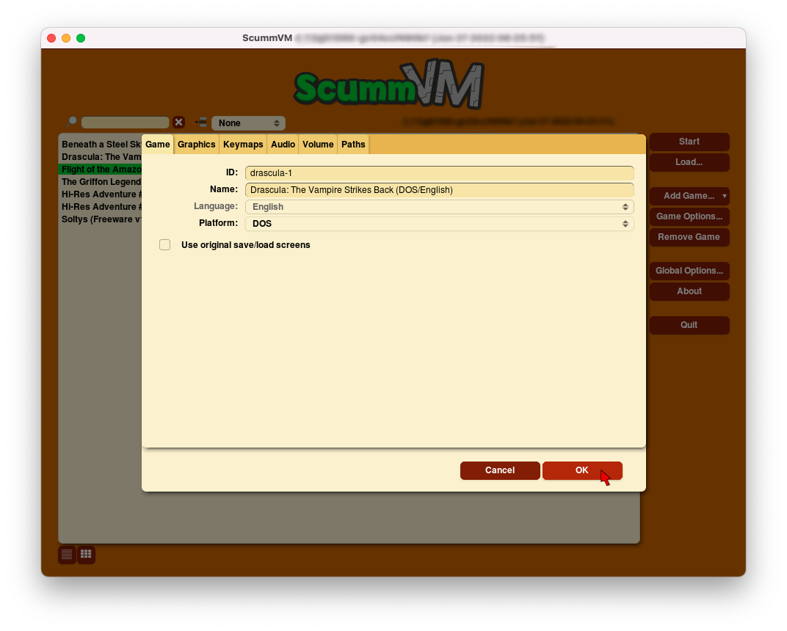
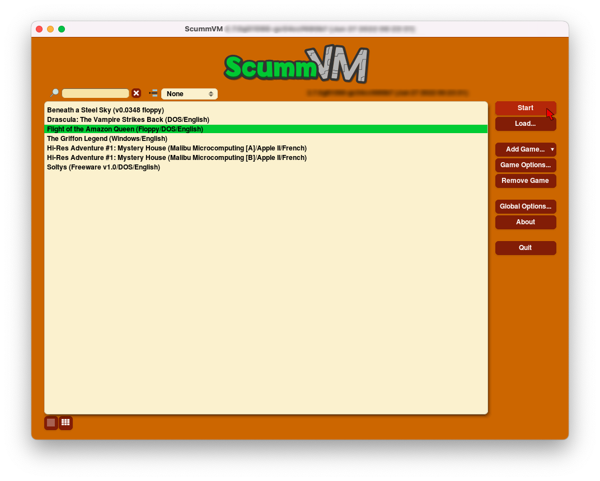

=================================
Add and play games
=================================

The game files
------------------------

ScummVM needs access to the data files for each game. A comprehensive list of required data files for each game is found on the `ScummVM Wiki Datafiles <https://wiki.scummvm.org/index.php?title=Datafiles>`__ page. ScummVM can run the game data files from any directory it has access to, including external media. 

.. note::

    For ease of use, you can create a dedicated games directory into which subdirectories containing game files can be copied. The resulting directory structure will look somewhat like this::

        ScummVM Games
        |-- Day of the Tentacle
        |   |-- MONSTER.SOU
        |   |-- TENTACLE.000
        |   `-- TENTACLE.001
        `-- Flight of the Amazon Queen
            |-- QUEEN.1
            `-- queen.tbl

   The exact layout of files and folders within the game folder is not important, as long as all the files are there.

For games on floppies or CDs:

- If the data files are accessible, the external media can be accessed directly by ScummVM. Alternatively, copy the game files to a folder as described above. 
- If the data files are not accessible, run the installer on the platform the game was designed for, to extract the individual files. 

For games downloaded from digital distributors such as `GOG.com  <gog.com>`__, `Steam <https://store.steampowered.com>`__, or from various `freeware sources <https://wiki.scummvm.org/index.php?title=Where_to_get_the_games#Freeware_Games>`__ sources:

- Run the installer, or
- If the data files are supplied as a .zip file, extract the archive.

.. tip::

   A great way to share game files and automatically back up and sync your saved game states between devices is to connect a Cloud storage service to ScummVM. For detailed instructions see the :doc:`../guides/connect_cloud` guide.

   For devices on the same local network, ScummVM can run a web server to allow hassle-free transfer of files. For detailed instructions, see the :doc:`../guides/local_webserver` guide. This is a good option if you do not wish to connect a Cloud service.

Multi-disc games
*****************

ScummVM needs access to all the data files, so it will not be able to run directly from a CD if the game has multiple discs. To add a multi-CD game, copy the required data files from the CD to a folder on your hard drive. 

- Where there are duplicate, identical files (same name, same file size) on more than one disc, only one copy of the file is required. 
- Where there are files that have the same name but are different on each disc, rename them. For example, where there is a ``music.clu`` on two discs, rename the file on the first disc to ``music1.clu`` and the file on the second disc to ``music2.clu``. 

.. _cdaudio:

CD audio
**********

Some games contain one or more separate audio tracks on CD. To use these with ScummVM, they need to be extracted from the CD in ``.wav`` or ``.aiff`` format, and then converted to either ``.mp3``, ``.flac`` or ``.ogg`` file formats. 

.. tip::

    Software suggestion:

    `fre:ac <https://www.freac.org/>`_ is a multi-platform, open-source software, with the ability to both rip CDs and convert audio between .mp3, .ogg, .flac and .wav formats. 

Place the converted audio files in the same folder that contains the other game datafiles. 

.. _macgames:

Macintosh games
******************

All LucasArts SCUMM games also exist in versions for the Macintosh. Most of the newer games shipped with only a single data file; ScummVM can use this file like it does any other data file. Some discs shipped with hidden files. To view hidden files in macOS, press :kbd:`Cmd+Shift+.` in a Finder window.  

Mac uses a different file system to other systems (HFS+), so to access the CD or floppy disc on a Windows or Linux system you will need additional software to view and copy the files. 

For Windows, HFSExplorer is a basic and free option, which allows read-only access to HFS drives. `Download the installer <http://www.catacombae.org/hfsexplorer/>`_ rather than the ZIP file, to ensure it is installed correctly. 

For Linux, hfsplus allows read-only access to HFS drives. To use hfsplus, use the command line: 

   1. Install hfsplus using the software manager. On Debian-based distributions, use ``sudo apt install hfsplus``.
   2. Find the game disc by running ``sudo fdisk -l`` and finding the one with type ``Apple HFS/HFS+``. In this example, this is ``/dev/fd0``.
   3. Create a mount point, for example: ``sudo mkdir /media/macgamedrive``
   4. Mount the device to that moint point: ``sudo mount -t hfsplus /dev/fd0 /media/macgamedrive``
   5. Access the device at ``/media/macgamedrive``.

.. _add and play games:

Add games to the Launcher
---------------------------------

1. Run ScummVM to open :doc:`../using_scummvm/the_launcher`.

2. In the Launcher window, click **Add Game**. This opens a file browser; either the system file browser or the ScummVM file browser. To add multiple games at once, click the expander arrow next to **Add Game**, and select **Mass Add**.

.. image:: ../images/Launcher/add_game.png
   :class: with-shadow

3.  Use the file browser to locate the folder containing the game data files. For the ScummVM file browser: Double click on a folder to open it, and use **Go up** to go back up one level. Click **Choose** to select the folder. 

.. image:: ../images/Launcher/choose_game_directory.png
   :class: with-shadow

.. note::

   The **Use Native file browser**  option in the :doc:`Misc <../settings/misc>` tab of the global settings controls whether ScummVM uses the native system file browser, or its own file browser. 

5.  The **Edit Game** dialog opens to allow configuration of various settings for the game. These can be reconfigured at any time, but for now everything should work at the default settings. Click **Ok**. 

6. Games are now ready to play! To play, select a game and click **Start**.

Games can also be launched directly from the command line. For more information, see the `Command line options <../advanced_options/command_line>`_ page.

