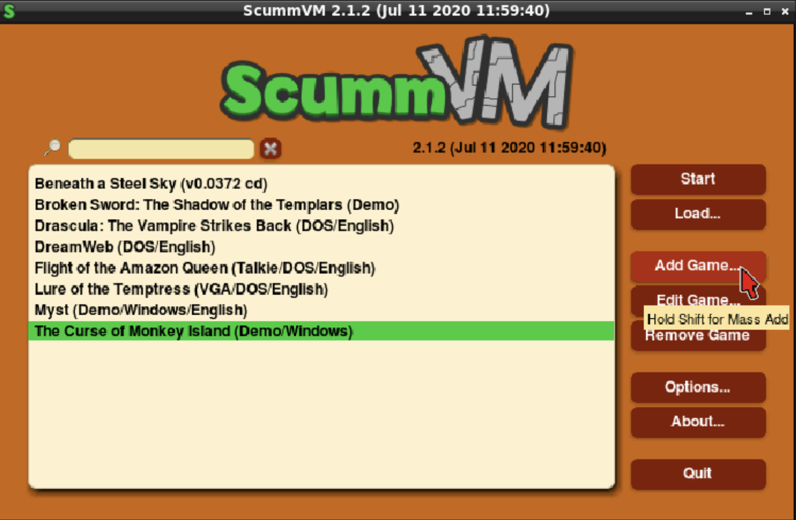
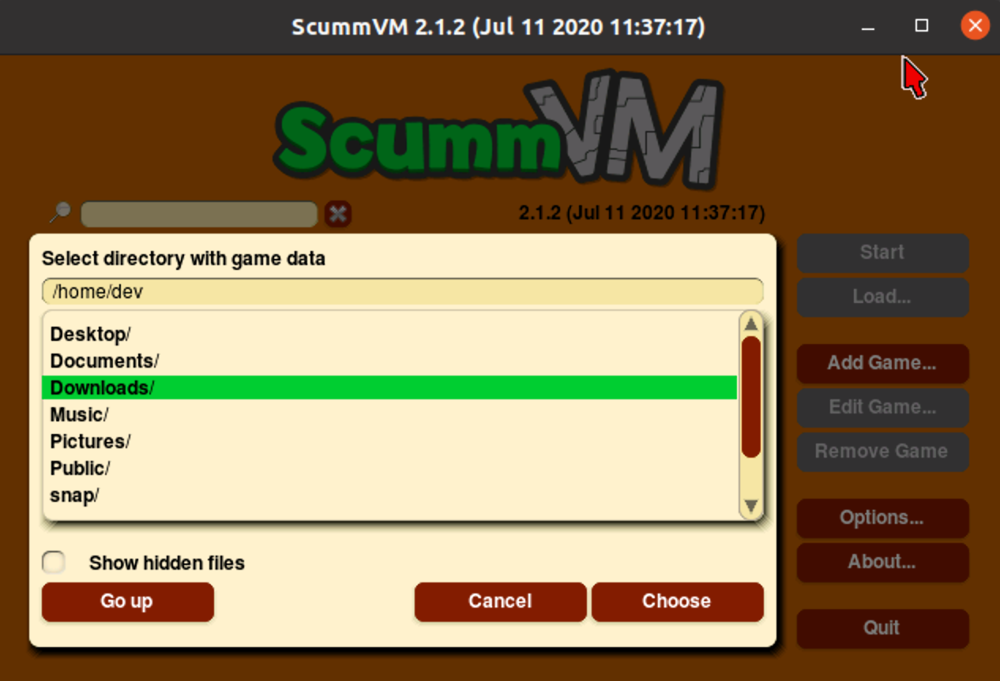
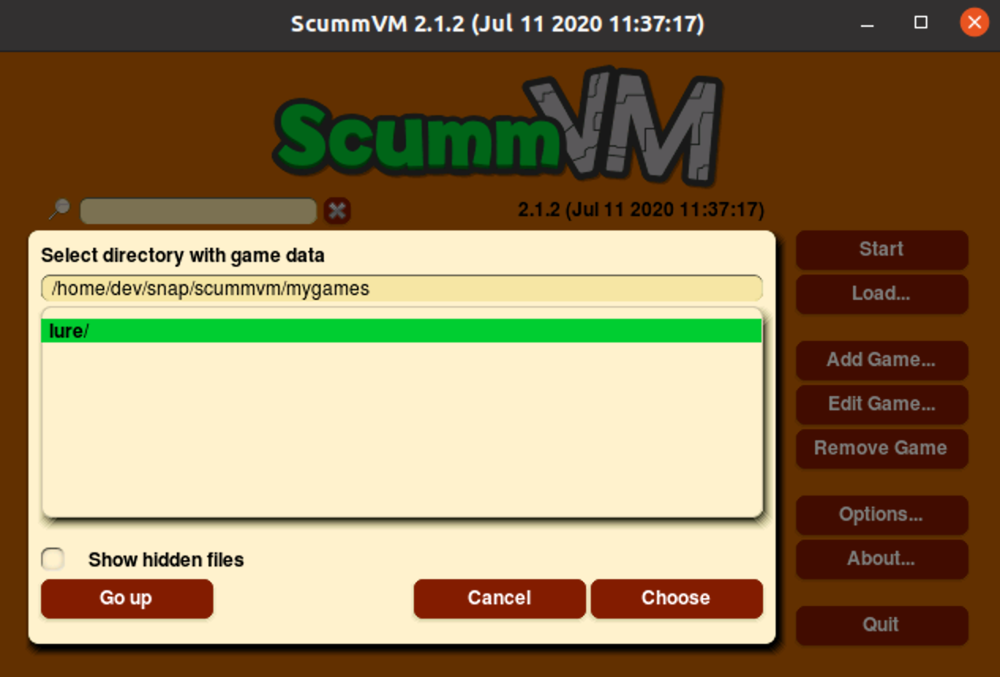
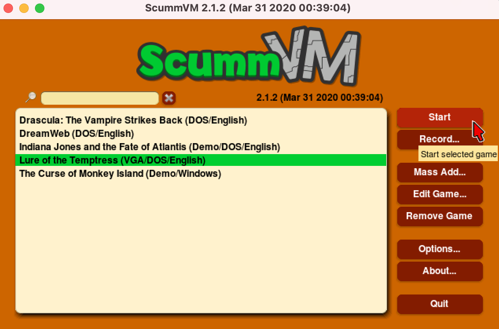

=================================
Adding and playing games
=================================

Accessing the game files
------------------------

ScummVM needs access to the data files for each game. A comprehensive list of required data files for each game can be found on the `ScummVM Wiki Datafiles <https://wiki.scummvm.org/index.php?title=Datafiles>`__ page. ScummVM can run the game data files from any directory it has access to, including external media. 

.. note::

    For ease of use, you can create a dedicated games directory into which subdirectories containing game files can be copied. The resulting directory structure will look somewhat like this::

        mygames
        |-- myfirstgame
        |   |-- readme.txt
        |   |-- firstgame.cpt
        |   |-- firstgame.dnr
        |   `-- firstgame.dsk
        `-- mysecondgame
            |-- secondgame.1c
            `-- readme.txt

For games on floppies or CDs:

- If the data files are accessible, the external media can be accessed directly by ScummVM. Alternatively, copy the game files to a folder as described above. 
- If the data files are not accessible, run the installer on the platform the game was designed for.

For games downloaded from digital distributors such as `GOG.com  <gog.com>`__, `Steam <https://store.steampowered.com>`__, or from various `freeware sources <https://wiki.scummvm.org/index.php?title=Where_to_get_the_games#Freeware_Games>`__ sources:

- Run the installer or
- If the data files are supplied as a .zip file, extract the archive.

.. _add and play games:

Adding the games to the Launcher
---------------------------------

1. Run ScummVM to open :doc:`../using_scummvm/the_launcher`.

2. In the Launcher window, click **Add Game**. This opens a file browser. To add multiple games at once, hold :kbd:`Shift` while clicking **Add Game**.

3.  Use the file browser to locate the folder containing the game you wish to add. Double click on a folder to open it, and use **Go up** to go back up one level. 

4. Once you have selected the folder that contains the data files, click **Choose**. 

5.  A dialog opens to allow configuration of various settings for the game. These can be reconfigured at any time, but for now everything should work at the default settings. Click **Ok**. 

.. image:: ../images/Launcher/add_game_settings.jpg
   :class: with-shadow

6. Added games are now ready to play! To play, select a game and click **Start** to play. 

Games can also be launched directly from the command line.

- To launch a game with no additional options, run ``scummvm`` followed by the game id.   
- To launch a game with options, run ``scummvm``, followed by any desired options, and then the game id. For more information, see the `Command line options <../advanced_options/command_line>`_ page.

In the following example, Flight of the Amazon Queen will be launched in full screen:

.. code:: 

   scummvm -f queen

.. image:: ../images/Launcher/start_game_cli.jpg
   :class: with-shadow

