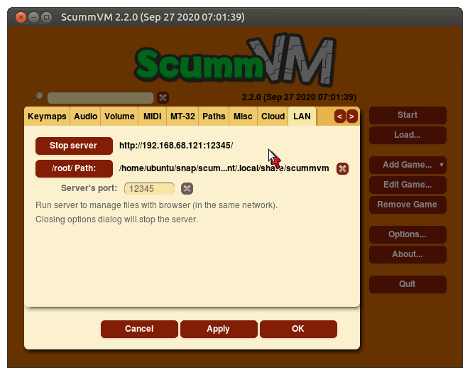
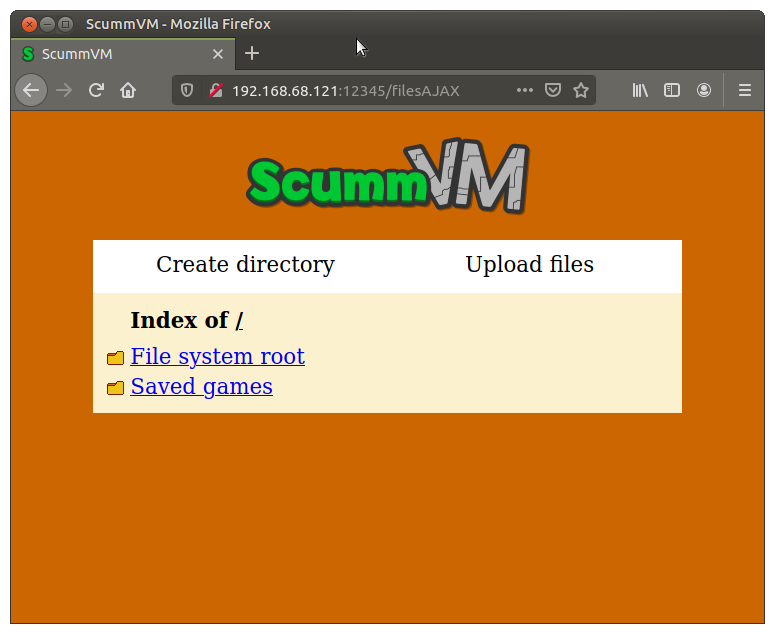

===================================
Cloud and LAN
===================================

Cloud
---------

ScummVM currently supports Dropbox, OneDrive, Google Drive and Box. Connecting ScummVM to a cloud storage service provides an easy way of sharing game files and saved games between multiple devices. 

To access Cloud settings, click on **Options** in the Launcher, and then click on the **Cloud** tab. 

.. note::

    Cloud functionality is not supported on all platforms. 

To connect your chosen cloud storage service to ScummVM, select it from the **Active storage** dropdown. 

.. figure:: ../images/cloud_and_lan/cloud_storage.png

Click on the link shown at **1.**, and log in to your cloud storage account. Once you have logged in, a 6-digit code will be displayed.

.. figure:: ../images/cloud_and_lan/cloud_code.png

Copy the 6-digit code, click into the empty box next to the **Paste** button, and then click the **Paste** button. 

.. figure:: ../images/cloud_and_lan/cloud_connect.png

Click **3. Connect**, then, once the next information loads, click on **Enable storage**.

.. figure:: ../images/cloud_and_lan/cloud_enable.png

Saved games automatically sync on launch, after saving, and on loading a saved game. You can also manually sync by using the **Sync now** button. 

To download the game files from your cloud ScummVM folder, click **Download game files**.

To change to a different cloud account, or to disconnect your cloud account from ScummVM, click **Disconnect**.

LAN
------

ScummVM can run a local server to make it easier to manage files. 

To access LAN settings, click on **Options** in the Launcher, and then click on the **LAN** tab.

.. caution::

    The options dialog must remain open while the server is running. Closing the options dialog will stop the server. 

Click **Run server** and then navigate to the IP address shown to access the ScummVM files. 

You can change what is accessible on the server by changing the **/root/ Path**. Any files or directories contained inside this directory will be accessible on the server. The server port can be changed to any port, although the default ``12345`` is unlikely to be in used. 

