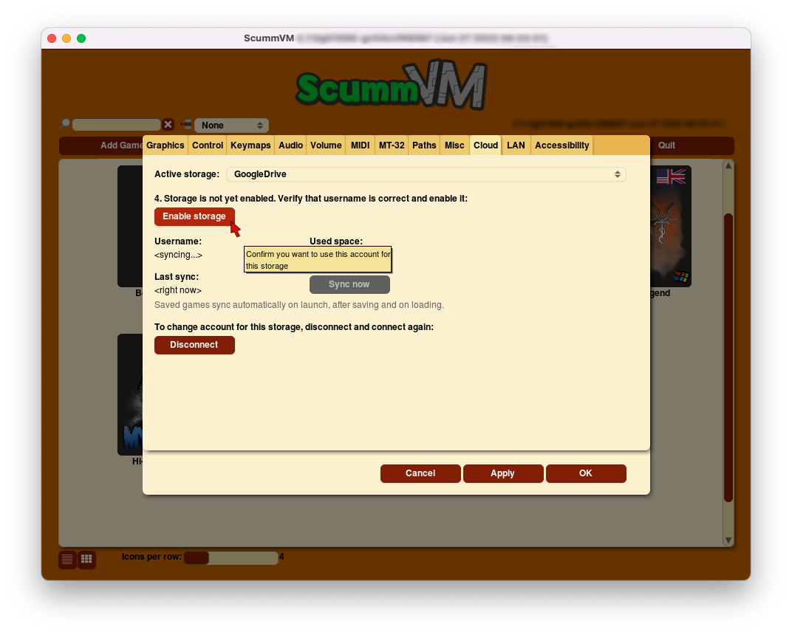

===============================
Connect a Cloud service
===============================

From the Launcher, go to **Options > Cloud**.

To connect your chosen cloud storage service to ScummVM, select it from the **Active storage** dropdown. 

.. figure:: ../images/cloud_and_lan/cloud_storage.png

Click on the link shown at **1.**, and log in to your cloud storage account. Once you have logged in, a 6-digit code will be displayed.

.. figure:: ../images/cloud_and_lan/cloud_code.png

Copy the 6-digit code, click into the empty box next to the **Paste** button, and then click the **Paste** button. 

.. figure:: ../images/cloud_and_lan/cloud_connect.png

Click **3. Connect**, then, once the next information loads, click on **Enable storage**.

Saved games automatically sync on launch, after saving, and on loading a saved game. You can also manually sync by using the **Sync now** button. 

To download the game files from your cloud ScummVM folder, click **Download game files**.

To change to a different cloud account, or to disconnect your cloud account from ScummVM, click **Disconnect**.