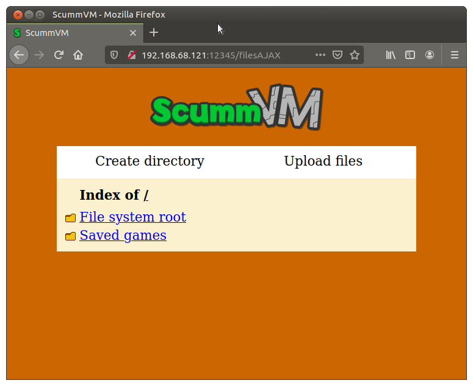
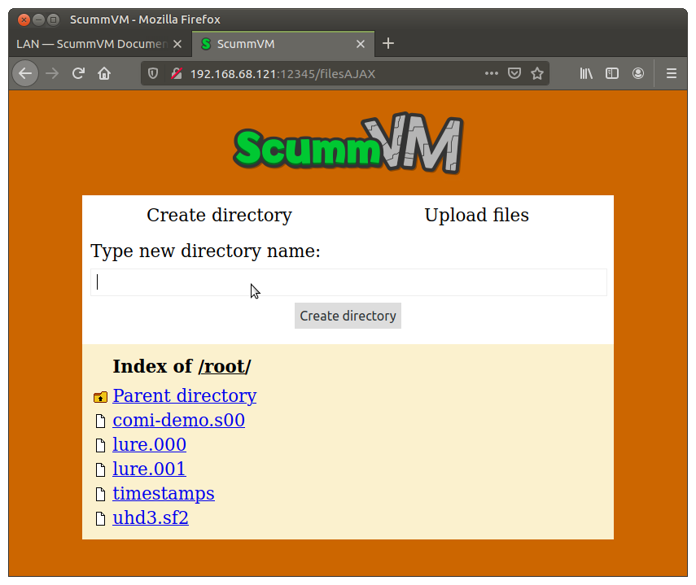
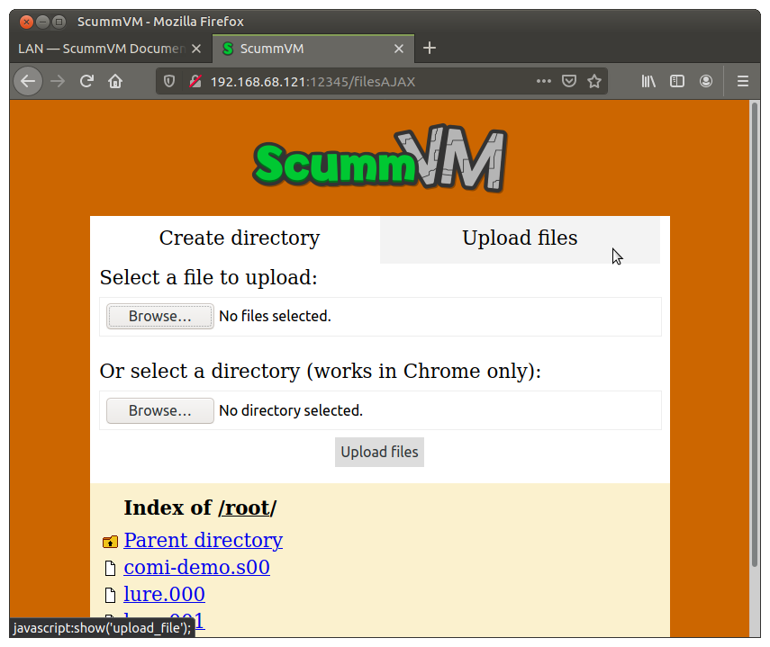

==============================
Set up a local webserver
==============================

ScummVM has the ability to run a local webserver, to make the transfer of game files easier. 

How to use the web server
----------------------------

Go to **Options > LAN**. You may need to use the red **>** button to bring the LAN tab into view. 

Click **Run server**. 

.. figure:: ../images/settings/LAN.png

    The LAN tab. 
    
To access the server, type the URL shown into the address bar of any web browser:

    The server running in the browser. 

To download a file, click on the file you wish to download. A system download dialog box opens.

To create a new directory, click **Create Directory**. 

    Creating a new directory.

To upload files, click **Upload Files** and select files from the system file explorer. 

    Uploading files. 
