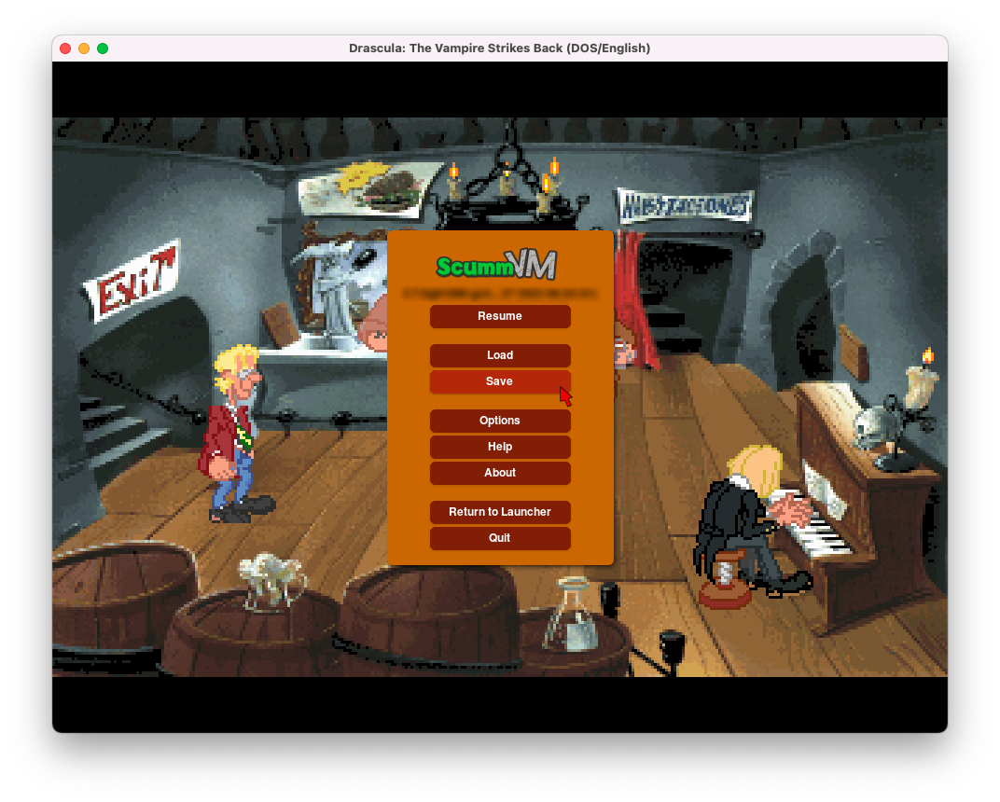

===============================
Save and load games
===============================

Save a game
==============

Games can be saved from the Global Main Menu (GMM), which can be accessed during game play by using the default :kbd:`Ctrl` + :kbd:`F5` keyboard shortcut, or by using the shortcut set in the :doc:`../settings/keymaps` setting. 

	The Global Main Menu, or GMM. 

There are two views: list view and tile view. Toggle between the two by clicking the list and tile icons at the bottom left of the window.  

.. figure:: ../images/Launcher/save_game_tile.png

	Saving a game, tile view.

.. figure:: ../images/Launcher/save_game_tile_desc.png

	Save game decription, tile view. 

.. figure:: ../images/Launcher/save_game_list.png

	Saving a game, list view.  

.. caution::

	Saving via the Global Main Menu does not work for all games. Some games have support for saving and loading games using the in-game menu. 

Autosave
------------

ScummVM will automatically save the game every 5 minutes. The :ref:`autosave period <autosave>` can be changed in the :doc:`Misc tab <../settings/misc>` or in the :doc:`configuration file <../advanced_options/configuration_file>`.

Load a game
===============

Saved games can be loaded directly from the Launcher without starting the game first, by selecting the **Load** button.

There are two views: list view and tile view. Toggle between the two by clicking the list and tile icons at the bottom left of the window. 

In list view, the pane on the left displays a list of your saved states. Click on a saved state to highlight it. On the right, information about the highlighted state such as timestamps, screenshots and playtime is displayed. 

When you have located the desired saved game:

- Click **Load** to launch the game using that state.
- Click **Delete** to delete the saved state.

.. figure:: ../images/Launcher/load_game_list.png

	Loading a game, list view. 

In tile view, each tile shows a screenshot of the saved state, as well as the description and save slot number. Click on the tile to load that saved state.

.. figure:: ../images/Launcher/load_game_tile.png
  
  Loading a game, tile view. 

Saved games can also be loaded from the Global Main Menu, which can be accessed during game play by using the default :kbd:`Ctrl` + :kbd:`F5` keyboard shortcut, or by using the shortcut set in the :doc:`../settings/keymaps` setting. 

.. caution::
  	
	Not all games support saving and loading games via the Global Main Menu. 

	In some games you can still access the original game menu by using :kbd:`Alt` + :kbd:`F5`. You can save and load games this way, however this may crash ScummVM in some games. 

Location of saved game files
-------------------------------

Saved game files can be found in the current ScummVM directory for some platforms, and in default directories for others. The defaults for Windows, Mac and Linux/Unix are shown below. 

The save directory can be changed via the savepath setting in the :doc:`Paths tab <../settings/paths>`. It can also be changed in the :doc:`configuration file <../advanced_options/configuration_file>`.

.. tabs::

	.. tab:: Mac OSX

		``~/Documents/ScummVM Savegames/``, where ``~`` is your Home directory. To see the Libraries folder you will need to view hidden files.
	
	.. tab:: Windows

		**Windows NT4**: ``<windir>\Profiles\username\Application Data\ScummVM\Saved games\`` where ``<windir>`` refers to the Windows directory. Most commonly, this is ``C:\WINDOWS``.
		
		**Windows 2000/XP**: ``\Documents and Settings\username\Application Data\ScummVM\Saved games\``
		
		**Window 7/Vista**: ``\Users\username\AppData\Roaming\ScummVM\Saved games\``
		
		The Application Data/AppData directory is hidden. To view it, use the Run utility or the command prompt, and enter ``%APPDATA%\ScummVM\Saved Games``, or enable hidden files in Windows Explorer. 

	.. tab:: Linux/Unix

		We follow the XDG Base Directory Specification. This means our configuration can be found in ``$XDG_DATA_HOME/scummvm/saves/``

		If XDG_DATA_HOME is not defined or empty, ``~/.local/share/`` will be used, where ``~`` is your Home directory. 
		
		Note that ``.local`` is a hidden directory; to view it use ``ls -a`` on the command line. If you are using a GUI file manager, go to **View > Show Hidden Files**, or use the keyboard shortcut :kbd:`Ctrl + H`.

		If ScummVM was installed using Snap, the saves can be found at ``~/snap/scummvm/current/.local/share/scummvm/saves/``

.. _originalsaves:

