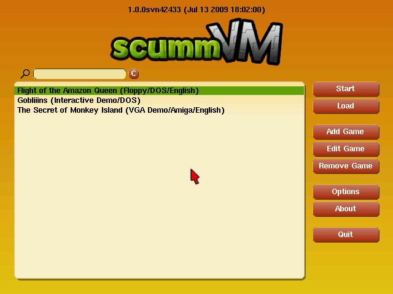
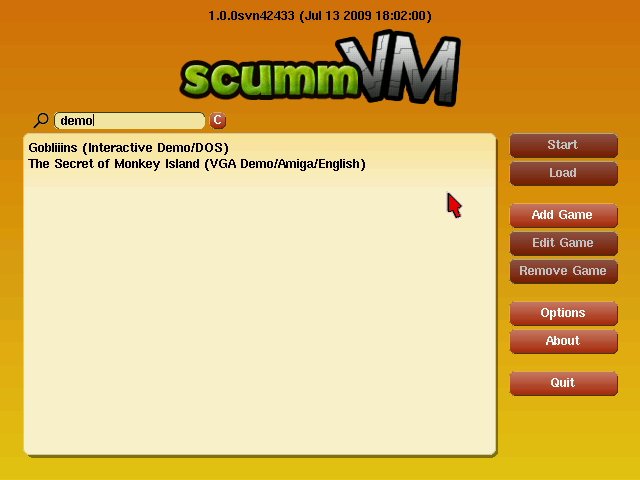
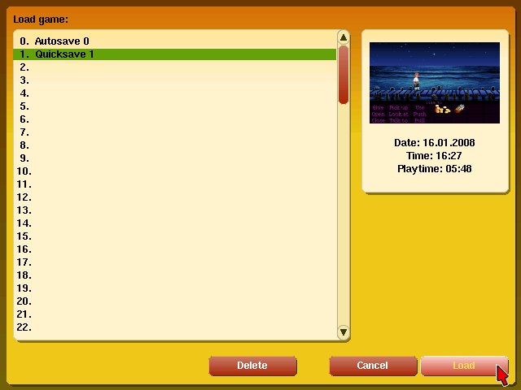
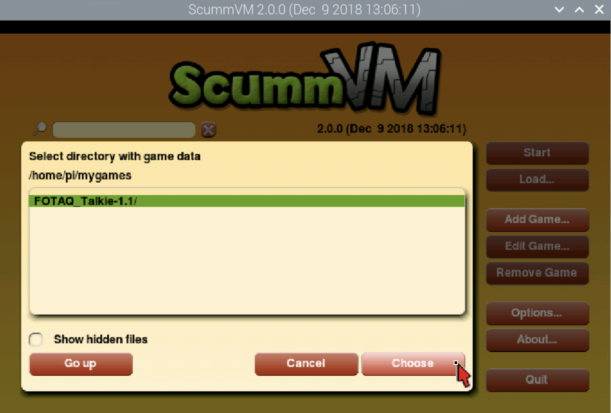
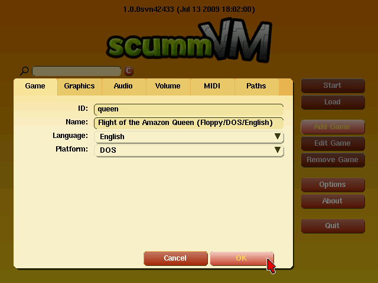
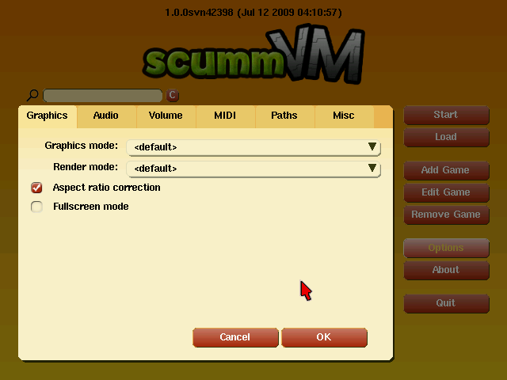
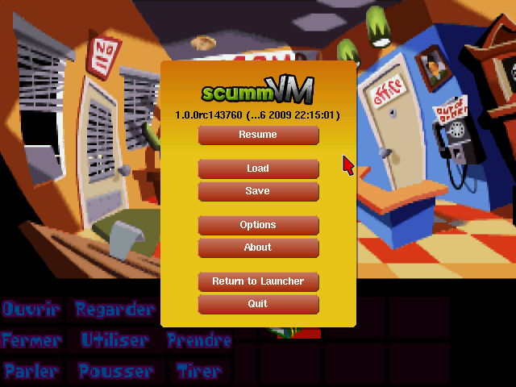

==============
The Launcher
==============

The main ScummVM window is called the Launcher. The Launcher opens whenever you start ScummVM without launching a game directly.

The games list
===============

The pane on the left lists the games you have added to ScummVM. This list usually offers some additional information about each game, such as original platform and language. To highlight any game on the list, type the first letter(s) of its title, or click on it.

Quick search
=============

Quick search allows you to filter the list of added games. 
The quick search input is located at the top of the page next to the magnifying glass icon. The filter is applied as you type, and is not case sensitive. To clear the filter, press the **C** button next to the input box. 

There are many ways to filter games. For instance, you can type "Monkey Island" to quickly locate all "Monkey Island" games on the list, or you can type "German" if you wish to play a game in German. 

The buttons
============
To the right of the games list there are a number of buttons. Their functions are as follows:

Start
-----
Launches the highlighted game.

Load 
----

Opens the Load window, from which you can run a previously saved state without having to start the game first. 

The pane on the left displays a list of your saved states. Click on a saved state to highlight it. On the right, information about the highlighted state such as timestamps, screenshots and playtime is displayed. When you have located the desired saved game:

- Click **Load** to launch the game using that state.
- Click **Delete** to delete the saved state.

.. caution::
  There are games that do not support this feature at all, or whose saved states lack information such as playtime or screenshots. 

Add Game 
---------

Opens a file browser. Use this file browser to locate the folder containing the game you wish to add. Double click on a folder to open it, and use **Go up** to go back up one level. 

Once you have selected the folder that contains the game data files, click **Choose**. 

To add more than one game at a time, hold :kbd:`Shift` while clicking **Add Game**

Edit Game 
----------

Opens the game settings window. This window also opens whenever a game is added from the Launcher.

Use this window to configure a game individually by overriding the default global game settings you have set via the **Options** window. You can also change the game's language and original platform, if applicable. For more information, see the :doc:`game_settings` page. 

Remove Game
-----------

Removes the highlighted game from the list.

Options
-------

Opens the global settings window. Use this window to define global game settings, as well as change a number of the ScummVM Launcher settings. For more details on how to fine-tune ScummVM, see the :doc:`global_settings` page.

About
-----
Shows credits and miscellaneous information about your version of ScummVM.

Quit
-------
Closes the Launcher and quits the ScummVM application.

The Global Main Menu
=====================

The Global Menu (or GMM for Global Main Menu) is available while playing any game by pressing :kbd:`Crtl` + :kbd:`F5`, and provides the following features:

- **Resume:** Closes the GMM and resume the game.
- **Load:** Loads a game state. This is not available for all games.
- **Save:** Saves a game state. This is not available for all games.
- **Options:** Changes some options to play the game, such as music volume or subtitle speed.
- **About:** Displays the ScummVM About box. This is also available from the The Launcher.
- **Help:** Displays a list of key commands. This not available in all engines.
- **Return to Launcher:** Quits the game and returns to The Launcher. This is not available in all engines.
- **Quit:** Quits the game and ScummVM, and returns to the Operating System.

.. caution::
  In some games you can still access the original game menu by using :kbd:`Alt`+:kbd:`F5`. You can save and load games using this, however it is not intended for this purpose, and may even crash ScummVM in some games. 
