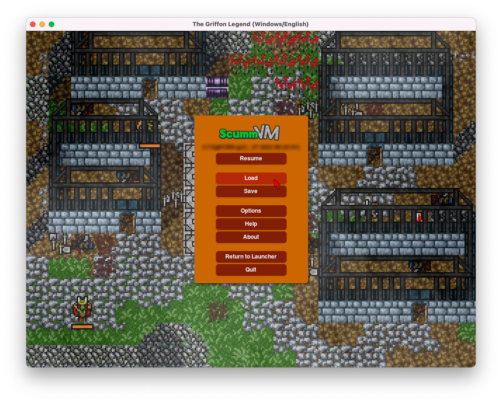

==============
The Launcher
==============

The main ScummVM window is called the Launcher. The Launcher opens whenever you start ScummVM, unless you launch a game directly from the command line. 

.. figure:: ../images/Launcher/the_launcher.png
   
   The Launcher.

The games list
===============

The pane on the left lists the games you have added to ScummVM. This list usually offers some additional information about each game, such as original platform and language. To highlight any game on the list, type the first letter(s) of its title, or click on it.

Quick search
=============

Quick search allows you to filter the list of added games. 
The quick search input is located at the top of the page next to the magnifying glass icon. The filter is applied as you type, and is not case sensitive. To clear the filter, select the **X** button next to the input box. 

There are many ways to filter games. For instance, you can type "Monkey Island" to quickly locate all "Monkey Island" games on the list, or you can type "German" if you wish to play a game in German. 

.. figure:: ../images/Launcher/quicksearch.png
   
   Using the quick search function. 

The buttons
============
To the right of the games list there are a number of buttons. Their functions are as follows:

Start
-----
Launches the highlighted game.

Load 
----

Opens the Load window, from which you can run a previously saved state without having to start the game first. 

See the :doc:`save_load_games` page.

Add Game 
---------

Opens a file browser to select a folder containing game files. 

See the :doc:`save_load_games` page.

Edit Game 
----------

Opens the game settings window. This window also opens whenever a game is added from the Launcher.

Use this window to configure a game individually by overriding the default global game settings you have set via the **Options** window. You can also change the game's language and original platform, if applicable. For more information, see the :doc:`../using_scummvm/how_to_settings` page. 

Remove Game
-----------

Removes the highlighted game from the list.

Options
-------

Opens the global settings window. Use this window to define global game settings, as well as change a number of the ScummVM Launcher settings. For more information, see the :doc:`../using_scummvm/how_to_settings` page

About
-----
Shows credits and miscellaneous information about your version of ScummVM.

Quit
-------
Closes the Launcher and quits the ScummVM application.

The Global Main Menu
=====================

   The Global Main Menu, or GMM.

The Global Main Menu (GMM) is available while playing any game by pressing :kbd:`Ctrl` + :kbd:`F5`, or :kbd:`Ctrl` + :kbd:`fn` + :kbd:`F5` on a Mac. It provides the following options:

- **Resume:** Closes the GMM and resume the game.
- **Load:** Loads a saved game state. This is not available for all games.
- **Save:** Saves a game state. This is not available for all games.
- **Options:** Provides gameplay options, such as sound volume, subtitle and keymap settings. 
- **About:** Displays the ScummVM About box. This is also available from the The Launcher.
- **Help:** Displays a list of keyboard shortcuts for the game. This not available for all games.
- **Return to Launcher:** Quits the game and returns to The Launcher. This is not available for all games.
- **Quit:** Quits the game and ScummVM, and returns to the Operating System.

